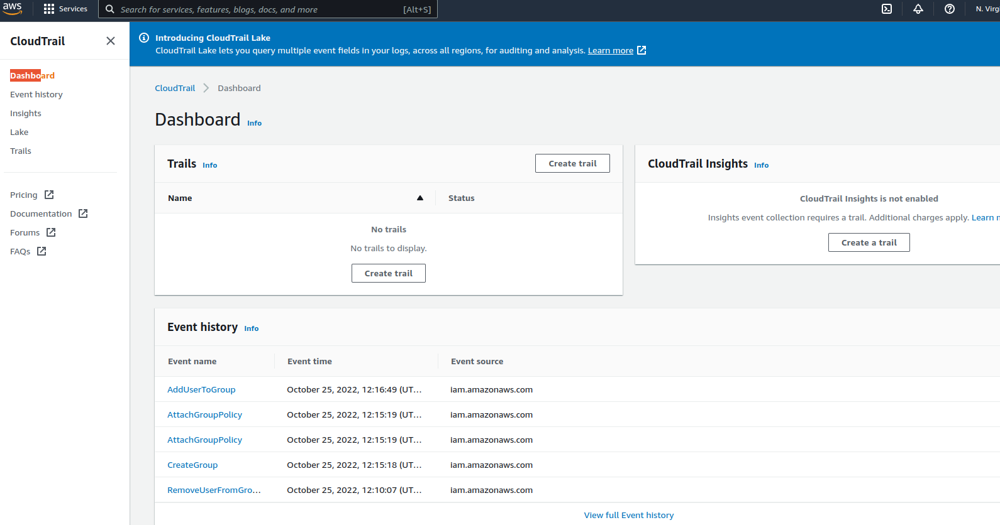
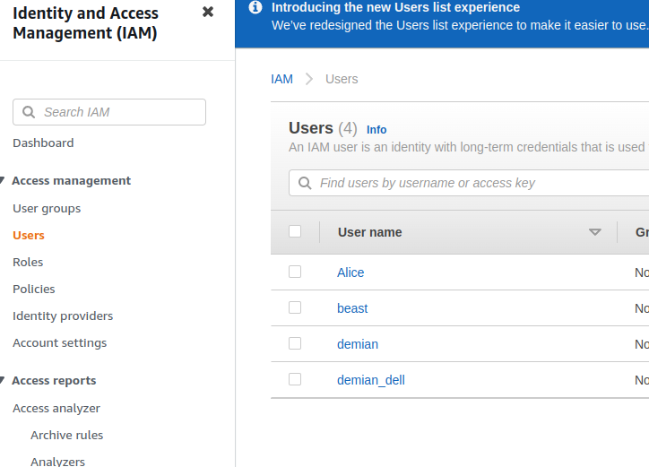
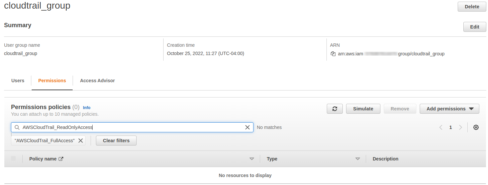
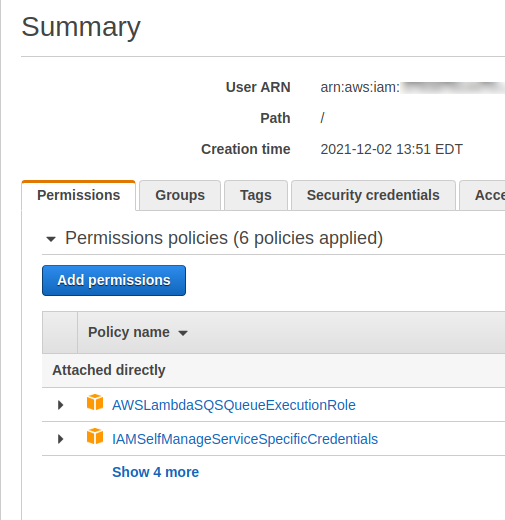
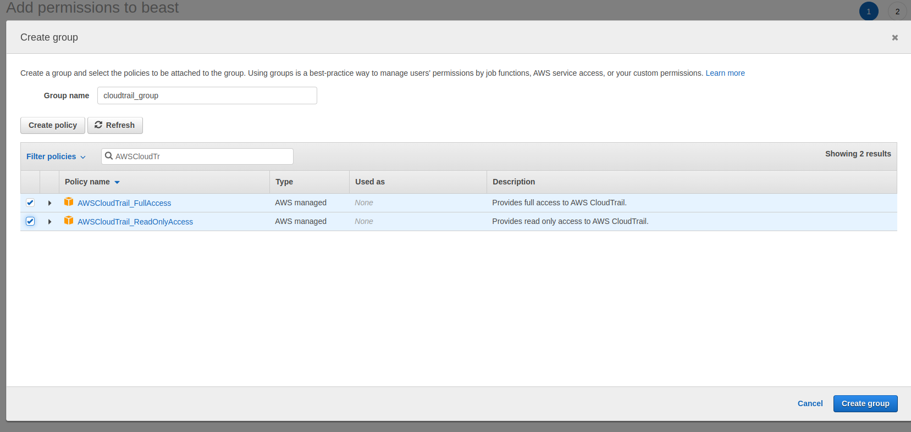
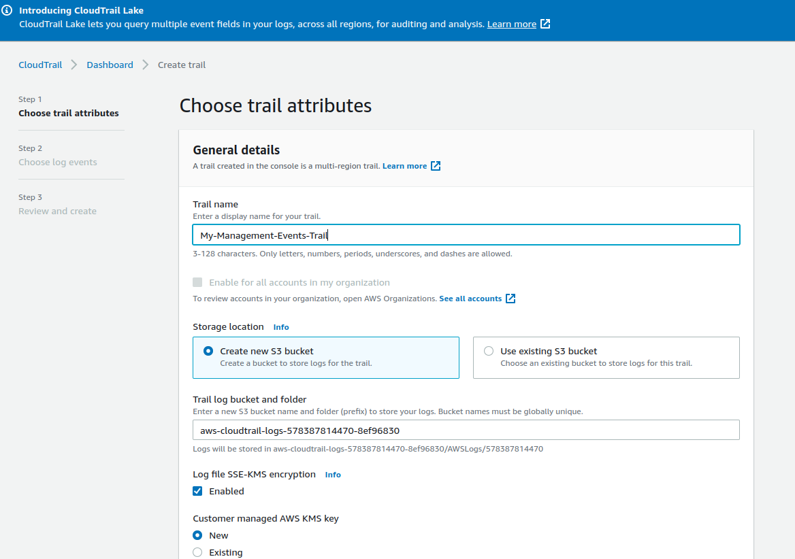
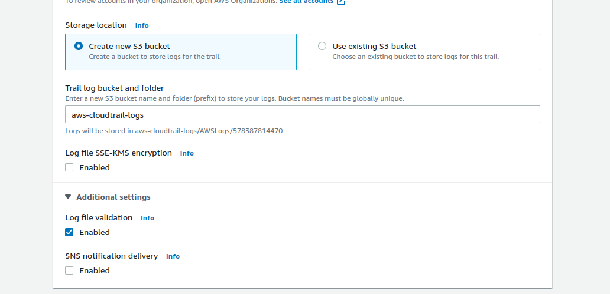
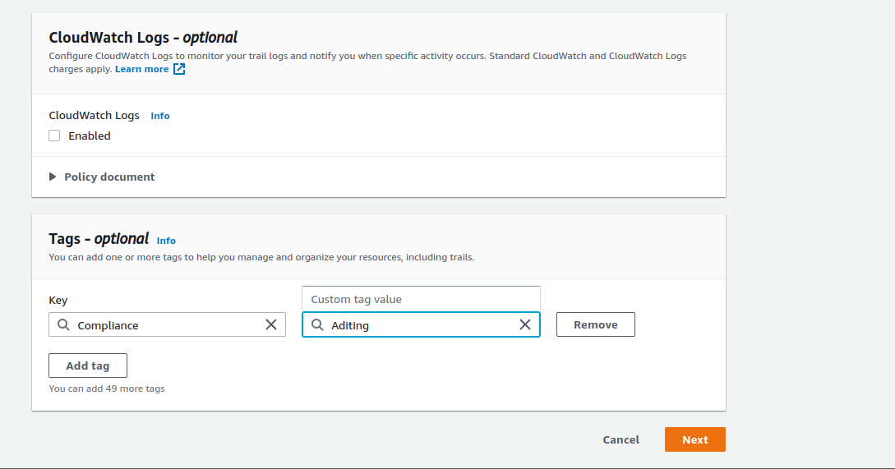
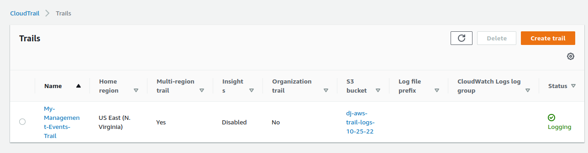

# Completing AWS Cloudtrail Tutorial

## Introduction

✍️ I felt like this is a good place to start and also review. I really wanted to get my AWS juices flowing again.

## Prerequisite

✍️ Of course having an AWS account. IAM user for administering CloudTrail. I used an existing user that I had and added CloudTrail administration.

## Use Case

- 🖼️ There will be a number of projects that I will be monitoring activity. I will start with monitoring root user activity.
- ✍️ It's recommended not to use root user access for daily activities. Howeverm there are instances when you have to use the root user. Cloudtrail can alert you anytime the root user is being used.

## Cloud Research

- ✍️ The AWS tutorial doesn't exactly work as they describe. Particularly setting up cloud trail permissions for the user.
- 🖼️ The tutorial has you create the group first and add permissions to it. That didn't work for me. I selected the user first and then added Cloudtrail permissions to it. At that point IAM ask me to create a group. 

## Try yourself

✍️ My Process

### Step 1 — IAM select user

### Step 2 — Search Permissions

### Step 3 — Add Permissions

### Step 4 — Add Permissions to Group

### Step 5 — Review Permissions

### Step 6 — Open Cloudtrail Dashboard

### Step 7 — Create Trail

### Step 6 — Trail Attributes 1

)

### Step 6 — Trail Attributes 2

### Step 6 — Completed Trail

## ☁️ Cloud Outcome

✍️ I re-learned how to setup permissions and roles.  I also learned how to setup a cloudtrail.

## Next Steps

✍️ Next step will be to add cloudtrail events to S3 buckets and root user access.

## Social Proof

✍️ Show that you shared your process on Twitter or LinkedIn

[Tweet](https://twitter.com/DemianJennings/status/1584970085453942784)

[LinkedIn](https://www.linkedin.com/posts/demian-jennings_100daysofcloud-activity-6990736430469693440-kO8S?utm_source=share&utm_medium=member_desktop)
