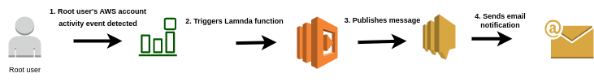
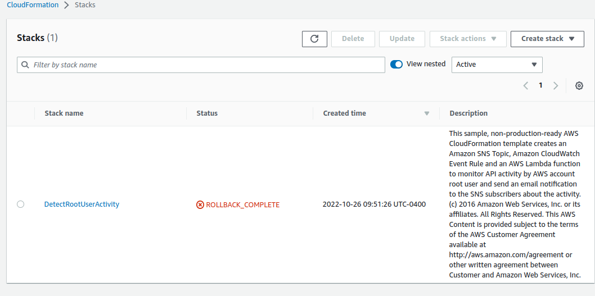
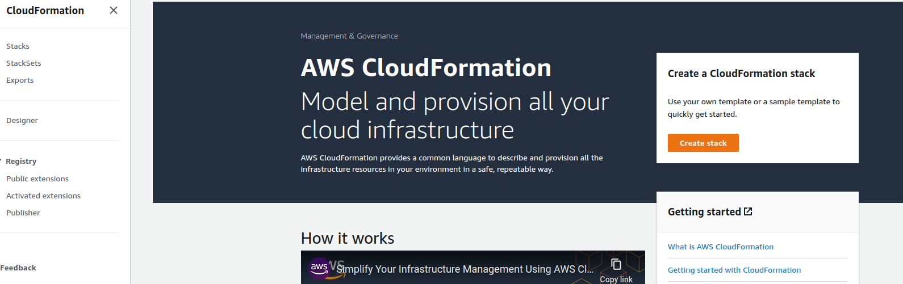
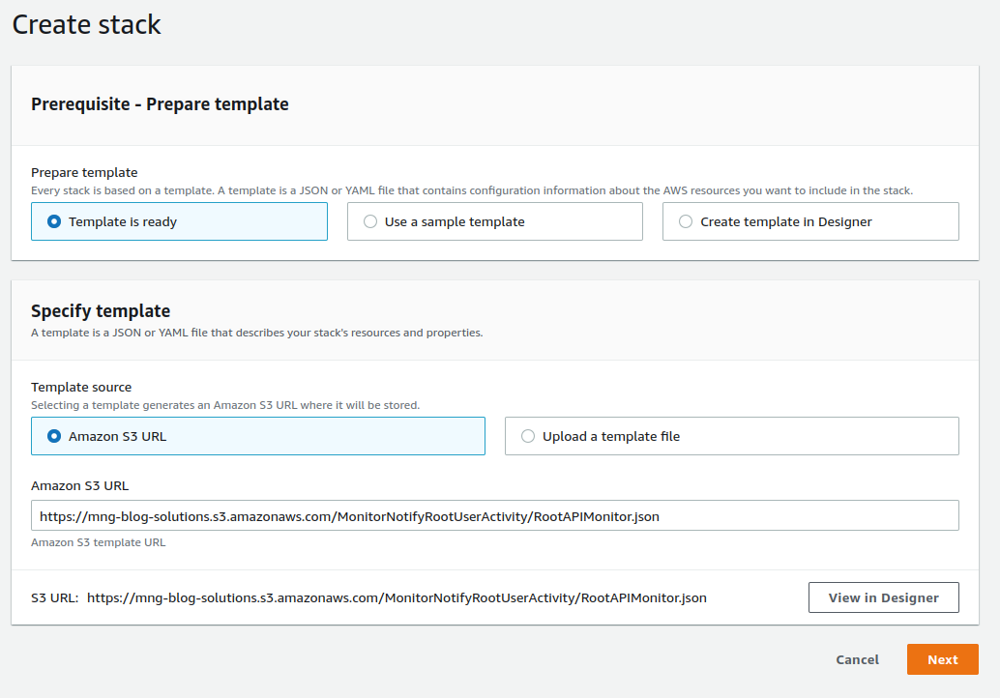
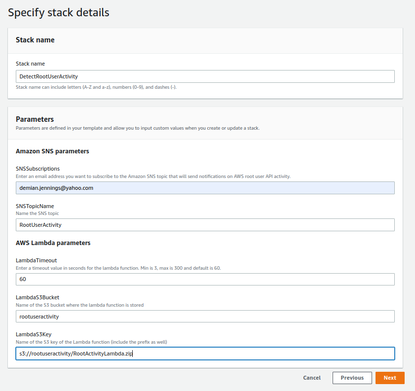

**Solution Diagram:**

# Monitor and Notify on AWS Account Root User Activity

## Introduction

✍️ It is recommended to create another IAM role with admin permissions to prevent the root user access from getting in the wrong hands. However, there are times when the root user must be used. This Cloudwatch event rule will notify via sns email whenever the root user is being used.

## Prerequisite

- Create and enable a multi-region AWS CloudTrail trail for all AWS regions.
- Upload the https://mng-blog-solutions.s3.amazonaws.com/MonitorNotifyRootUserActivity/RootActivityLambda.zip file to an S3 bucket.

## Use Case

- Provide notification of root user account activity

## Cloud Research

- It appears that my cloudformation was rolled back. So I have to troubleshoot what happened. I was using another IAM role perhaps I need to create this with the root user.

## Try yourself

✍️ The tutorial I followed is here https://aws.amazon.com/blogs/mt/monitor-and-notify-on-aws-account-root-user-activity/

I will show my steps

### Step 1 — Create a CloudFormation Stack

### Step 2 — Stack Settings

### Step 3 — Set SNS parameters and Lambda zip file location

### Step 4 — Acknowledge capabilities and create stack

### Step 5 — Receive SNS email notification

## ☁️ Cloud Outcome

✍️ Overall I have some bugs to fix, but I learned about cloudformation, cloudwatch, cloudtrail and sns topics. Some of it was review, some was new.

## Next Steps

✍️ Go back and fix my bugs and try again. Maybe with a different example

## Social Proof

[tweet](https://twitter.com/DemianJennings/status/1585283019132358656)

[LinkedIn](https://www.linkedin.com/feed/update/urn:li:activity:6991049691186507777/)

