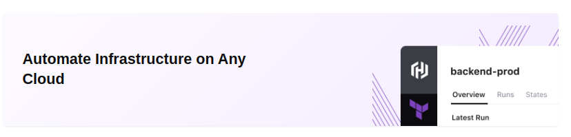

<!-- This template removes the micro tutorial for a quicker post and removes images for a full template check out the 000-DAY-ARTICLE-LONG-TEMPLATE.MD-->

**Terraform IaC:**

# Automate Infrastructure as with Terraform

## Introduction

✍️ I want to learn how to automate infrascture as code with terraform. I'm interested in the devsecops space and I see that terraform is used.

## Use Case

- ✍️ Terraform lets build, change, and version infrastructure safely and efficiently. This includes low-level components like compute instances, storage, and networking; and high-level components like DNS entries and SaaS features.

## Cloud Research

- ✍️ I followed the tutorials on the Terraform site under Amazon Web Services

## Social Proof

✍️ Show that you shared your process on Twitter or LinkedIn

[tweet](https://twitter.com/DemianJennings/status/1585696534166786049)
[linkedIn](https://www.linkedin.com/posts/demian-jennings_100daysofcloud-aws-infrastructure-activity-6991463197425750016-9ycm?utm_source=share&utm_medium=member_desktop)