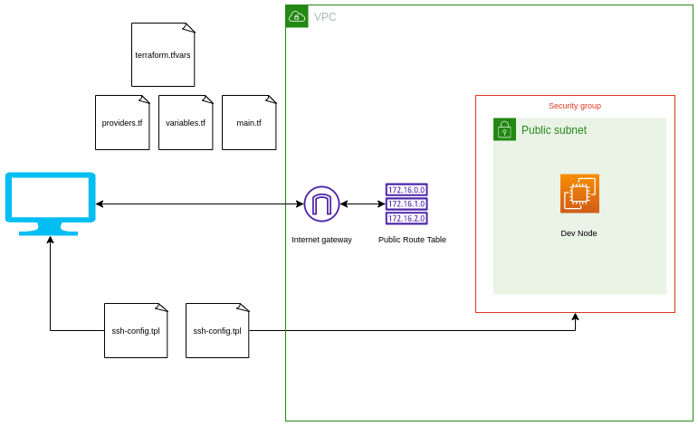
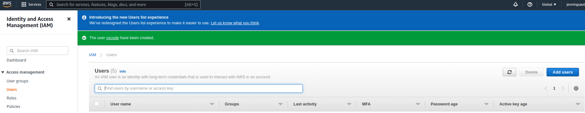
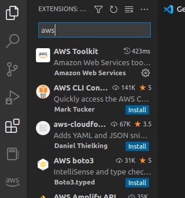
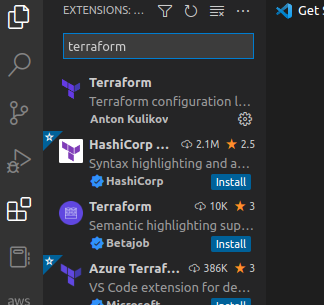
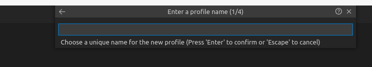
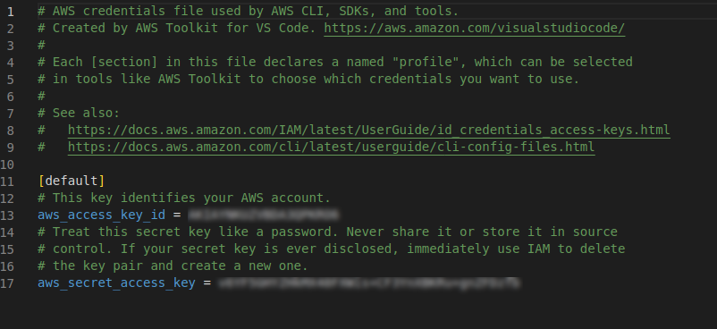
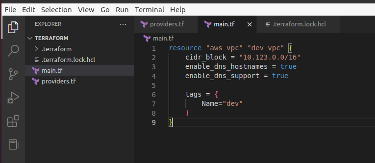
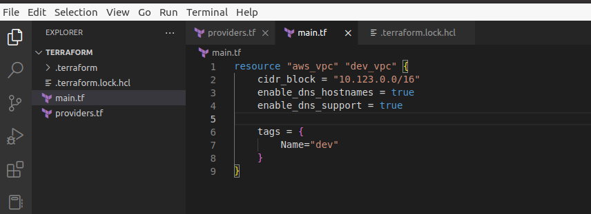
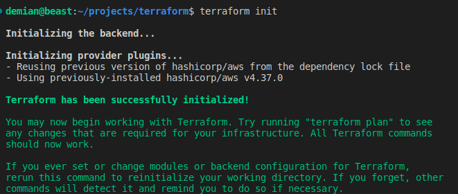
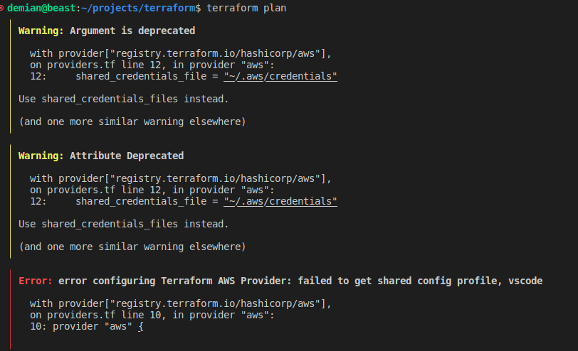

**Add a cover photo like:**

# Build EC2 dev environment using terraform Part I

## Introduction

✍️ I wanted to go deeper in learning about terraform, by creating something I can actually use.

## Prerequisite

✍️ I would at least go through the initial terraform tutorial. Know the basics of terraform. Also know how to create AWS IAM user and have your AWS and terraform cli setup.

## Use Case

- The cover photo shows the basic setup of a ec2 instance on a public subnet inside of a security group in a VPC.

## Cloud Research

- I am following the tutorial by Derek Morgan on the youtube channel freecodecamp.org. https://www.youtube.com/watch?v=iRaai1IBlB0

## Try yourself

✍️ I have just started. It will probably take a few days to complete. Plus I will need to troubleshoot some things.

### Step 1 — Create AWS IAM user

- create a new user with admin access and create an access id

### Step 2 — Install AWS vscode extension

### Step 3 — Install terraform vscode extension

### Step 4 — create a aws profile. Add Access ID and Secret ID

### Step 4 — create a main.tf

### Step 5 — create a providers.tf

### Step 5 — run terraform init

### Step 6 — run terraform plan

## ☁️ Cloud Outcome

✍️ As you can see in the last command I have an error. So I need to troubleshoot that. It's related to my aws shared profile.

## Next Steps

✍️ Troubleshoot errors and continue

## Social Proof

✍️ Show that you shared your process on Twitter or LinkedIn

[tweet](https://twitter.com/DemianJennings/status/1586009772746104832)
[linkedin](https://www.linkedin.com/posts/demian-jennings_100daysofcloud-terraform-ec2-activity-6991776165619232768-Vy9e?utm_source=share&utm_medium=member_desktop)
