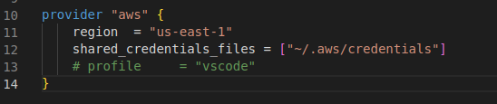
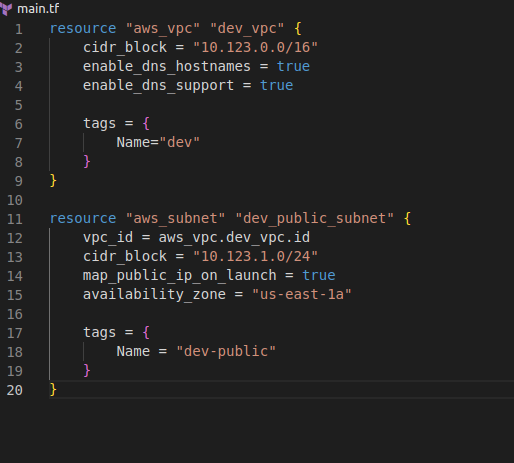

**Architecture:**

# Build EC2 dev environment using terraform Part II

## Introduction

✍️ Continued with the dev environment build.

## Prerequisite

✍️ This is a continuation of the ec2 dev environment build with terraform. 

## Use Case

- 🖼️ Besides learning terraform, it would give me something to work with.

## Cloud Research

- The tutorial that I'm following was built using terraform version 3. The version I'm using is version 4, so there are some changes.
https://www.youtube.com/watch?v=iRaai1IBlB0

## Try yourself

✍️ I spent a little time research my bug, and then created my subnet.

### Step 1 — Fix credential bug

There are 2 changes with regard to credentials. 
1. shared_credentials_file is depracated. It still works but the new usage is shared_credentials_files and place the string in a bracket to indicate a list.
2. I had to comment out the profile. I don't fully understand it, but it has something to do with looking for a profile that is not there. For now just commenting out works

### Step 1 — Add Subnet resource

add the resource to main.tf and run terraform apply.

## ☁️ Cloud Outcome

✍️ It may not look like a lot was done. But researching bugs takes some time. The good thing is I'm getting more acquanted with the documentation.

## Next Steps

✍️ The next step is to setup the internet gateway.

## Social Proof

[tweet](https://twitter.com/DemianJennings/status/1586478787100872704)
[linkedin](https://www.linkedin.com/posts/demian-jennings_100daysofcloud-activity-6992245368046456832-eLyM?utm_source=share&utm_medium=member_desktop)
