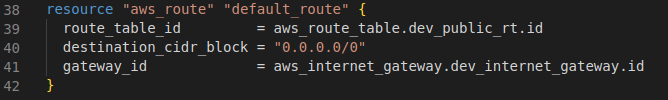
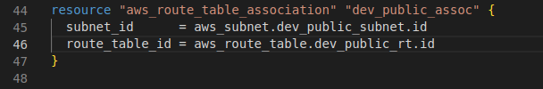

**Architecture Diagram:**

# EC2 dev environment buils using terraform Part III

## Introduction

✍️ Adding an internet gateway and routes and route table.

## Prerequisite

✍️ Terraform, AWS account. Follow the build up to this point.

## Use Case

- An internet gateway is a horizontally scaled, redundant, and highly available VPC component that allows communication between your VPC and the internet.
- An internet gateway enables resources in your public subnets (such as EC2 instances) to connect to the internet if the resource has a public IPv4 address or an IPv6 address.  For example, an internet gateway enables you to connect to an EC2 instance in AWS using your local computer.

- A route table contains a set of rules, called routes, that are used to determine where network traffic from your subnet or gateway is directed. To put it simply, a route table tells network packets which way they need to go to get to their destination.

## Cloud Research

- I'm continuing to follow the youtube tutorial here https://www.youtube.com/watch?v=iRaai1IBlB0
- I referred to the terraform and aws documentation for routes, route_tables and internet gateways
- From the aws docs. An internet gateway is a horizontally scaled, redundant, and highly available VPC component that enables communication between your VPC and the internet.

To use an internet gateway, attach it to your VPC and specify it as a target in your subnet route table for internet-routable IPv4 or IPv6 traffic. An internet gateway performs network address translation (NAT) for instances that have been assigned public IPv4 addresses.

## Try yourself

### Step 1 — Add internet gateway resource to main.tf

### Step 2 — Add route table resource

### Step 3 — Add route resource 

### Step 4 — Add route_table association

## ☁️ Cloud Outcome

✍️ I'm starting to see how everything is coming together. I learned these concepts separately. Now it's starting to gel and make sense. I see how vpc's, gateways, routes and route tables are connected.

## Next Steps

✍️ The next step is to setup security groups

## Social Proof

✍️ Show that you shared your process on Twitter or LinkedIn

[tweet](https://twitter.com/DemianJennings/status/1586807199191470087)

[linkedIn](https://www.linkedin.com/posts/demian-jennings_100daysofcloud-activity-6992573423147237376-T8Rs?utm_source=share&utm_medium=member_desktop)
