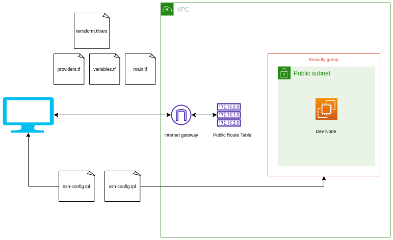
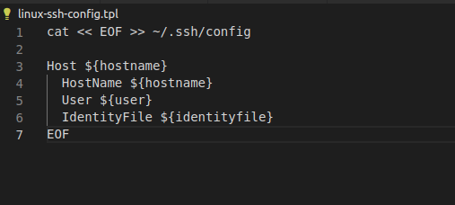

**Architecture Diagram**

# EC2 dev environment buils using terraform Part IV

## Introduction

✍️ We continue setting up the dev environment. Today we setup a security group, a datasource to facilitate creating the ec2 instance, created some template scripts and ssh config scripts

## Prerequisite

✍️ This is a continuation of setting up the dev environemnt. So just follow the last 3 days. Continuing the tutorial here: https://www.youtube.com/watch?v=iRaai1IBlB0

## Use Case

- A security group acts as a virtual firewall that controls the traffic for one or more instances. 

## Cloud Research

- Security groups
When you launch an instance, you can specify one or more security groups. You can modify the rules for a security group at any time; the new rules are automatically applied to all instances that are associated with the security group. When we decide whether to allow traffic to reach an instance, we evaluate all the rules from all the security groups that are associated with the instance.

- When you launch an instance in a VPC, you must specify a security group that's created for that VPC. After you launch an instance, you can change its security groups. Security groups are associated with network interfaces. Changing an instance's security groups changes the security groups associated with the primary network interface (eth0). For more information, see Changing an Instance's Security Groups in the Amazon VPC User Guide. You can also change the security groups associated with any other network interface.

### Step 1 — Create Security Group Resource

### Step 2 — Launch an ec2 instance in AWS. For this I choose ubuntu 18.04

### Step 3 — create an ssh keypair

### Step 4 — ssh into ec2 image on AWS with public IP

### Step 5 — create userdata template file, userdate.tpl

### Step 6 — create linux_ssh-config_tpl

## ☁️ Cloud Outcome

✍️ Overall I feel like I got a lot done. Setting up the config files and template files was all new stuff. Good to review security groups. Getting close to the end.

## Next Steps

✍️ Setup provisioners.

## Social Proof

✍️ Show that you shared your process on Twitter or LinkedIn

[tweet](https://twitter.com/DemianJennings/status/1587902948465590273)
[linkedIn](https://www.linkedin.com/posts/demian-jennings_100daysofcloud-activity-6993668965319290880-IS-2?utm_source=share&utm_medium=member_desktop)
