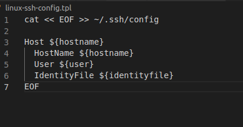
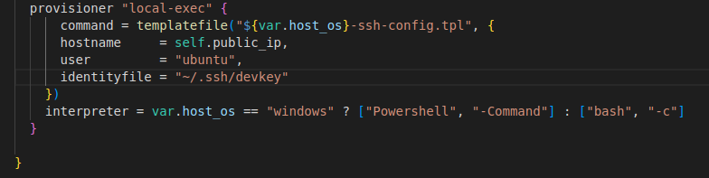
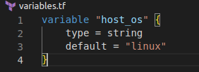
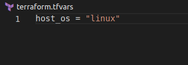
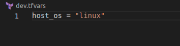
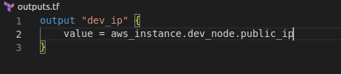

**Architecture Diagram**

# EC2 dev environment buils using terraform Part V

## Introduction

✍️ This is the completion of the ec2 dev environment build. I setup tfvars variable files and add conditional expressions in the main.tf to switch shells based on the host OS. I wrap everything up with formatting the output.

## Prerequisite

✍️ The last part of the tutorial by Derek Morgan on freecodecamp.org channel. Link here: https://www.youtube.com/watch?v=iRaai1IBlB0

## Use Case

- The purpose of this final phase is to automate selecting the cli shell based on host OS. That is controlled by adding variable files and using conditional logic. Finally, the output is formatted by using a outputs.tf file.

## Try yourself

✍️ Add a mini tutorial to encourage the reader to get started learning something new about the cloud.

### Step 1 — create config template file

### Step 2 — add provisioner section to main.tf

### Step 3 — create varaibles.tf

### Step 4 — create terraform.tfvars
This sits the default name of host OS

### Step 5 — create dev.tfvars
This sits the default name of host OS

### Step 6 — format output 
Format the output. create outputs.tf file

## ☁️ Cloud Outcome

✍️ This has been an awesome tutorial. Just to think that a week ago I had heard of terraform before, but I had know idea what it's purpose was or how to use it. I feel confident with the fundamentals now and I actually have something real that I can apply my knowledge and practice. Everything is working great. There were some minor differences in what I did and the tutorial due to version differences and my host OS is linux. Overall, the tutorial was fantastic.

## Next Steps

✍️ I want to take time and review all of the topics that I covered creating the dev environment. I want to review the documentation, so I fully understand what I did before I move on. Besides that, I'd like to actually put the dev environment to use.

## Social Proof

✍️ Show that you shared your process on Twitter or LinkedIn

[tweet](https://twitter.com/DemianJennings/status/1588560951120646144)
[Linkedin] (https://www.linkedin.com/posts/demian-jennings_100daysofcloud-activity-6994327439770275841-C6KL?utm_source=share&utm_medium=member_desktop)
