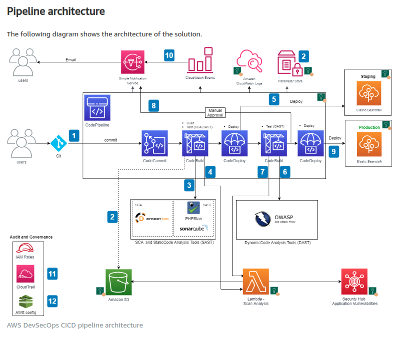

<!-- This template removes the micro tutorial for a quicker post and removes images for a full template check out the 000-DAY-ARTICLE-LONG-TEMPLATE.MD-->

**Pipeline Architecture:**

# Building end-to-end AWS DevSecOps CI/CD pipeline with open source SCA, SAST and DAST tools

## Introduction

✍️ I am moving into devsecops, so I wanted a project to implement all of those tools.

## Prerequisite

✍️ Before I can begin with the pipeline, I must first have the following prequisites:
- Elastic Beanstalk environments with an application deployed.
- A CodeCommit repo
- The provided buildspec-*.yml files, sonar-project.properties file, json file, and phpstan.neon file uploaded to the root of the application code repository.
- The Lambda function uploaded to a S3 bucket. We use this function to parse the scanning reports and post the results to Security Hub.
- A SonarQube URL and generated API token for code scanning.
- An OWASP ZAP URL and generated API key for dynamic web scanning.
- An application web URL to run the DAST testing.
- An email address to receive approval notifications for deployment, pipeline change notifications, and CloudTrail events.
- AWS Config and Security Hub enabled. For instructions, see Managing the Configuration Recorder and Enabling Security Hub manually, respectively.

So before I get started on the pipeline, I've got some work to do to finish the prequistes.

## Use Case

- ✍️ Delivering secure and compliant application changes rapidly while running operations consistently with automation.

## Cloud Research

- ✍️ I am re-creating a CI/CD pipeline from a blog post written by Srinivas Manepalli.

## Social Proof

[tweet](https://twitter.com/DemianJennings/status/1588975923789197312)
[linkedin](https://www.linkedin.com/posts/demian-jennings_100daysofcloud-activity-6994742581452582913--XIx?utm_source=share&utm_medium=member_desktop)