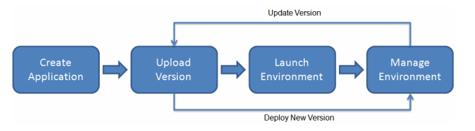

**Prerequisites and prerequisites of prerequisites:**

# Building AWS DevSecOps CI/CD pipeline Part I
## Deploy a high-availabilty WordPress website with Elastic Beanstalk Environment

## Introduction

- Before I can build a CI/CD pipeline, I first need to have an application. 

## Prerequisite

- Knowledge of the basic Elastic Beanstalk operations and the Elastic Beanstalk console

## Use Case

 

With Elastic Beanstalk, you can quickly deploy and manage applications in the AWS Cloud without having to learn about the infrastructure that runs those applications. Elastic Beanstalk reduces management complexity without restricting choice or control. 

## Cloud Research

- I started with the basic Elastic Beanstalk getting started tutorial https://docs.aws.amazon.com/elasticbeanstalk/latest/dg/GettingStarted.html
- I then moved to building this https://docs.aws.amazon.com/elasticbeanstalk/latest/dg/php-hawordpress-tutorial.html

I was not successful. The project failed to deploy. It has to be my settings, maybe my environment variables, or I just don't have the subnets setup correctly. I'll dig in and figure it out.

## ☁️ Cloud Outcome

- (result) My first crack at it was failure. But I'm going to try again with a fresh mind.

## Next Steps

- Retrace my steps. Check all settings

## Social Proof

[tweet](https://twitter.com/DemianJennings/status/1589744208466030594)

[linkedin](https://www.linkedin.com/posts/demian-jennings_100daysofcloud-activity-6995510910345764864-sTXk?utm_source=share&utm_medium=member_desktop)