# AWS Code Commit

## Introduction

✍️ AWS CodeCommit is a building block to building a CI/CD pipeline. 

## Prerequisite

✍️ You should be familiar with setting up IAM users. Also I chose to setup SSH keys, so you should be familiar with that process.

## Use Case

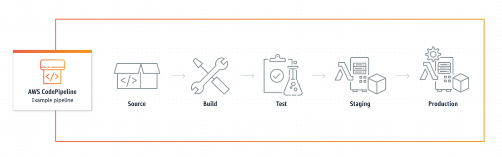
Commiting the code to a repository initiates the first step in the pipeline. 

## Cloud Research

- I'm following a udemey devops tutorial, AWS Certified DevOps Engineer Professional 2022 - Hands On!, by Staphane Maarek. However, The  AWS documention for setting up an IAM user and ssh keys are this is pretty current and useful.
## Try yourself

### Step 1 — Create a repository in AWS CodeCommit
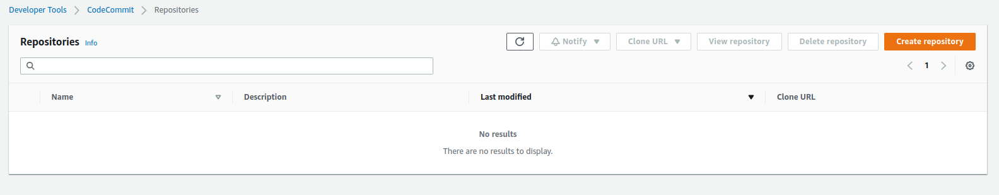

### Step 2 — Name the repository and accept all the defaults
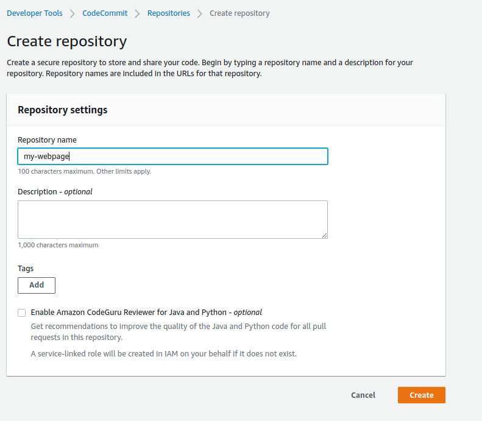

### Step 3 — clone the repository on your computer somewhere
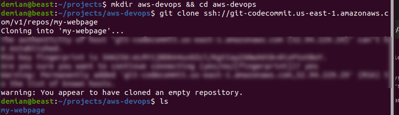

### Step 4 — Select Users
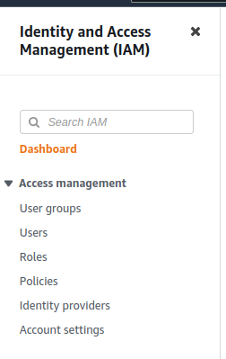

### Step 5 — Click Add Users Button
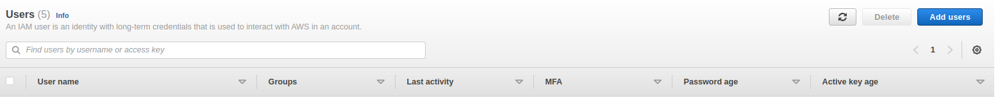

### Step 6 — Enter User name, Check Access key and password
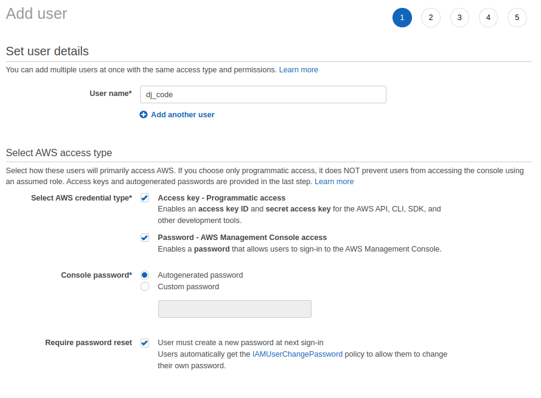

### Step 7 — Select Add User to group
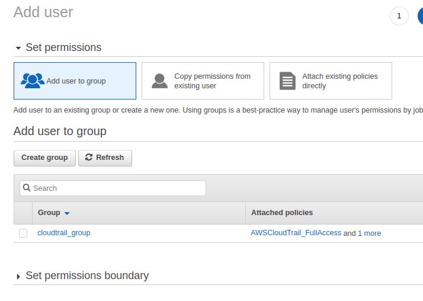

### Step 8 — Enter name and check Administrator access
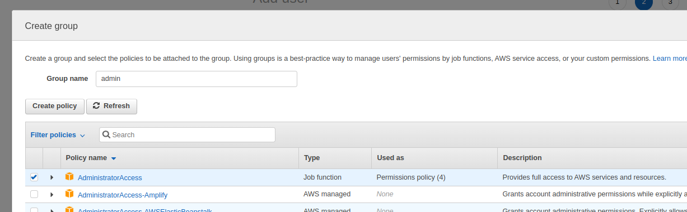

### Step 9 — Success!, download keys
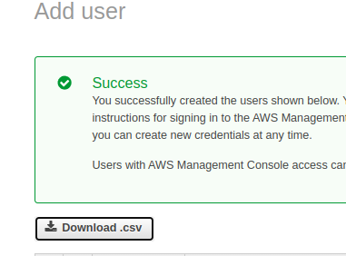

### Step 10 — Setup SSH
1. In the terminal, ssh-keygen
2. cat the location of the key and copy
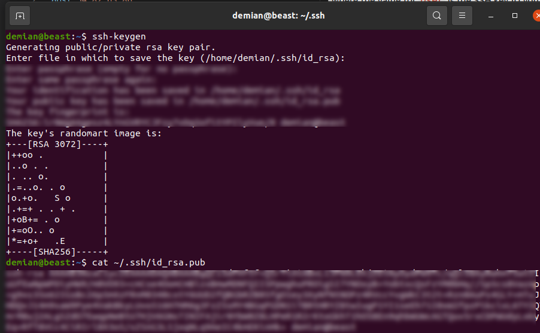

### Step 11 — Click upload key
1. paste in the key you just copied
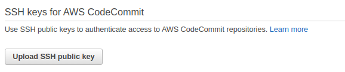

### Step 12 — Modify the config file in .ssh directory
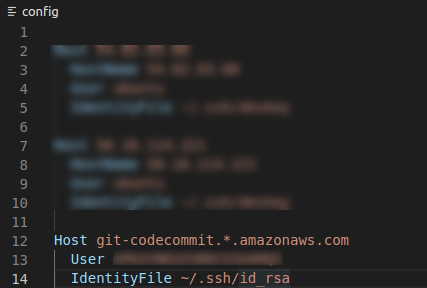

### Step 13 — Test SSH connection
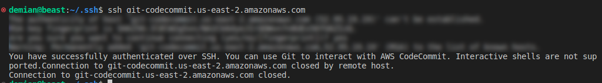

### Step 14 — Copy sample files to directory
1. git status (Just to see where you at)
2. git add .
3. git commit -m "Your message"
4. git push
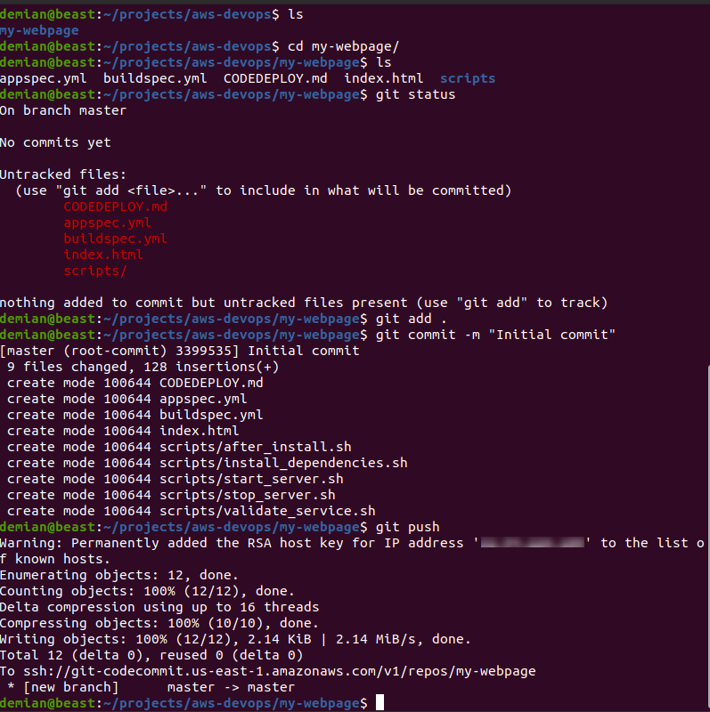

## ☁️ Cloud Outcome

✍️ Overall, CodeCommit is very similar to github, but I feel you get an extra layer of security. I learned how to setup and use CodeCommit dashboard and cli.

## Next Steps

✍️ Explore more features in CodeCommit, branches, pull requests, security, triggers and notifications

## Social Proof

✍️ Show that you shared your process on Twitter or LinkedIn

[tweet](https://twitter.com/DemianJennings/status/1590453916264960000)

[linkedin](https://www.linkedin.com/posts/demian-jennings_100daysofcloud-aws-pipeline-activity-6996220023392354304-U8bk?utm_source=share&utm_medium=member_desktop)
