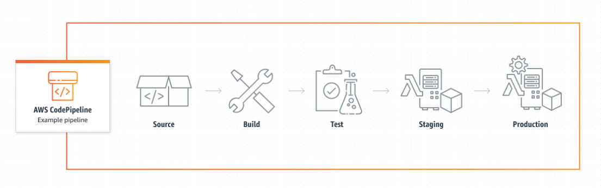

**CodePipeline**

# AWS CodeCommit Basics - Branches, Pull requests  and IAM Groups

## Introduction

✍️ Review the basics of CodeCommit. Creating branches, pull requests and limiting repository actions through IAM groups

## Prerequisite

✍️ You should have a basic idea of git and github is helpful. You should know the basics of IAM.

## Use Case

- Creating branches and pull requests is a best practice when working in teams. It gives the manager a chance to review the code before merging it into the repository.

## Cloud Research

- CodeCommit is very similar to github. So if you know how that works, Codecommit is very similar.

### Step 1 — checkout a new branch
- git checkout -b my-feature-2

### Step 2 — Make a change to file/files
(here I'm changing the version on line 29)

### Step 3 — Add changes
- git add .

### Step 4 — commit changes
 - git commit -m "Changed to v4"

### Step 5 — push changes to upstream branch
- git push --set-upstream origin my-feature-2

### Step 6 — Branch listed in aws repositories

### Step 7 — Create Pull request

### Step 8 - Give it a name

### Step 9 - Merge pull request

### Step 10 - Complete merge

### Step 11 - merge success

## Creating User groups

### Step 12 - create group

### Step 13 - name group

### Step 14 - create policy

### Step 15 - edit policy

### Step 16 - name policy

### Step 17 - Attach policy to junior_devs group

## ☁️ Cloud Outcome

✍️ I have used github, so this was a review. But its important to go back over the fundamentals every once in awhile.

## Next Steps

✍️ creating triggers and notifications in CodeCommit

## Social Proof

✍️ Show that you shared your process on Twitter or LinkedIn

[tweet](https://twitter.com/DemianJennings/status/1591499819826167810)

[linkedIn](https://www.linkedin.com/posts/demian-jennings_100daysofcloud-aws-activity-6997266177890693120-E0lE?utm_source=share&utm_medium=member_desktop)
