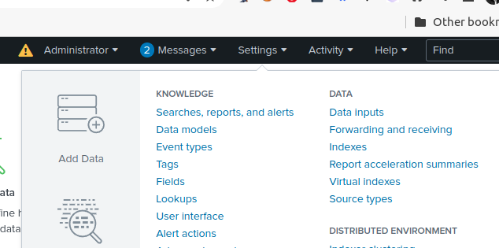

**SIEM Lab Architecture:**

# Day 16 - Build Security Event Monitoring Lab

## Introduction

✍️ The motivation for this lab comes from me potentially securing a client who requires a SOC dashboard to be designed and built using Wazuh. In order to do that I need an environment that is injesting data and monitoring logs.

## Prerequisite

✍️ Basic knowledge of Splunk. The ability to open a linode account.

## Use Case

- Build a safe testing enviroment to study malicious traffic.

## Cloud Research

- My journey started with me first working on a pre-built virtual lab setup from the network defense essentials course from ec-council. As great as the lab is, there were some issues with it. First the lab is timed and closes after a certain amount of time and you have to start all over. The setup for splunk can be cumbersome, so this time limit was a problem. I needed an environment that I can setup incrementally and come back to it to build and study it. The other issue is that my ultimate goal of starting this was to design and create SOC dashboards with Wazuh. But you have to have something to display before you can have a dashboard. So building the Splunk lab is just a means to get to the ultimate goal. I am following the video tutorials of youtube channel,HackerSploit.

## Try yourself

### Step 1 — Create a Splunk account

### Step 2 — Create Linode Account

### Step 3 — Create Linode

Choose Linode

### Step 4 - Select Splunk

### Step 5 — Enter Splunk details

### Step 6 — Choose CPU, I chose the smallest

### Step 7 — Summary of Step

Enter Root Password

### Step 8 — Launch Lish Console

### Step 9 — Select Settings
Click Forwarding and receiving

### Step 10 — Click Add New

### Step 11 — Configure receiving port
Enter the default port 9997

### Step 12 — Click on Apps
Select Find More Apps

### Step 13 — Enter Snort in the Search
choose Snort Alert for Splunk

### Step 14 — Enter your Splunk username and password

### Step 15 — Snort success screen

### Step 16 — Setup Splunk Forwarder

### Step 17 — Choose OS

choose your OS and it will automatically download.

### Step 17 — Terminal Instructions for linux

1. change directory to folder with .deb file, cd ~/Donwloads
2. move file /opt directory. sudo mv \<splunk file name> /opt
3. install. sudo apt install \<splunk file name>
4. change directory to /opt/splunkforwarder/bin. cd /opt/splunkforwarder/bin
5. start splunk. sudo ./splunk start --accept-license
6. Add Forwarder. sudo ,/splunk add forward-server \<add linode IP address>

## ☁️ Cloud Outcome

✍️ So far no significant issues. The tutorial is very clear. I have never worked with linode before, but I like it. It seems easy to work with and configure and the cost is low. There is still more work to be done, but I'm happy with the progress so far.

## Next Steps

✍️ Continue forwarding Snort Logs To Splunk

## Social Proof

[tweet](https://twitter.com/DemianJennings/status/1594089391609126917)
[LinkedIn](https://www.linkedin.com/posts/demian-jennings_100daysofcloud-security-linode-activity-6999856845150375936-VIY7?utm_source=share&utm_medium=member_desktop)
