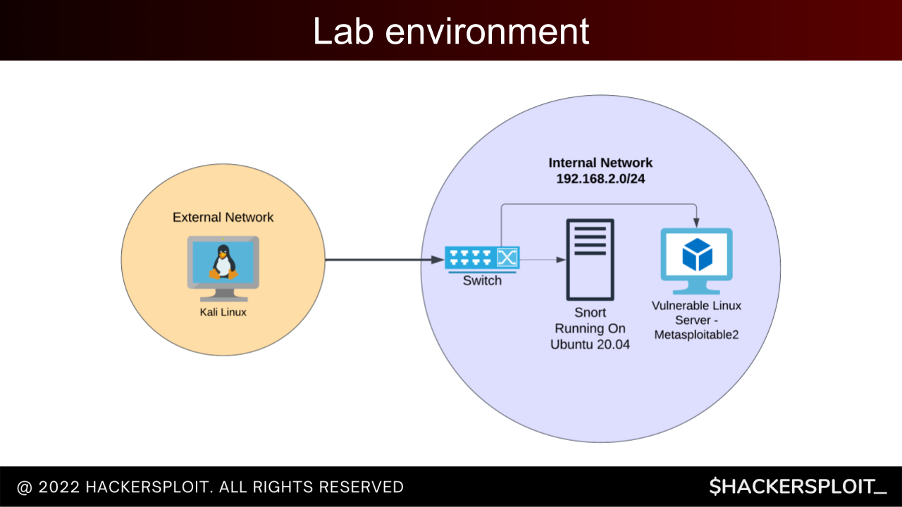

**Add a cover photo like:**

# Continue with Virtual Lab Build

## Introduction

✍️ My aim was to complete the setup of the lab to practice blue team and red team skills. For that I need a safe place to practice that will not harm my computer.

## Prerequisite

✍️ There are basic instructions that you can find in the documentation or google. The only trick is assembling all of these separate pieces of information

## Use Case

- ✍️ The goal of today was to setup the Kali Linux VM in the external network and also the VM's on the right side of the graphic which is the vulnerable linux server(metasploitable 2) and the ubunt vm

## Cloud Research

- Documentation for virtualBox, VMware, Kali linux, metasploitable2. I'm following instructions from Hackersploit in his youtube video "How to Setup a Virtual Penetration Testing Lab" and "Introduction To Snort IDS"

## Try yourself
I chose to install both virtualBox and VMware. That isn't necessary, I installed both and later I'll decide which on I like best.

### Step 1 — Installation of VirtualBox

1. navigate to the virtualBox Download site
2. download the correct one for your operating system. I use linux
3. cd ~/Downloads
4. sudo dpkg -i virtualbox-7.0_7.0.4-154605_Ubuntu_focal_amd64.deb
5. If you get an error about it cannot download dependencies, do this: 
sudo apt -f install

### Step 2 — Installation of VMWare
1. Search for VMware workstation
2. Download it
3. cd ~/Downloads
4. sudo apt-update
5. sudo apt install -y build-essential
6. sudo bash VMware-Player-Full-17.0.0-20800274.x86_64.bundle (this may be different for your installation)
7. Install conig extra's:  sudo vmware-modconfig --console --install-all

### Step 3 — Download The Kali Linux VM

1. Go to Kali linux site and look for the prebuilt VM(easiest way).
2. Unzip it
3. import it into my case VMware 

### Step 4 — Download metasploitable 2, vulnerable network

1. Go to https://sourceforge.net/projects/metasploitable/files/Metasploitable2/
2. Download. Will take a long time
3. import it into my case VMware 

## ☁️ Cloud Outcome

✍️ For some reason, maybe I overthought this. I spent a good amount of time just searching for direct instructions. I feel it's a good exercise, because I think I will be repeating this in the future. I think when it come to setting up the lab, I don't feel like my instructions were straight to the point. But after today I'm feeling better about it.

## Next Steps

✍️ I have to test it and make sure everything is running correctly, then I can setup snort.

## Social Proof

[tweet](https://twitter.com/DemianJennings/status/1594809085530087426)

[linkedIn](https://www.linkedin.com/posts/demian-jennings_100daysofcloud-penetrationtesting-linux-activity-7000576621027934208-uutg?utm_source=share&utm_medium=member_desktop)
