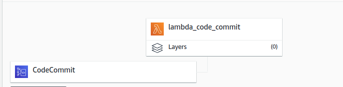
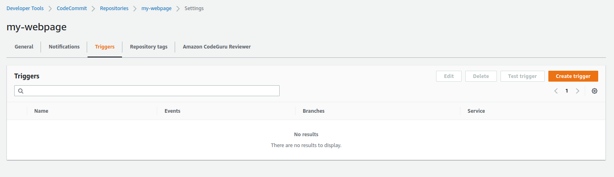
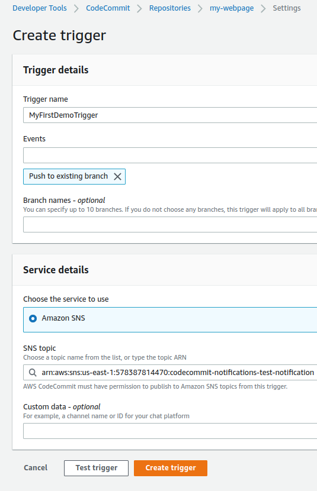
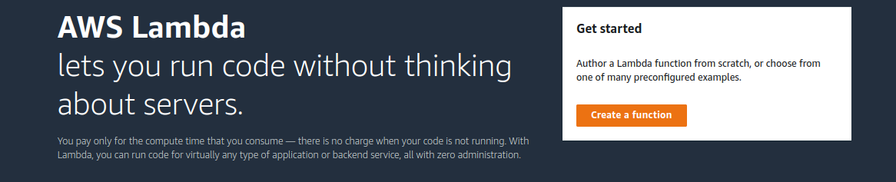
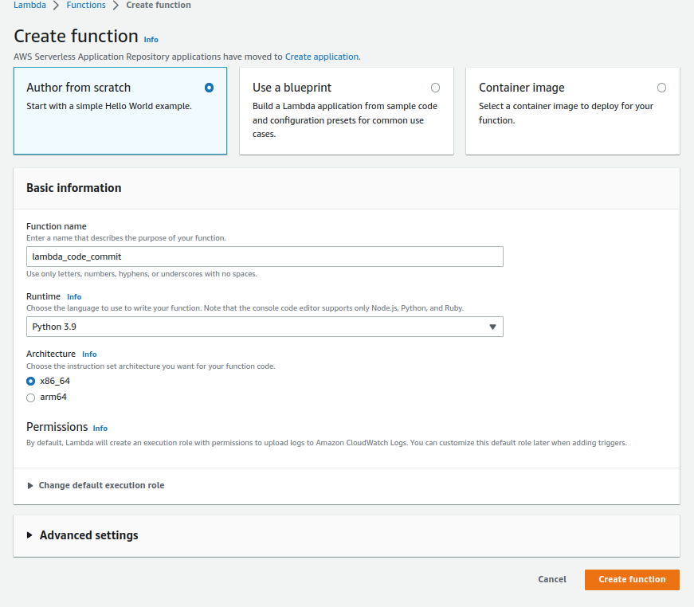
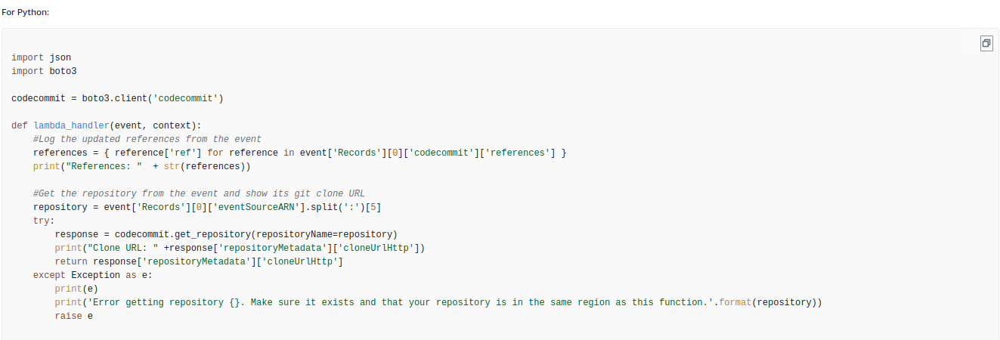
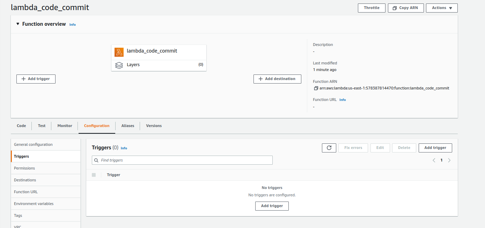
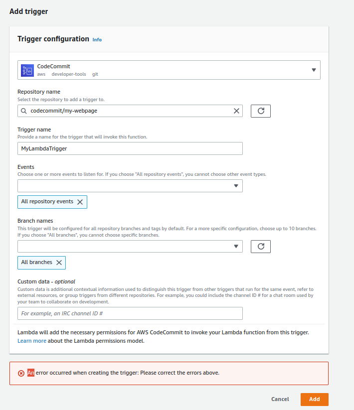

**Add a cover photo like:**

# CodeCommit triggers and Notifications

## Introduction

✍️ Creating triggers in CodeCommit is a way to initiate an automation.

## Prerequisite

✍️ how to create a lambda function, basic IAM knowledge, your langauge of choice.

## Use Case

- The use case is to initiate an automation or notification

## Cloud Research

- I'm following the udemy course from Stephane Maarek, aws-certified-devops-engineer-professional-hands-on. More details can be found on https://docs.aws.amazon.com/codecommit/latest/userguide/how-to-notify-lambda.html

## Try yourself

### Step 1 — Create a trigger
In CodeCommit select Triggers from the settings menu

### Step 2 — Enter in Trigger Details and Service Details

### Step 3 — Create Lambda Function

### Step 4 — Fill in Lambda details

### Step 5 - Edit Code
Replace default lambda code with this

### Step 5 — Add Trigger

### Step 6 — Trigger Configuration

## ☁️ Cloud Outcome

✍️ TBH it mostly worked. But I had issues copying and pasting code, which I still haven't fixed. Also the notifications came in through cloudwatch but not in the format that the code specifies. So I have to troubleshoot further. 

## Next Steps

✍️ Next, I'm moving on to CodeBuild

## Social Proof

✍️ Show that you shared your process on Twitter or LinkedIn

[tweet](https://twitter.com/DemianJennings/status/1596280157366792193)
[linkedIn](https://www.linkedin.com/posts/demian-jennings_100daysofcloud-aws-cloud-activity-7002046516483792896-H02z?utm_source=share&utm_medium=member_desktop)
