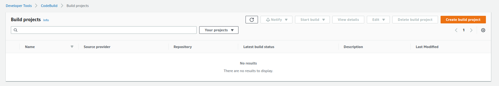
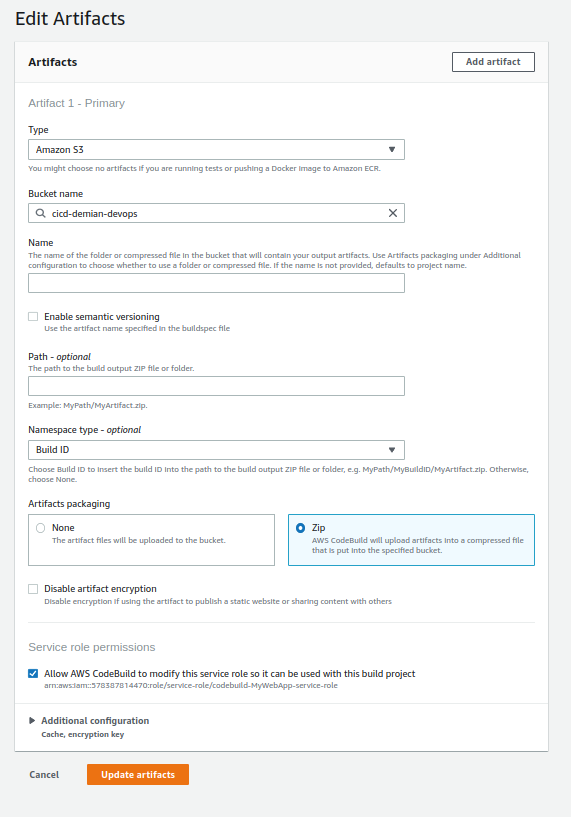

# CodeBuild

## Introduction

✍️ Codebuild is another component of building an AWS pipeline. It is similar to jenkins. As per factory Docs:
AWS CodeBuild is a fully managed build service in the cloud. CodeBuild compiles your source code, runs unit tests, and produces artifacts that are ready to deploy. CodeBuild eliminates the need to provision, manage, and scale your own build servers. It provides prepackaged build environments for popular programming languages and build tools such as Apache Maven, Gradle, and more. You can also customize build environments in CodeBuild to use your own build tools. CodeBuild scales automatically to meet peak build requests.

## Prerequisite

✍️ General knowledge of AWS. 

## Use Case

- In a code pipeline, CodeBuild performs the Build and test function.

## Cloud Research

- My material for research comes from AWS Codebuild documentation and videos 13-20 in AWS certified DevOps Engineer Professional 2022 course

## Try yourself

### Step 1 — Create Project
Create a project in CodeBuild

### Step 2 — Name Project

### Step 3 — Choose Source Repo
Here I choose the project that I'm continuing to work on.

### Step 4 — Choose Environment

### Step 5 — Set Basic Configurations

### Step 6 — Remaining Configurations

### Step 7 — Setting Completed

### Step 8 — Start Build

### Step 9 — Completed Build

### Step 10 — Inspect Cloudwatch Logs

### Step 11 — Testing for Errors
In our buildspec.yml file under commands. We are grepping for the word "congratulations". Here will intentionally remove that from our html file. We are expecting that the build will fail. So we are testing it.

### Step 12 — Build Failure
As expected the build fails

### Step 13 — Using Parameters
Utilizing AWS Parameter Store is a more secure way to handle sensitive data such as passwords and database keys

### Step 14 — Parameter Details
Here I'm providing the name as /Prod/DbPassword. So DbPassword will be stored in the Encrypted Prod folder

### Step 15 — Attaching the ssm iam policy

### Step 16 — Creating Artifacts
Artifacts are items that are created from the build project. This is how that would be done.
In our case we are saving any file in our repository just as an arbitrary test case.

### Step 17 — Edit build to add Artifact

### Step 18 — Store Artifacts in S3 bucket

### Step 19 — Bucket Configurations

## Step 20 — Edit Artifacts

## Step 21 — Creating an Eventbridge Event

## Step 22 — Define a Rule setting

## Step 23 — Configurations

## Step 24 — Invoke a target
In our case I'm using a Lambda function

## Step 25 — Permissions

## Step 20 — Review Schedule

## ☁️ Cloud Outcome

✍️ Overall, After completing this deepdive I feel that I have a good grasp on codeBuild. The tutorial that I was using, utilized cloudwatch events. Cloudwatch events are being deprecated and moving to EventBridge. So this was a good time to get familiar with Eventbridge.

## Next Steps

✍️ CodeDeploy deep dive.

## Social Proof

✍️ Show that you shared your process on Twitter or LinkedIn

[tweet](https://twitter.com/DemianJennings/status/1601707256579428354)
[linkedIn](https://www.linkedin.com/posts/demian-jennings_100daysofcloud-100daysofcloud-activity-7007474628872871936-Puia?utm_source=share&utm_medium=member_desktop)
