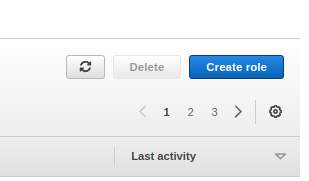

**CodeDeploy:**

 

# CodeDeploy Deep Dive

## Introduction

✍️ CodeDeploy automates the software deployment process. This is the last step Code Pipeline process.

## Prerequisite

✍️ You'll need to know the basics on how to navigate around AWS. ec2's, IAM, etc.

## Use Case

- Building a AWS CI/CD pipeline

## Cloud Research

- I'm following AWS certified Devops Engineer Professional 2022 udemy course by Stephane Maarek. Videos 21-22

## Try yourself

### Step 1 — Create an ec2 instance

Codebuild will need an ec2 instance for our application. Before creating the ec2 we will go ahead and create a role first.

### Step 2 — Create a IAM Role

Our ec2 will need certain permissions. So head over IAM and create a role.

### Step 3 — The role is an AWS service with S3 use case

### Step 4 — Provide S3 Read Only Access

### Step 5 — Name the role and Create role

### Step 6 — Create an ec2 instance, choose ami and instance type

### Step 7 — Create Key Pair

We will need to install some things on our instance. Although we will use ec2connnect, follow the aws instructions to use the AWS keypair.

### Step 8 — Launch Instance

### Step 9 — Connect to EC2 with Ec2 Instance Connect

### Step 10 — Ec2 Instance Connect Terminal

Enter in the following:
sudo yum update -y
sudo yum install -y ruby wget
wget https://aws-codedeploy-eu-west-1.s3.eu-west-1.amazonaws.com/latest/install
chmod +x ./install
sudo ./install auto
sudo service codedeploy-agent status

### Step 11 — Add Tags

We will add 2 tags that will come in handy later, Development and webserver

## ☁️ Cloud Outcome

✍️ Creating ec2's and creating IAM roles, setting up ssh keys were more of a review. However, setting it up in terms of using it for CodeDeploy is new. So those details were important

## Next Steps

✍️ Next, I will continue building the application and pipeline.

## Social Proof

✍️ Show that you shared your process on Twitter or LinkedIn

[Twitter](https://twitter.com/DemianJennings/status/1617271083086008320)
[LinkedIn](https://www.linkedin.com/posts/demian-jennings_100daysofcloud-aws-pipeline-activity-7023038599050743808-AbeF?utm_source=share&utm_medium=member_desktop)
