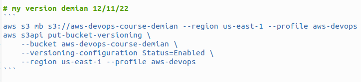
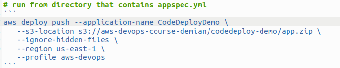

**Add a cover photo like:**

# Create Application for Pipeline

## Introduction

✍️ Today I create an application for my AWS CodeDeploy to run

## Prerequisite

✍️ You should be familiar with how to navigate around AWS

## Use Case

- You can't have a pipeline with out an application to run

## Cloud Research

- Continuing on with AWS Certified DevOps Engineer Professional 2022 course, by Stephane Maarek

### Step 1 — Create Application

Choose Application from the Deploy menu. Give it a name and choose a compute platform

### Step 2 — Create Application

### Step 3 — Create a IAM service role for Deployment

Choose CodeDeploy

### Step 4 — Name the role and Accept

### Step 5 — Create Deployment Group

### Step 6 — Name the Deployment Group

Add service role that you just created.

### Step 7 — Choose In-Place Deployment for now

For now also, just pick Amazon Ec2 instances. Set key value pair of tags, Environment and Development.
Disable load balancing.

### Step 8 — Create Deployment

### Step 9 — Create S3 Bucket

Enter the following commands in the CLI. Change the name to something else.

### Step 10 — Push Appsec and projectfolder.png

### Step 11 — Review Details
If everything looks good create deployment

[linkedin](https://www.linkedin.com/posts/demian-jennings_100daysofcloud-aws-awspipeline-activity-7023484749855772673-YyO6?utm_source=share&utm_medium=member_desktop)
