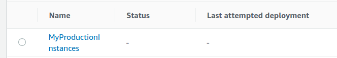

**Add a cover photo like:**

# Deployment Groups and Configurations

## Introduction

✍️ As a Devop Engineer you may want to control how changes are released. For example, you may want to test changes in a dev environment before releasing to production. Also, taking down all the ec2s at once could be detrimental. In that case, you may only want to release changes to ec2 at a certain rate. Hence the need for Groups and Configurations.

## Prerequisite

✍️ Understanding how to navigate the CodePipeline menus

## Use Case

- Controlling what you release.
- Controlling how you release it.

## Cloud Research

- ✍️ Following the Devops course 2022, by Stephae Maarek

### Step 1 —Fix mistake from the day before
This wasn't a mistake as much as I didn't put in the http vs https. Everything from yesterday is working well.

### Step 2 — Launch More Instances to test
From the ec2 menu, right click on the instance and in the Image and template menu choose launch more like this

### Step 3 — Launch 4 instances
choose 4 instances for test purposes

### Step 4 — Add this shell script to details

### Step 5 — Launch

### Step 6 — Create Deployment Group
Click on the application and click Create Deployment Group

### Step 7 — Edit the tags under Environment Variables
Add Production under Environment key

### Step 8 — Name The Deployment and Choose Service Role

### Step 9 — Uncheck Enable load balancing and create deployment group

### Step 10 — Select the MyProductionInstances

### Step 11 — Edit Deployment

### Step 12 — Create Deployment Configuration
We will create a production configurtion

### Step 14 — Name the Configuration and Enter 80 in the value (%)

### Step 15 — Choose the Configuration You just Created

### Step 16 — Save Changes

### Step 17 — Create Deployment

### Step 18 — Deployment Settings
Give it a name

### Step 19 — Create Deployment

### Step 20 — Failed Deployment, need more instances for this to work. For now change configuration

### Step 21 — Edit MyProductionInstance
Choose group instances and click edit

### Step 22 — Change Deployment Settings to One at a time

### Step 23 — Create Deployment

### Step 24 — Change Deployment Settings to One at a time

### Step 25 — Check Settings one more time

### Step 20 — Success

## ☁️ Cloud Outcome

✍️ Overall I learned how and why you need different groups and configurations. This I'm sure will be revisited. I did look at blue/green deployments, but will delve into that more later.

## Next Steps

✍️ Next up taking a closer look at appspec.yml and hooks.

## Social Proof

✍️ Show that you shared your process on Twitter or LinkedIn

[tweet](https://twitter.com/DemianJennings/status/1618112192699854849)

[LinkedIn](https://www.linkedin.com/posts/demian-jennings_100daysofcloud-aws-awspipeline-activity-7023878951970172928-3s4U?utm_source=share&utm_medium=member_desktop)
