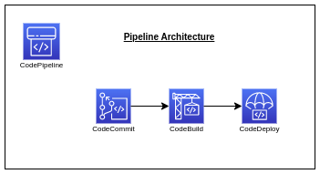
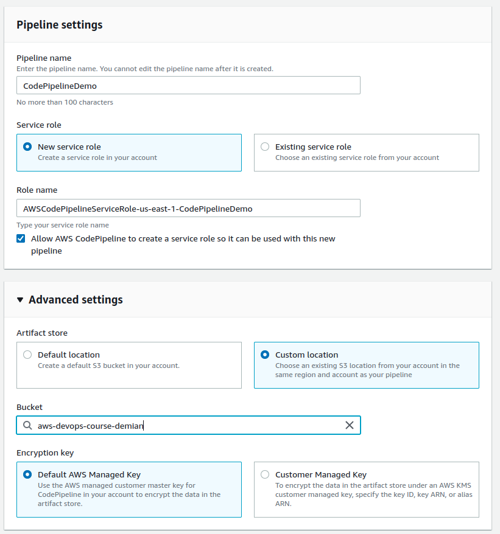

# AWS CodePipeline

## Introduction

✍️ This is the last major step to building an AWS CICD pipeline.

## Prerequisite

✍️ Since AWS Codepipeline is the last step in building an AWS CICD pipeline, you should have your source set up in either CodeCommit maybe Github. You should have Codebuild prepared. Lastly, you should have CodeDeploy and deployments setup.

## Use Case

- Building a CI/CD Pipeline. So as you progress through development and push changes to your repository, that action initiates building and deploying of your changes immmediately in a manner that you safely create.

## Cloud Research

- This is more content from Stefane Maarek, in his udemy AWS Certified Devops course.

### Step 1 — Create a Pipeline
Head over to CodePipeline and click the button create pipeline

### Step 2 — Set your Pipeline Settings
Here I am using an S3 bucket that I previously created, so I don't have a million s3 buckets.

### Step 3 — Summary of Step

Here I set my repository, branch of my repository, and source provider. The rest default settings.

### Step 4 — Skip Build provider (for Now!)

### Step 5 — Deploy Stage
I set my deploy provider and app name

### Step 6 — Review all of your handiwork

### Step 7 — Success!
waa lah!

### Step 8 — Verify the Deployment History

### Step 9 — Verify App on public IP

### Step 10 — Test Pipeline is Working
For this I will make an edit of index.html, save changes on 
the master branch. and verify the pipeline works as intended.
Head over to CodeCommit.

### Step 11 — Edit index.html

### Step 12 — Pipeline in Progress!

### Step 13 — Success again!

### Step 14 — Check History

### Step 15 — Check Webpage for change

### Step 16 — Review Cloudwatch Rules

## ☁️ Cloud Outcome

✍️ Overall, it was a success. It seemed like it took me awhile to get to 
this point, but in reality it wasn't that hard. Actually, this phase was the
easiest.

## Next Steps

✍️ There are a little of settings and ways to tweak CodePipeline. So I will explore that.

## Social Proof

✍️ Show that you shared your process on Twitter or LinkedIn

[twitter](https://twitter.com/DemianJennings/status/1622808950348345344)
[LinkedIn](https://www.linkedin.com/posts/demian-jennings_100daysofcloud-aws-pipeline-activity-7028575503993196544-rAJJ?utm_source=share&utm_medium=member_desktop)

