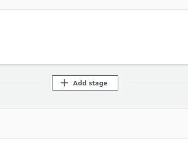
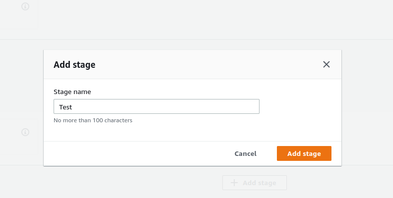

# AWS CodeBuild

## Introduction

✍️ In today's hour I add tests to my pipeline. Now its starting to look like a complete CICD pipeline

## Prerequisite

✍️ At this point I have a functioning pipeline, I am just adding Tests. 

## Use Case

- 🖼️ You do not want to release untested code out to production, so this is when you can integrate unit tests, to insure nothing is broken.

## Cloud Research

- ✍️ I'm following Stephane Maarek, Udemy's AWS Devops course 2022

### Step 1 — Edit Pipeline

### Step 2 — Add Stage
In between Source and Deploy stages click the Add stage button

### Step 3 — Add Test Stage

### Step 4 — Add action group to stage
Select an action provider. There are many options but for now we will choose CodeBuild. Also select SourceArtifact, project name(MyWebAppMaster), and for Output artifacts for now enter TestResults.

### Step 5 — New Test Stage
We can continue to add stages. If they are added side by side, they are considered parallel stages and they will be executed at the same time. If they are added beneath then they are considered sequential and will be executed one at a time. Click done and save.

### Step 6 — Select Release Change
The pipeline will be triggered

### Step 7 — Build History
Our build has failed. This is due to IAM permissions. This can be viewed in phase details under build logs.

### Step 8 — Add Permissions in IAM
Under roles in IAM, search for codebuild and we will edit those permissions.

### Step 9 — Edit the CodeBuild base policy, S3
The S3 is to restrictive. select the codebuildbasepolicy and then S3. In the visual editor change the resource to any. That's way to permissive, in real production you would want least privileges to apply but for now check any and review policy and save.

### Step 10 — Test the pipeline again
Head to CodePipeline, select the pipeline and click Retry.

### Step 11 — Successful Build

### Step 12 — Make a change in CodeCommit
We want to make a change in codeCommit and test the whole pipeline. I will change Congratulations to Error, I expect it to fail. Then I will change it back. Reminder Our test is testing for the word Congratulations.

### Step 13 — Expected Failure

### Step 14 — Change it Back an rerun

## ☁️ Cloud Outcome

✍️ I learned how to integrate a crucial part of the pipeline, Tests!

## Next Steps

✍️ How to handle artifacts, manual approval, stage actions, sequential vs parallel.

## Social Proof

[tweet](https://twitter.com/DemianJennings/status/1623118448791285761)
[linkedIn](https://www.linkedin.com/posts/demian-jennings_100daysofcloud-aws-awscloud-activity-7028884724647362561-jWjX?utm_source=share&utm_medium=member_desktop)
