# Add Manual Approval Steps

## Introduction

✍️ In this day we study how to add extra manual approval steps to the CodePipeline.

## Prerequisite

✍️ This pipeline has been built previously, so you should have that. Otherwise, you need to generally know how to manuever around AWS.

## Use Case

- 🖼️ In these examples, I add parallel and sequential steps to the CodePipeline, and include a manual approval step as one final check before code is released to production.

## Cloud Research

- ✍️ The source of this material is from Stephane maarek's course AWS Devops 2022. This pipeline was completed in previous days. Those are in my repository.

### Step 1 — Edit Deploy Stage

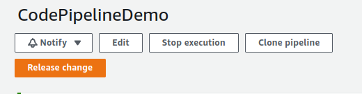

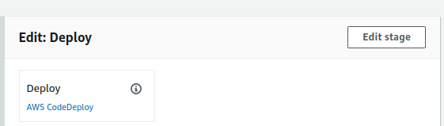

### Step 2 — Add parallel action

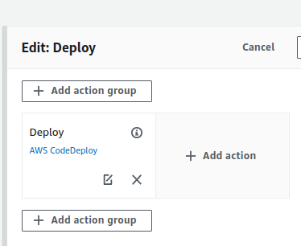

### Step 3 — Edit actions
So now when it does deploy it will upload to S3 at the same time
Click Done and Save

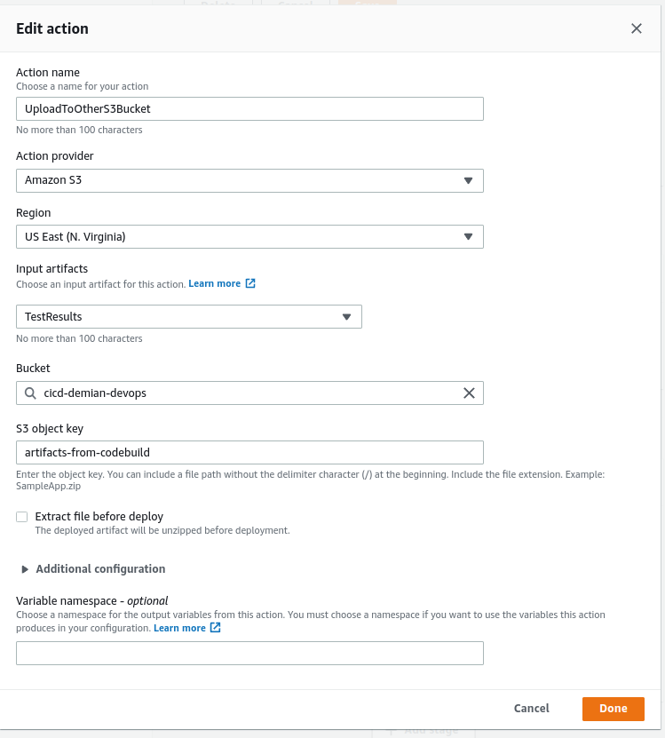

### Step 4 — Test by making a change in codeCommit repository

### Step 5 — Edit the index.html file in CodeCommit. Change V10 to V11.

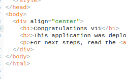

### Step 6 — Commit Changes

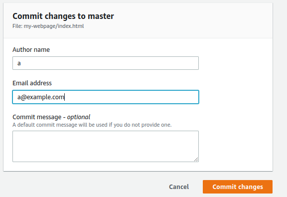

### Step 7 — Upload to other S3 Successful

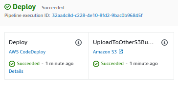

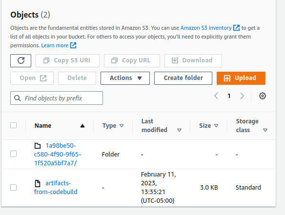

### Step 8 — Add Manual Approval Stage

Add a sequential step after deploy. This will be our deploy to production stage.

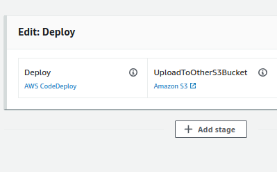

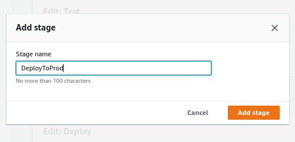

### Step 9 — Add Action Group

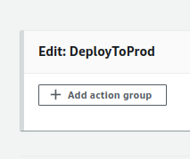

### Step 10 — Make Edits to depoly to MyProductionInstances

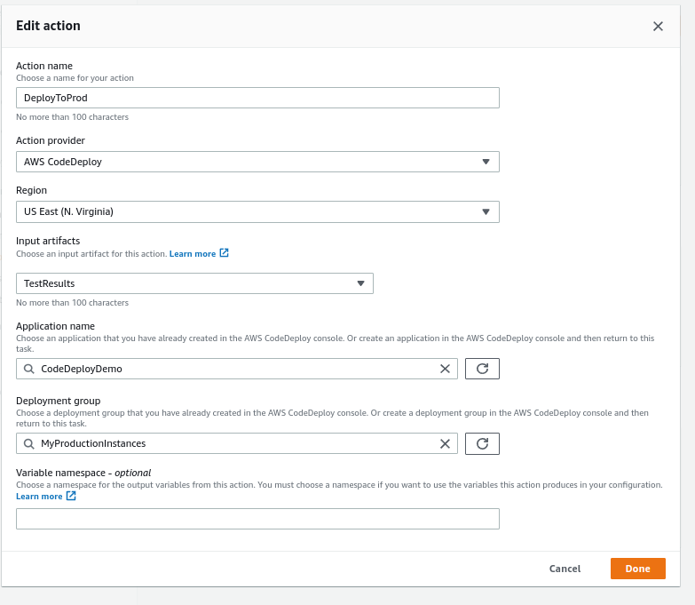

### Step 11 — Add Action group Above DeployToProd

This is where we will add a manual approval steps. To verify changes before they are released to production.

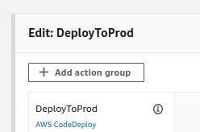

### Step 12 — Edit Action

Here we set up the manual steps. Provide the optional steps of sending an sns topic and providing the dev url to review before releasing changes to Production.

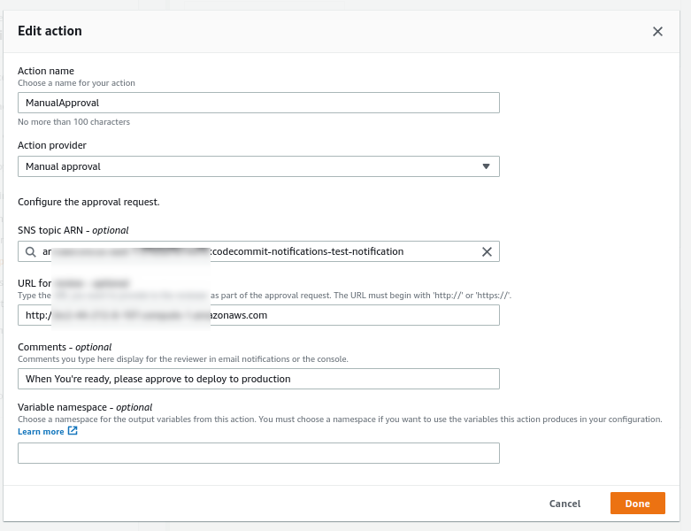

### Step 13 — Click done, save and release change

Now when before changes are released to production they will have to be manually approved

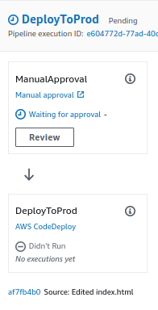

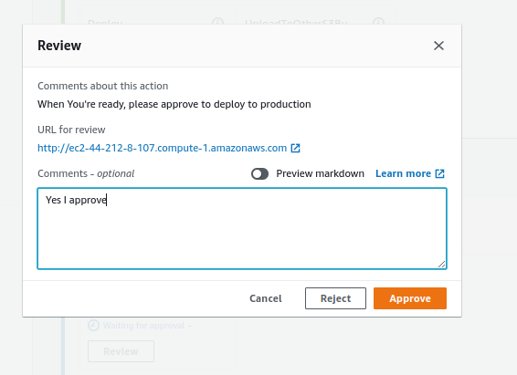

## ☁️ Cloud Outcome

✍️ This was an important step to learn. It's a way to implement checks and balances. Also, it shows the difference between parallel and sequential stages.

## Next Steps

✍️ What ever is left to learn from Codepipeline.

## Social Proof

✍️ Show that you shared your process on Twitter or LinkedIn

[twitter](https://twitter.com/DemianJennings/status/1624524775157628930)

[linkedin](https://www.linkedin.com/posts/demian-jennings_100daysofcloud-aws-awscloud-activity-7030290868368498688-AWBu?utm_source=share&utm_medium=member_desktop)
