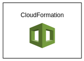

# CloudFormation Basics

## Introduction

✍️ For the foreseable future, I will be diving headfirst into cloud formation. CloudFormation is a way to create infrastructure as code.

## Prerequisite

✍️ A general familiarity of how to navigate AWS.

## Use Case

- Cloud Formation is a great clean way to build infrastructure as well as take it down cleanly. Most AWS services can be created with cloud formation.

## Cloud Research

- AWS Devops by Stephane Maarek.

### Step 1 — Select Create Stack
Head over to CloudFormation and select "Create stack" with new resources.

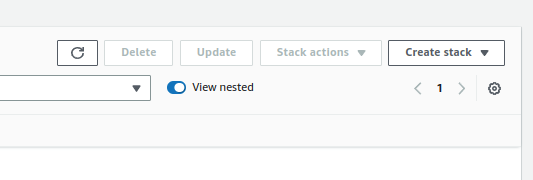

### Step 2 — Upload Template
This first template was provided as part of the course materials from the Devops course. Upload and press Next.

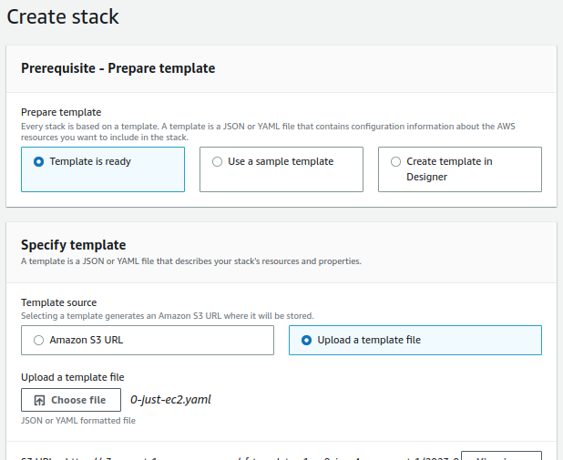

### Step 3 — Name your Template

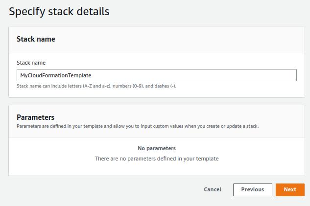

### Step 4 — Accept Default Options

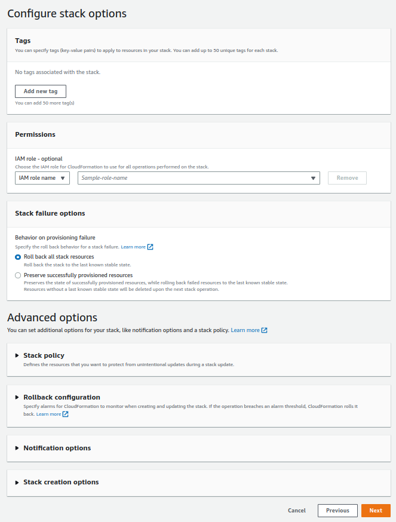

### Step 5 — Review Your Options
Review your options and select Submit

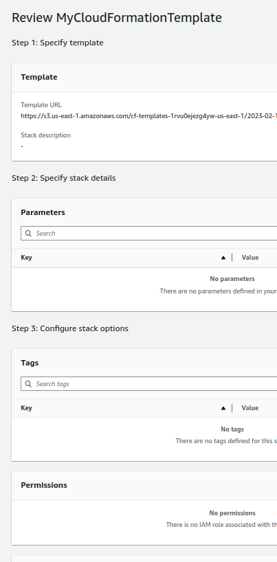

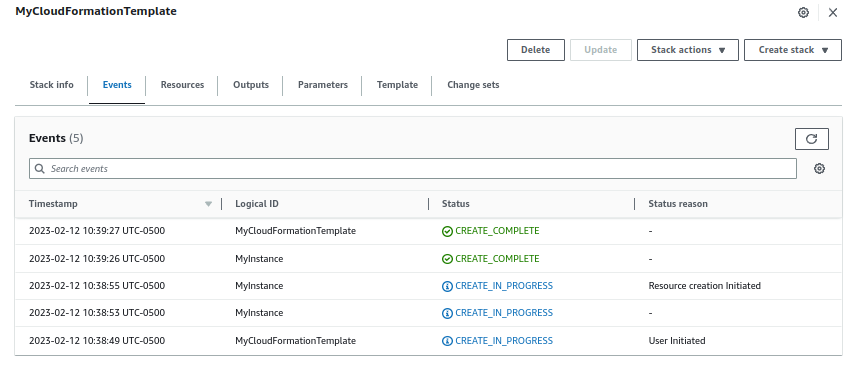

### Step 6 — Stack is Created
The stack was successfully created, however over time you may want to update or delete the stack. We will update the stack with extra security groups and elastic IP. Click on Update from main dashboard.

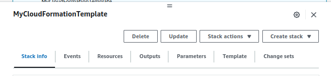

### Step 7 — Replace Current Template

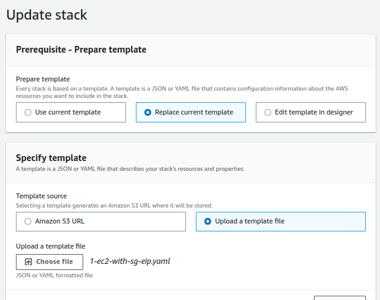

### Step 8 — Describe Security group
I'll add a description and accept the next page options for stack options.

### Step 9 — Preview the changes
The changes are previewed. Everything looks ok, I'll submit

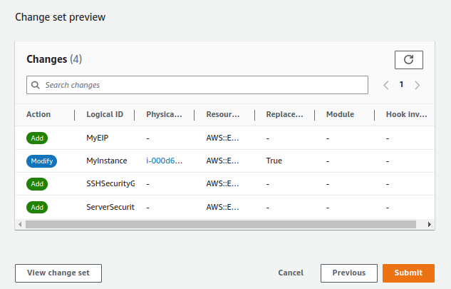

### Step 10 — Changes in progress

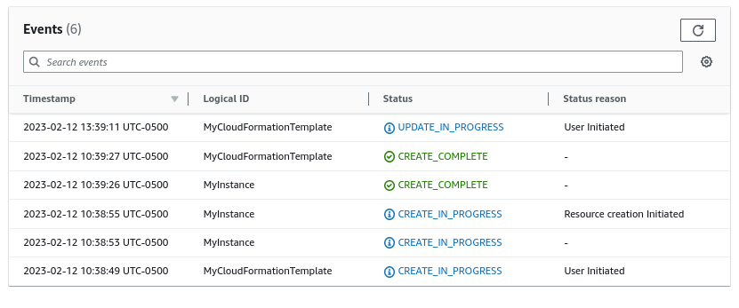

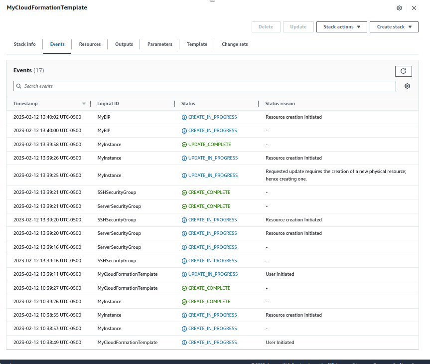

### Step 11 — Delete the stack
Everything looks good, however if we to delete the stack and all of its recources it's as easy as deleting the stack in Stackformation.

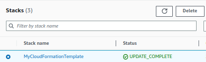

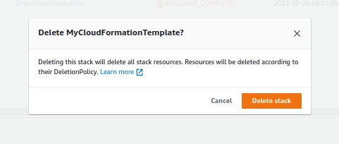

## ☁️ Cloud Outcome

✍️ Cloud formation is very powerful, and I am just scratching the service. This was a good introduction.

## Next Steps

✍️ Keep Diving Deep!!!

## Social Proof

✍️ Show that you shared your process on Twitter or LinkedIn

[Twitter](https://twitter.com/DemianJennings/status/1624858467335823361)
[LinkedIn](https://www.linkedin.com/posts/demian-jennings_100daysofcloud-devops-infrastructure-activity-7030624514073886721-9rEQ?utm_source=share&utm_medium=member_desktop)
