# Cloud Formation User Data

## Introduction

✍️ In this day in the cloud. I explore passing user data in different ways.

## Prerequisite

✍️ Know how to navigate AWS

## Use Case

- 🖼️ Including user data into cloud formation. In this session I will go over several ways to include user data into your cloud formation

## Cloud Research

- I'm following the tutorials from Stephane Maarek, AWS Devops

## User Data through Bash Script

✍️ In the first example, under the UserData section in our yml and as a value to Fn::Base64 we input userdata through a bash script.

### Step 1 — Create a Stack
Head over to cloudFormation and click create stack
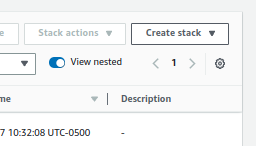

### Step 2 — Upload from template
Draw your attention closer to the vertical pipe in the userdata section. The Pipe enables multiline input, it makes it one giant string.

```
---
Parameters:
  SSHKey:
    Type: AWS::EC2::KeyPair::KeyName
    Description: Name of an existing EC2 KeyPair to enable SSH access to the instance

Resources:
  MyInstance:
    Type: AWS::EC2::Instance
    Properties:
      AvailabilityZone: us-east-1a
      ImageId: ami-009d6802948d06e52
      InstanceType: t2.micro
      KeyName: !Ref SSHKey
      SecurityGroups:
        - !Ref SSHSecurityGroup
      # we install our web server with user data
      UserData: 
        Fn::Base64: |
          #!/bin/bash -xe
          yum update -y
          yum install -y httpd
          systemctl start httpd
          systemctl enable httpd
          echo "Hello World from user data" > /var/www/html/index.html

  # our EC2 security group
  SSHSecurityGroup:
    Type: AWS::EC2::SecurityGroup
    Properties:
      GroupDescription: SSH and HTTP
      SecurityGroupIngress:
      - CidrIp: 0.0.0.0/0
        FromPort: 22
        IpProtocol: tcp
        ToPort: 22
      - CidrIp: 0.0.0.0/0
        FromPort: 80
        IpProtocol: tcp
        ToPort: 80
```

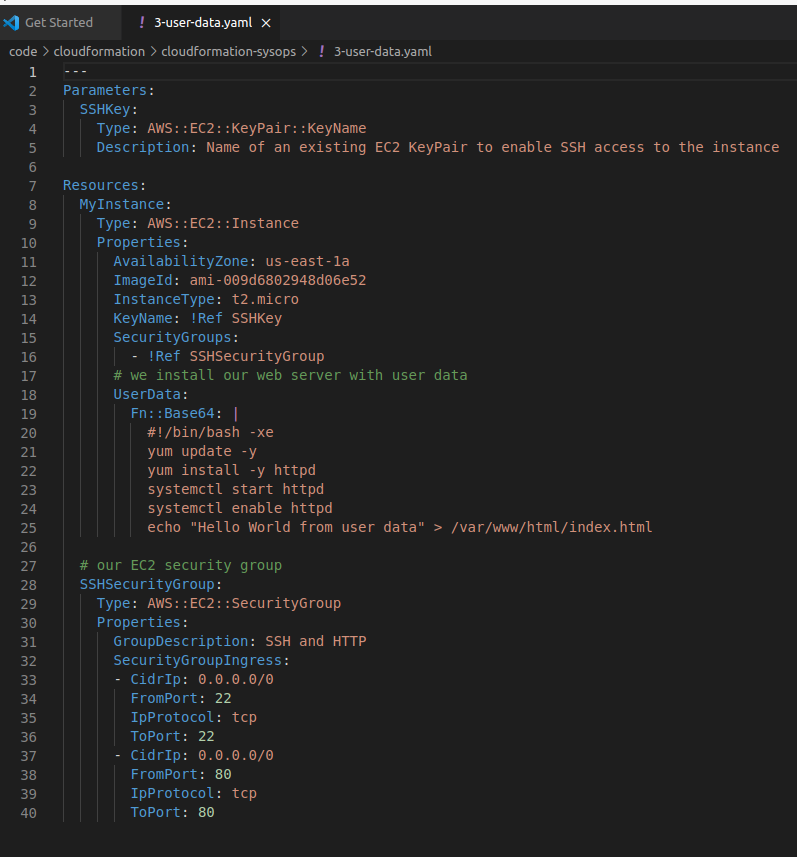

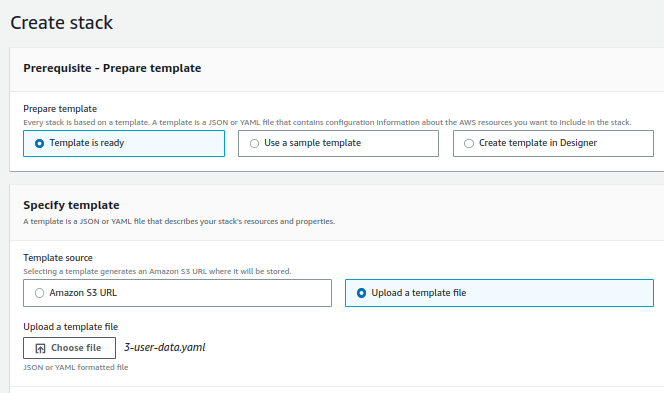

### Step 3 — Set Stack details
Give it a name and an ssh key pair. If you don't have a key pari set one up in the ec2

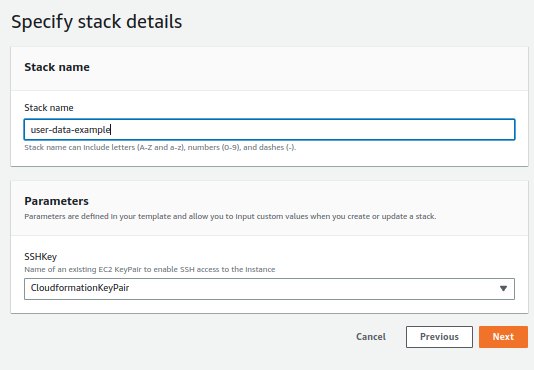

### Step 4 — Accept the rest of the options
Accept the defaults and click next and then submit

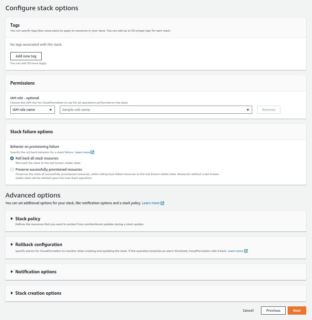

### Step 5 — Result, review progress

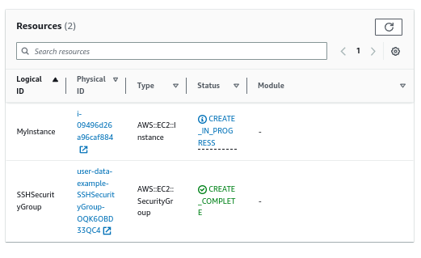

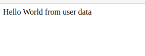

### Step 6 — Success

review the logs by connecting to by ssh into instance. Enter this in the shell
```sudo cat /var/log/cloud-init-output.log```
The cloudformation worked regardless of user init. Which may be something we want to address later.

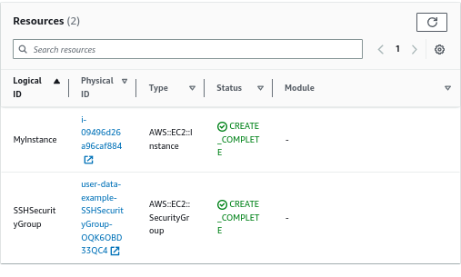

### Step 7 — Delete stack

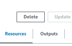

### Step 8 — cfn-init
```AWS::CloudFormation::Init```
Makes complex cloudformation readable. The EC2 instance eill query CloudFormation service to get init data. Logs will go to /var/log/cfn-init.log

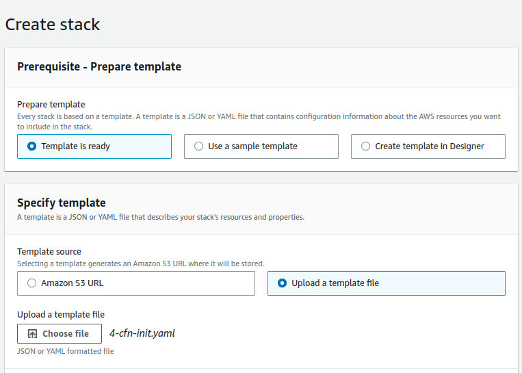

### Step 9 — Explanation
In this example, we are using a Metadata section, to pass data in. As scripts get more complicated, this will give us a more readable yml file.
```
---
Parameters:
  SSHKey:
    Type: AWS::EC2::KeyPair::KeyName
    Description: Name of an existing EC2 KeyPair to enable SSH access to the instance

Resources:
  MyInstance:
    Type: AWS::EC2::Instance
    Properties:
      AvailabilityZone: us-east-1a
      ImageId: ami-009d6802948d06e52
      InstanceType: t2.micro
      KeyName: !Ref SSHKey
      SecurityGroups:
        - !Ref SSHSecurityGroup
      # we install our web server with user data
      UserData: 
        Fn::Base64:
          !Sub |
            #!/bin/bash -xe
            # Get the latest CloudFormation package
            yum update -y aws-cfn-bootstrap
            # Start cfn-init
            /opt/aws/bin/cfn-init -s ${AWS::StackId} -r MyInstance --region ${AWS::Region} || error_exit 'Failed to run cfn-init'
    Metadata:
      Comment: Install a simple Apache HTTP page
      AWS::CloudFormation::Init:
        config:
          packages:
            yum:
              httpd: []
          files:
            "/var/www/html/index.html":
              content: |
                <h1>Hello World from EC2 instance!</h1>
                <p>This was created using cfn-init</p>
              mode: '000644'
          commands:
            hello:
              command: "echo 'hello world'"
          services:
            sysvinit:
              httpd:
                enabled: 'true'
                ensureRunning: 'true'

  # our EC2 security group
  SSHSecurityGroup:
    Type: AWS::EC2::SecurityGroup
    Properties:
      GroupDescription: SSH and HTTP
      SecurityGroupIngress:
      - CidrIp: 0.0.0.0/0
        FromPort: 22
        IpProtocol: tcp
        ToPort: 22
      - CidrIp: 0.0.0.0/0
        FromPort: 80
        IpProtocol: tcp
        ToPort: 80
```

### Step 10 — Load up this yml file as a template
Repeat the previous steps to make a stack. Verify the public IP (remember to cal http not https). The ssh into the ec2


### Step 11 — Check the Logs
``` sudo cat /var/log/cfn-init.log ```

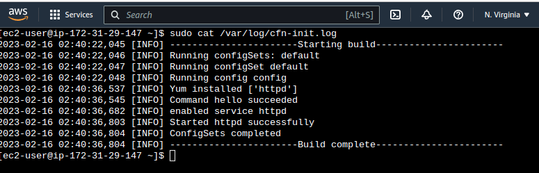

### Step 12 — cfn-signal and wait conditions
The instance is still be created whether the cfn-init worked or not. We will fix that now using cfn-signal and wait. In the following code we add a cfn-signal and wait condition. 

```
---
Parameters:
  SSHKey:
    Type: AWS::EC2::KeyPair::KeyName
    Description: Name of an existing EC2 KeyPair to enable SSH access to the instance

Resources:
  MyInstance:
    Type: AWS::EC2::Instance
    Properties:
      AvailabilityZone: us-east-1a
      ImageId: ami-009d6802948d06e52
      InstanceType: t2.micro
      KeyName: !Ref SSHKey
      SecurityGroups:
        - !Ref SSHSecurityGroup
      # we install our web server with user data
      UserData: 
        Fn::Base64:
          !Sub |
            #!/bin/bash -xe
            # Get the latest CloudFormation package
            yum update -y aws-cfn-bootstrap
            # Start cfn-init
            /opt/aws/bin/cfn-init -s ${AWS::StackId} -r MyInstance --region ${AWS::Region}
            # Start cfn-signal to the wait condition
            /opt/aws/bin/cfn-signal -e $? --stack ${AWS::StackId} --resource SampleWaitCondition --region ${AWS::Region}
    Metadata:
      Comment: Install a simple Apache HTTP page
      AWS::CloudFormation::Init:
        config:
          packages:
            yum:
              httpd: []
          files:
            "/var/www/html/index.html":
              content: |
                <h1>Hello World from EC2 instance!</h1>
                <p>This was created using cfn-init</p>
              mode: '000644'
          commands:
            hello:
              command: "echo 'hello world'"
          services:
            sysvinit:
              httpd:
                enabled: 'true'
                ensureRunning: 'true'

  SampleWaitCondition:
    CreationPolicy:
      ResourceSignal:
        Timeout: PT2M
        Count: 1
    Type: AWS::CloudFormation::WaitCondition

  # our EC2 security group
  SSHSecurityGroup:
    Type: AWS::EC2::SecurityGroup
    Properties:
      GroupDescription: SSH and HTTP
      SecurityGroupIngress:
      - CidrIp: 0.0.0.0/0
        FromPort: 22
        IpProtocol: tcp
        ToPort: 22
      - CidrIp: 0.0.0.0/0
        FromPort: 80
        IpProtocol: tcp
        ToPort: 80
```

## ☁️ Cloud Outcome

✍️ (Result) Describe your personal outcome, and lessons learned.

## Next Steps

✍️ Describe what you think you think you want to do next.

## Social Proof

✍️ Show that you shared your process on Twitter or LinkedIn

[twitter](https://twitter.com/DemianJennings/status/1626069950778441730)

[linkedin](https://www.linkedin.com/posts/demian-jennings_100daysofcloud-aws-awscloud-activity-7031836128454299648-YpVu?utm_source=share&utm_medium=member_desktop)
