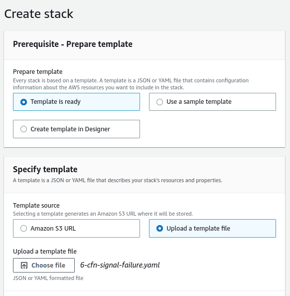
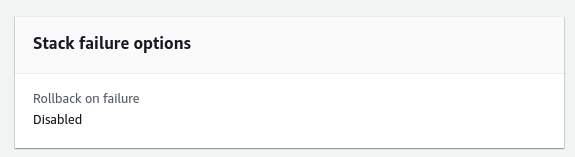

# Rollback and Nested CloudFormation

## Introduction

✍️ I explore two topics rollbacks and nested. When creating CloudFormation we have have different options with rollbacks where we can control what happens in the event of failures. Basically, we have three options rollback, do nothing and delete. Nesting allows us to use other cloudformations in our cloudformation.

## Prerequisite

✍️ Besides just general AWS navigation skills, you should have knowledge on how to work with yaml files. You should know how to use ssh and how to set up keys. Since, I'm getting into the details of cluodformation, you should know how to create a cloudFormation stack

## Use Case

- 🖼️ If you want to control events in case of failure. Perhaps you want to troubleshoot rather than destroy the stack. As for, nested cloudformation, the idea is you have built a great running stack, there's no sense in copy and pasting or reinvent the wheel.

## Cloud Research

- ✍️ I'm following the udemy course of Stefane Maarek, AWS Devops.

## Try yourself

### Step 1 — Upload Yaml file
For this is example I will use the 6-cfn-signal-failure.yaml file

```
---
Parameters:
  SSHKey:
    Type: AWS::EC2::KeyPair::KeyName
    Description: Name of an existing EC2 KeyPair to enable SSH access to the instance

Resources:
  MyInstance:
    Type: AWS::EC2::Instance
    Properties:
      AvailabilityZone: us-east-1a
      ImageId: ami-009d6802948d06e52
      InstanceType: t2.micro
      KeyName: !Ref SSHKey
      SecurityGroups:
        - !Ref SSHSecurityGroup
      # we install our web server with user data
      UserData: 
        Fn::Base64:
          !Sub |
            #!/bin/bash -xe
            # Get the latest CloudFormation package
            yum update -y aws-cfn-bootstrap
            # Start cfn-init
            /opt/aws/bin/cfn-init -s ${AWS::StackId} -r MyInstance --region ${AWS::Region}
            # Start cfn-signal to the wait condition
            /opt/aws/bin/cfn-signal -e $? --stack ${AWS::StackId} --resource SampleWaitCondition --region ${AWS::Region}
    Metadata:
      Comment: Install a simple Apache HTTP page
      AWS::CloudFormation::Init:
        config:
          packages:
            yum:
              httpd: []
          files:
            "/var/www/html/index.html":
              content: |
                <h1>Hello World from EC2 instance!</h1>
                <p>This was created using cfn-init</p>
              mode: '000644'
          commands:
            hello:
              command: "echo 'boom' && exit 1"
          services:
            sysvinit:
              httpd:
                enabled: 'true'
                ensureRunning: 'true'

  SampleWaitCondition:
    CreationPolicy:
      ResourceSignal:
        Timeout: PT1M
        Count: 1
    Type: AWS::CloudFormation::WaitCondition

  # our EC2 security group
  SSHSecurityGroup:
    Type: AWS::EC2::SecurityGroup
    Properties:
      GroupDescription: SSH and HTTP
      SecurityGroupIngress:
      - CidrIp: 0.0.0.0/0
        FromPort: 22
        IpProtocol: tcp
        ToPort: 22
      - CidrIp: 0.0.0.0/0
        FromPort: 80
        IpProtocol: tcp
        ToPort: 80


```
This file is designed to fail, so we can test our options.

### Step 2 — Create New Stack with template



### Step 3 — Disable Rollback


### Step 4 — Review Options



### Step 5 — Stack Failed
As expected the stack failed. But now, with rollback disabled. We can go back in and troubleshoot the problem


### Step 6 — Connect to EC2 and review logs


### Step 7 — View Logs
```
sudo cat /var/log/cfn-init.log
```


### Step 8 — Fix the issue or delete the stack
Now that we have identified the failure, we can fix the issue. For now I'll delete the stack

---
## Nested Stacks
-   Nested stacks are stacks as part of other stacks
-   They allow you to isolate repeated patterns / common components in separate stacks and call them from other stacks
-   Nested stacks sre considered best practice
-   To update a nested stack, always update the parent (root stack) 

### Step 1 — Create Stack from template
Below is my parent stack. 
Keys to focus on are:
&nbsp;&nbsp;&nbsp;&nbsp;The Type should be AWS::CloudFormation::Stack
&nbsp;&nbsp;&nbsp;&nbsp;and it needs to have a TemplateURL(That's the nested stack)
```
Parameters:
  SSHKey:
    Type: AWS::EC2::KeyPair::KeyName
    Description: Name of an existing EC2 KeyPair to enable SSH access to the instance
  
Resources:
  myStack:
    Type: AWS::CloudFormation::Stack
    Properties:
      TemplateURL: https://s3.amazonaws.com/cloudformation-templates-us-east-1/LAMP_Single_Instance.template
      Parameters:
        KeyName: !Ref SSHKey
        DBName: "mydb"
        DBUser: "user"
        DBPassword: "pass"
        DBRootPassword: "passroot"
        InstanceType: t2.micro
        SSHLocation: "0.0.0.0/0"

Outputs:
  StackRef:
    Value: !Ref myStack
  OutputFromNestedStack:
    Value: !GetAtt myStack.Outputs.WebsiteURL
```


### Step 2 — Name the Nested Stack
and add ssh key if you wish. Click next on stack options. 


### Step 3 — Acknowledge Capabilities
and add ssh key if you wish. Click next on stack options. 


### Step 4 — Both Stacks in progress
and add ssh key if you wish. Click next on stack options. 
When completed review it and if satisfied delete it the parent and the nested stack will automatically get deleted too.

## ☁️ Cloud Outcome

✍️ As we go deeper into the CloudFormation rabbit hole, we are learning how to control what happens in the event of success or failure. As far as nested cloudformation, I love this capability because once you finetune a cloudFormation, you can add that stack without rewriting it or cut and paste.

## Next Steps

✍️ I will continue to go deeper in the rabbit hole. Probably, changesets, deletionpolicy, terminationProtection.

## Social Proof

✍️ Show that you shared your process on Twitter or LinkedIn

[twitter](https://twitter.com/DemianJennings/status/1626710025044389888)
[linkedin](https://www.linkedin.com/posts/demian-jennings_100daysofcloud-activity-7032475935878578176-SDK7?utm_source=share&utm_medium=member_desktop)