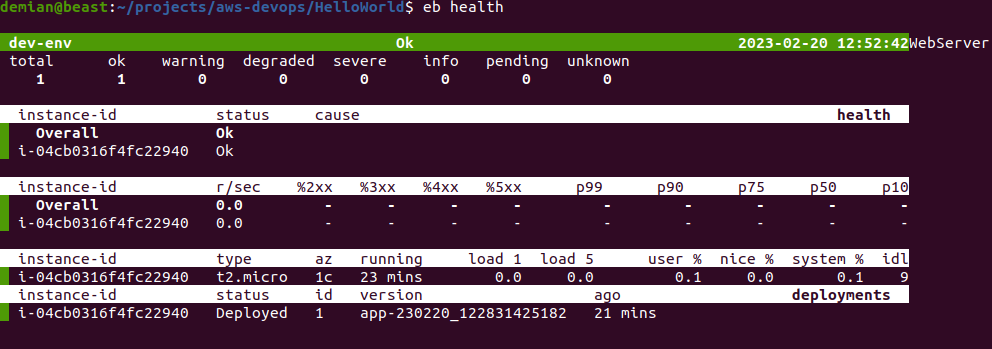
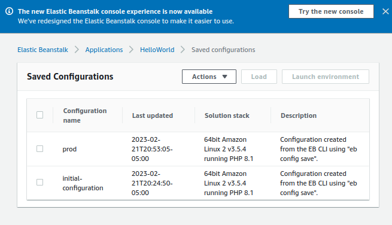

# Elastic Beanstalk

## Introduction

✍️ Elastic Beanstalk is a service for deploying and scaling web applications and services. Upload your code and Elastic Beanstalk automatically handles the deployment—from capacity provisioning, load balancing, and auto scaling to application health monitoring.

## Prerequisite

✍️ General AWS skills. 

## Use Case

- 🖼️ If you want to have a structure set up automatically with everything that you might need use elastic beanstalk.

## Cloud Research

- ✍️ My source material is from Stephane Maarek's, AWS Devops course on udemy.


### Step 1 — Install ebcli
from the command line install Elastic Beanstalk CLI

```
pip install awscli --upgrade --user
```

verify installation by typing
```
eb
```
 you should say all available commands
### Step 2 — Create a project
```
mkdir HelloWorld
cd HelloWorld
eb init
```
follow all of the prompts, region, Application Name, PHP, and SSh keys

```
echo "Hello World" > index.html
eb create dev-env
```


### Step 3 — View Appliction

to view:
```
eb open
```


### Step 4 — What did we make

to view:
```
eb open
```

### Step 5 — eb status

to view:
```
eb open
```


### Step 6 — eb health

to view:
```
eb open
```



### Step 7 — eb health --refresh
will refresh every 10 seconds
to view:
```
eb open
```


### Step 8 — eb logs
views all the logs
to view:
```
eb open
```


### Step 9 — Saved Configurations
allows to quickly reproduce an elastic beanstalk
The first step is to backup the current dev configuration
```
eb config save dev-env --cfg initial-configuration
```
That command will create a saved_configs directory and a initial-cofiguration.cfg.yml


### Step 10 — Save Environment Variable

```
eb setenv ENABLE_COOL_NEW_FEATURE=true
```


### Step 11 — Save New State
We will now save our config from the current state
```
eb config save dev-env --cfg prod
```
That will save the config in prod.cfg.yml




### Step 12 — Modifying a config
What if we would like to make a change? We will do the following:
- add an environment variable
- add auto scaling rules
Add this on the bottom of the OptionSettings section.
```
  AWSEBAutoScalingScaleUpPolicy.aws:autoscaling:trigger:
    UpperBreachScaleIncrement: '2'
  AWSEBCloudwatchAlarmLow.aws:autoscaling:trigger:
    LowerThreshold: '20'
    MeasureName: CPUUtilization
    Unit: Percent
  AWSEBCloudwatchAlarmHigh.aws:autoscaling:trigger:
    UpperThreshold: '50'
```

### Step 13 — Update config
then update the saved prod configuration
```
eb config put prod
```

### Step 14 — Apply config
then update the saved prod configuration
```
eb config dev-env --cfg prod
```

## ☁️ Cloud Outcome

✍️ I personally like how you can have everything you need in application. It's a great way to build especially if you are inexperienced with AWS

## Next Steps

✍️ There's more to learn about different configurations with elastic beanstalk

## Social Proof

✍️ Show that you shared your process on Twitter or LinkedIn

[Twitter](https://twitter.com/DemianJennings/status/1628226285662085121)
[linkedin](https://www.linkedin.com/posts/demian-jennings_100daysofcloud-aws-cloud-activity-7033992567767650304-DS6z?utm_source=share&utm_medium=member_desktop)