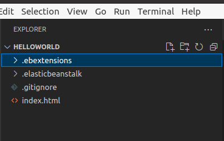

# Changing elastic beanstalk configurations with ebextensions

## Introduction

✍️ Change configurations using ebextensions

## Prerequisite

✍️ You should have an understanding of how elastic beanstalk works, because here we are looking at modifying it and extending it.

## Use Case

- 🖼️ This is different way to change the configuration. It has the added benefit of being able to incorporate cloudformation commands in it.

## Cloud Research

- ✍️ My source material is the AWS Devops course on udemy, from Stephane Maarek.


### Step 1 — Create a folder in HelloWorld dir
create a folder called .ebextensions
These will be files that gets run by elastic beanstalk to configure.



### Step 2 — Copy config file into HelloWorld directory
So when this beanstalk gets deployed, this config file will change the autoscaling options.

01-autoscaling.config

```
# we can also update configs using .ebextensions
# See here for precedence: https://docs.aws.amazon.com/elasticbeanstalk/latest/dg/command-options.html#configuration-options-precedence

option_settings:
  # See: https://docs.aws.amazon.com/elasticbeanstalk/latest/dg/command-options-general.html#command-options-general-autoscalingasg 
  aws:autoscaling:asg:
    MinSize: 1
    MaxSize: 10
    Cooldown: 240

  # See: https://docs.aws.amazon.com/elasticbeanstalk/latest/dg/command-options-general.html#command-options-general-autoscalinglaunchconfiguration
  aws:autoscaling:launchconfiguration:
    InstanceType: t2.micro
    # ImageId: ...
    # SecurityGroups: ...
    # InstanceIamProfile: ....


# This format works too:
# option_settings:
#   - namespace:  namespace
#     option_name:  option name
#     value:  option value

# See: https://docs.aws.amazon.com/elasticbeanstalk/latest/dg/ebextensions-optionsettings.html
```

### Step 3 — Deploy changes

To deploy changes
```
eb deploy
```

### Step 4 — Add DynamoDB and SNS to beanstalk
To do this will add cloudformation commands to beanstalk
In the .ebextensions directory, I will add a new config file, 02-dynamodb.config

```

Resources:
  DynamoDBTable:
    Type: AWS::DynamoDB::Table
    Properties:
      KeySchema:
         HashKeyElement:
           AttributeName: id
           AttributeType: S
      # create a table with the least available rd and wr throughput
      ProvisionedThroughput:
         ReadCapacityUnits: 1
         WriteCapacityUnits: 1

  NotificationTopic:
    Type: AWS::SNS::Topic

Outputs:
  NotificationTopicArn:
    Description: Notification topic ARN
    Value: { "Ref" : "NotificationTopic" }

option_settings:
  aws:elasticbeanstalk:application:environment:
    # these are assigned dynamically during a deployment
    NOTIFICATION_TOPIC: '`{"Ref" : "NotificationTopic"}`'
    DYNAMODB_TABLE: '`{"Ref" : "DynamoDBTable"}`'
    AWS_REGION: '`{"Ref" : "AWS::Region"}`'

# ssh onto the instance and run:
# /opt/elasticbeanstalk/bin/get-config environment
# /opt/elasticbeanstalk/bin/get-config environment -k NOTIFICATION_TOPIC
# /opt/elasticbeanstalk/bin/get-config environment -k DYNAMODB_TABLE
# /opt/elasticbeanstalk/bin/get-config optionsettings
```

### Step 6 — In the terminal run eb deploy

```
eb deploy
```

## ☁️ Cloud Outcome

✍️ Overall, I like the flexibility of the elastic beanstalk. ebextensions gives you the power of incorporating cloudformation commands. I did have problems with error messages calling for a compose.json. Still not totally clear on the solution.

## Next Steps

✍️ There's more juice to squeeze out of this. I'm going deeper into elastic beanstalk.

## Social Proof

[twitter](https://twitter.com/DemianJennings/status/1628972818791649280)
[linkedin](https://www.linkedin.com/posts/demian-jennings_100daysofcloud-aws-awscloud-activity-7034738888673816577-O82Z?utm_source=share&utm_medium=member_desktop)
