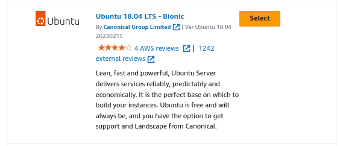
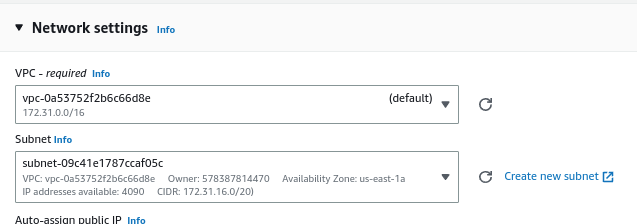
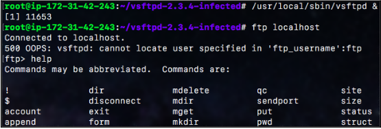
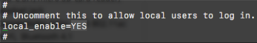

# Create a Vulnerable Ubuntu Instance

## Introduction

✍️ As part of my pentest lab I need a vulnerable machine for educational purpose

## Prerequisite

✍️ Know how to create an ec2, have general linux skills

## Use Case

- 🖼️ If you are building a lab , you will need a target. This is the target.

## Cloud Research

- ✍️ My source of material was the text hands on AWS Penetration Testing with Kali linux

## Try yourself

✍️ Head over to ec2

### Step 1 — Select Ubuntu instance
For this I'm choosing 18.04. Select it and press continue



### Step 2 — Select Edit on the Network Settings
Note the vpc and subnet. For subnet you willl have to click the box and choose one. Tghen deploy the ec2



### Step 3 — SSH into instance


### Step 4 — Update & Upgrade
```
sudo apt-get update && sudo apt-get dist-upgrade
```

### Step 5 — Clone Vulnerable Service

```
git clone https://github.com/nikdubois/vsftpd-2.3.4-infected.git
```

### Step 6 — Install Build-Essential
```
sudo apt-get install build-essential
```

### Step 7 — Edit Makefile

cd into the vsftpd folder and edit the makefile, adding the -lcrypt value.

### Step 8 — Run Make command
```
make
```

### Step 9 — Add a user
```
useradd nobody
mkdir /usr/share/empty
```


### Step 10 — Run the Installation

```
sudo cp vsftpd /usr/local/sbin/vsftpd
sudo cp vsftpd.8 /usr/local/man/man8
sudo cp vsftpd.conf.5 /usr/local/man/man5
sudo cp vsftpd.conf /etc

```

### Step 11 — Switch to root
```
sudo su
/usr/local/sbin/vsftpd &
```

### Step 12 — verify you can connect to localhost

```
ftp localhost
```
This froze my terminal and I shut it down and come back in.



### Step 13 — As sudo su enter these commands

```
mkdir /var/ftp/
useradd -d /var/ftp ftp
chown root:root /var/ftp
chmod og-w /var/ftp
```

### Step 14 — Edit /etc/vsftpd.conf
```
ftp localhost
```




## ☁️ Cloud Outcome

✍️ Overall, it seems that it was successful. I had to implement sudo a couple times. I'll really find out once I start doing penetration tests.

## Next Steps

✍️ Make a vulnerable windows machine

## Social Proof

[twitter](https://twitter.com/DemianJennings/status/1629387468695797761)
[link](https://www.linkedin.com/posts/demian-jennings_100daysofcloud-aws-awscloud-activity-7035153552121466880-m4O2?utm_source=share&utm_medium=member_desktop)
