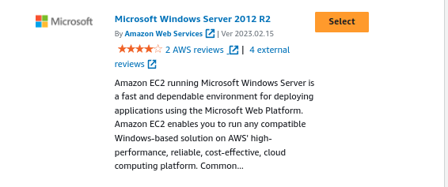
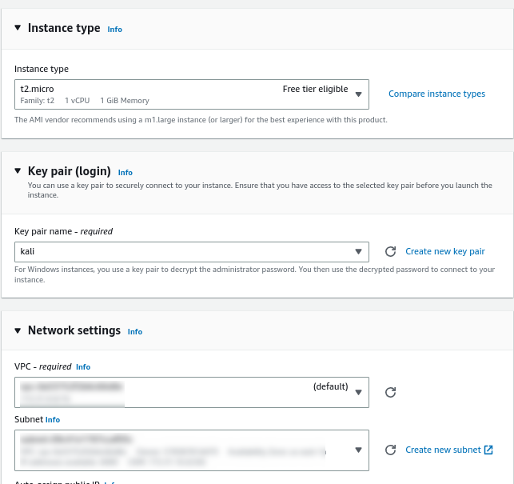
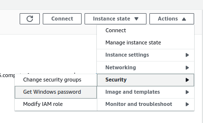
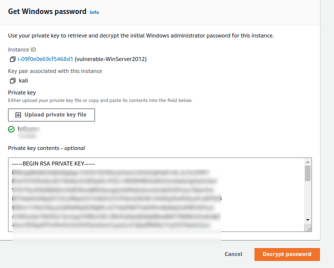
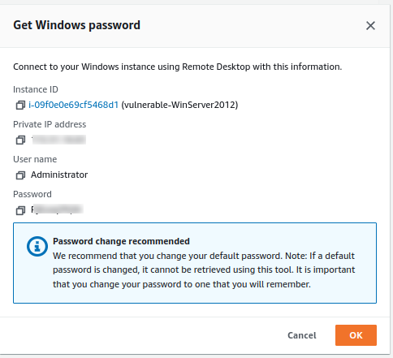
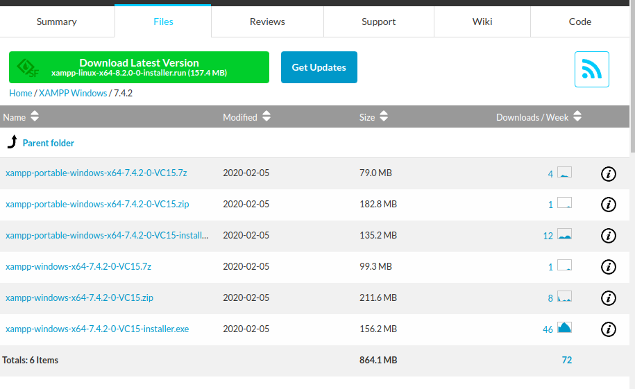
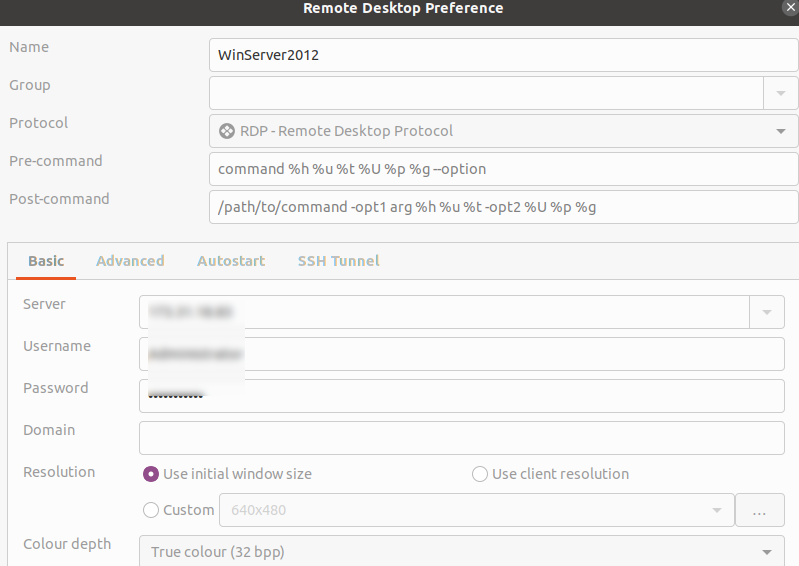
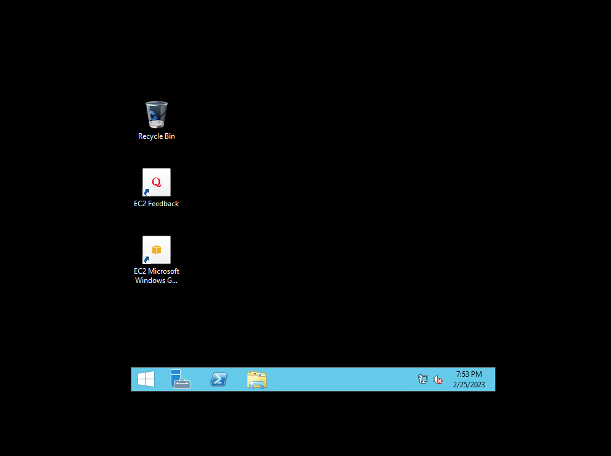
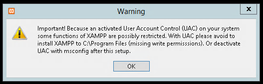

# Setting up a vulnerable windows ec2

## Introduction

✍️ Building a vulnerable windows application on a Windows 2012 Server

## Prerequisite

✍️ This intentionally vulnerable application will be the one of the targets of my AWS based penetration lab.

## Use Case

- 🖼️ Very simple idea but very satisfying also. I will be using remmina to rdp into my windows server instance. In the that instance I will setup a vulnerable php web application using xammp.

## Cloud Research

- ✍️ The source material is a combination of youtube and the book "hands on penetration testing with kali linux"

## Try yourself

✍️ Head over to ec2 

### Step 1 — Search for Windows Server 2003



### Step 2 — Settings
Set up key pair, VPC and Subnet. Keep note of VPC and Subnet



### Step 3 — Get Windows Password



### Step 4 — Upload Key



### Step 5 — Retrieve Password



### Step 6 — Install RDP client For linux
```
sudo apt-get install remmina remmina-plugin-rdp -y

```


### Step 7 — Create New Connection Profile



### Step 8 — My Server Desktop!



### Step 9 — Uh oh! Warning!



## ☁️ Cloud Outcome

✍️ Overall, I am syched! I am not a fan of windows, I use it begrudgingly. But having this option to spin a windows server, really gives me options. The bad news is the warning I got was indeed important. So I have to figure that out but overall, I'm happy. One step closer to a complete AWS penetration testing lab.

## Next Steps

✍️ Troubleshooting, and then setup my kali linux attacker instance.

## Social Proof

[tweet](https://twitter.com/DemianJennings/status/1629591311031361539)
[linkedin](https://www.linkedin.com/posts/demian-jennings_100daysofcloud-aws-project-activity-7035357579404865536-_g7K?utm_source=share&utm_medium=member_desktop)
