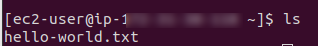

# Elastic Beanstalk - Odds n Ends

## Introduction

✍️ In this installment I covered ddds an ends like adding an external DB, passing commands to elastic beanstalk and controlling the quantity or duration of versions.

## Prerequisite

✍️ Since I covering the finer details of elastic beanstalk, you should have a basic understanding of how elastic beanstalk works. You should know how to ssh into an ec2, and you should know the basics of the eb cli.

## Use Case

- 🖼️ These are options that are available to you when configuring elastic beanstalk.

## Cloud Research

- ✍️ My source material comes from Stephane Maarek's course, AWS Devops.

### Step 1 — Using an external DB in Beanstalk
If you were to create a database with elastic beanstalk, and then lets say you deleted your beanstalk, your database would be deleted along with it. This may not be desirable. In this case, create the database externally, and link it to beanstalk. In this case I'm going to make an external DynamoDB database and then link it.


### Step 2 — In the Software Configuration
Modify Your environment variable for DynamoDB_Table to the External table


### Step 3 — Edit Environment Variable


### Step 4 — Passing Commands to the beanstalk
There are 2 type of commands:
- regular commands run before the container is constructed
- container commands that only run inside the container
We are adding a new config file to show both

```
# Commands
# https://docs.aws.amazon.com/elasticbeanstalk/latest/dg/customize-containers-ec2.html#linux-commands 

# You can use the commands key to execute commands on the EC2 instance. The commands run before the application and web server are set up and the application version file is extracted.
commands:
  create_hello_world_file:
    command: touch hello-world.txt
    cwd: /home/ec2-user

# Container Commands
# https://docs.aws.amazon.com/elasticbeanstalk/latest/dg/customize-containers-ec2.html#linux-container-commands

# You can use the container_commands key to execute commands that affect your application source code. Container commands run after the application and web server have been set up and the application version archive has been extracted, but before the application version is deployed. 
container_commands:
  modify_index_html:
    command: 'echo " - modified content" >> index.html'

  database_migration:
    command: 'echo "do a database migration"'
    # You can use leader_only, to only run the command on a single instance
    leader_only: true

# Container Commands vs Commands?
# Read here: https://stackoverflow.com/questions/35788499/what-is-difference-between-commands-and-container-commands-in-elasticbean-talk/40096352#40096352
```

### Step 6 — Deploy
```
eb deploy
```
### Step 7 — Verify Changes
SSH into the ec2 to verify that the file hello-world.txt exists


Visit elastic beanstalk URL to confirm changes


### Step 8 — Controlling The Quantity or Duration of Versions
Versions allow you to rollback your environment if necessary. However, you may want to control the number of versions or how long the stay. Thats cone in the application versions settings


## ☁️ Cloud Outcome

✍️ Overall, every new topic that I cover in AWS, there always comes a time where there are random tidbits of knowledge that don't fit neatly in a lesson. This is one of those times. The knowledge is valuable and a essential, just not always neat. I feel empowered learning the flexibility and the effectiveness of elastic beanstalk.

## Next Steps

✍️ Deployments

## Social Proof

✍️ Show that you shared your process on Twitter or LinkedIn

[tweet](https://twitter.com/DemianJennings/status/1630410996123615234)
[LinkedIn](https://www.linkedin.com/posts/demian-jennings_100daysofcloud-aws-awscloud-activity-7036177500225363968-stUt?utm_source=share&utm_medium=member_desktop)