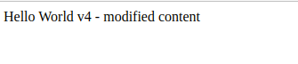

**Add a cover photo like:**

# Updates

## Introduction

✍️ In this session I explore different type of deployments and worker environments.

## Prerequisite

✍️ You should be familiar with the eb cli. Also basic AWS navigation.

## Use Case

- 🖼️ These are options to deploy test environments and how to use worker environments, depending on the needs of your app.

## Cloud Research

- ✍️ The material I pulled from is Stephane Maarek, AWS Devops udemy course.

### Step 1 — Rolling Updates
Pull up an application in Elastic Beanstalk and click on configuration. We are going to edit Rolling updates and deployments.

### Step 2 — Rolling Update Options
- All at once: The quickest but there will be downtime
- Rolling: Only a percentage will be down at a time, reduce capacity, but do not incur additional cost.
- Rolling with additional batch: new capacity will be added so there will be additional cost, but no downtime.
- Immutable: creating new instances all together. More costly

### Step 3 — Configuration Updates
- Rollng based on Health
- Disabled
- Rolling based on Time
- Immutable

### Step 4 — Example
 I will use an immutable deployment policy

### Step 5 — Make an Update in Index.html
I'll make a minor change in the index.html, to observe how it updates.

### Step 6 — Configuration Updates

### Step 7 — Review Updates
We can see how the autoscaling group and ec2 being created.

## Swap URL (Blue/Green)
What if we want to duplicate our environment and create another that we will call test environment.
Current State:

### Step 8 — Create New Prod Environment
I'll make a small change to v4 and create a new environment

### Step 9 — Swap Environoments
Once we are happy with our test-env, we may want to swap environments nad have people start using the test-environments
- Rollng based on Health
- Disabled
- Rolling based on Time
- Immutable

### Step 10 — Verify URL
If I refresh the URL of the dev-env. The version has changed

## Worker Environments
Worker environments are suited for long running workloads on demand or performing tasks on a schedule

### Step 11 — Create Worker Environment

### Step 12 — Parameters
twitter

### Step 13 — Cloudformation
The worker environment will pull from the sqs que, try to perform the work, if unsuccessful, it will push into the dead letter queue.

## ☁️ Cloud Outcome

✍️ I learned how to control deployment, and also I didn't know that you could cron functionality with a worker-environment. Good to know.

## Next Steps

✍️ Lambda functions next.

## Social Proof

[twitter](https://twitter.com/DemianJennings/status/1630756924500111361)
[linkedIn](https://www.linkedin.com/posts/demian-jennings_100daysofcloud-activity-7036523050309189635-nT0u?utm_source=share&utm_medium=member_desktop)
