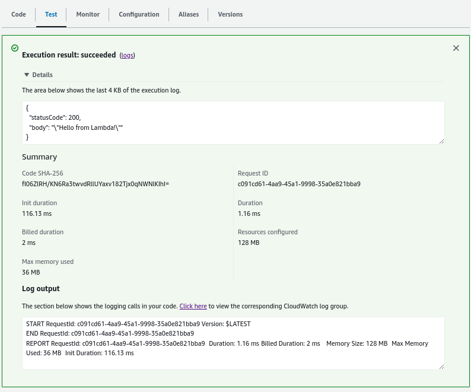
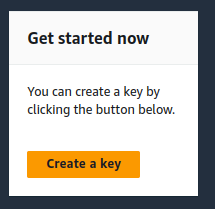

# Lambda Functions

## Introduction

✍️ Today's session I explored AWS Lambda functions. Lambda functions often serve as a glue in AWS connecting different services. But they are quite useful and have many functions. I covered the basics today, explored using environmental variables and encrypting variables.

## Prerequisite

✍️ You should know basic AWS navigation and how to manipulate IAM permissions.

## Use Case

- 🖼️ Connecting services together.
- ✍️ Too many use cases to list.

## Cloud Research

- ✍️ My source material is from Stephane Maarek's course AWS Devops udemy course.

### Step 1 — Create a Function


### Step 2 — Lambda Result


### Step 3 — Test Function
Give it a test event name. For template I will use the hello-world, but there are many others to sample. Then click test


### Step 4 — Verify Cloudwatch Logs & Results




### Step 5 — Edit Configuration
I'm going to edit the description. Here we can edit the descrption, memory, timeout and more.


## Environment Variables
### Step 6 — Create Environment Variables
Under the configuration tab, click on the environment variables and click edit


### Step 7 — Add Environment Variable
The variable will be a key value pair.


### Step 9 — Create KMS Key
Open the KMS console and create a key. We will accept the defaults on the configure key page.


### Step 10 — Create Alias
Accept the rest of the defaults


### Step 10 — Add Encrypted Variable
Click on the box to enable helpers for encryption in transit. Add The key value pair and click encrypt


### Step 11 — Search For key
Search for the key that you just created and select it. Before you click encrypt, expand the decrypt code snippet. Copy the code snippet to your clipboard. Then click encrypt.


### Step 12 — Edit the Lambda Function
Paste in the code snippet to your lambda function and edit it to look like this:
```
import boto3
import os
import json

from base64 import b64decode
DB_URL = os.environ['DB_URL']

ENCRYPTED = os.environ['DB_PASSWORD']
# Decrypt code should run once and variables stored outside of the function
# handler so that these are decrypted once per container
DECRYPTED = boto3.client('kms').decrypt(
    CiphertextBlob=b64decode(ENCRYPTED),
    EncryptionContext={'LambdaFunctionName': os.environ['AWS_LAMBDA_FUNCTION_NAME']}
)['Plaintext'].decode('utf-8')

def lambda_handler(event, context):
    print(DB_URL)
    print(DECRYPTED)
    #print(DB_PASSWORD)
    return {
        'statusCode': 200,
        'body': json.dumps('Hello from Lambda!')
    }
```
Then Deploy and test it

### Step 13 — Access Denied Error
This is a permissions error, so we have to allow decryption in our lambda IAM role permissions


### Step 14 — Find IAM Role for Lambda


### Step 16 — Add Inline Policy


### Step 17 — Permissions Good to Go


### Step 18 — Retest


## ☁️ Cloud Outcome

✍️ This lesson was a good primer on Lambda Functions. The Lambda layout and console has changed significantly from my source material. Everything is still there but it has been reorganized and in different places. So you have to adjust.

## Next Steps

✍️ There is more to learn in Lambda, and I have a side project in mind to practice what I learned.

## Social Proof

[twitter](https://twitter.com/DemianJennings/status/1631490746539712512)
[LinkedIn](lhttps://www.linkedin.com/posts/demian-jennings_100daysofcloud-aws-awscloud-activity-7037256802706608129-soz3?utm_source=share&utm_medium=member_desktop)