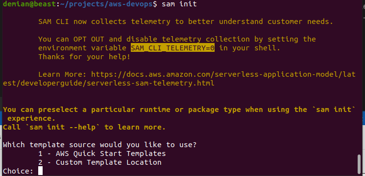
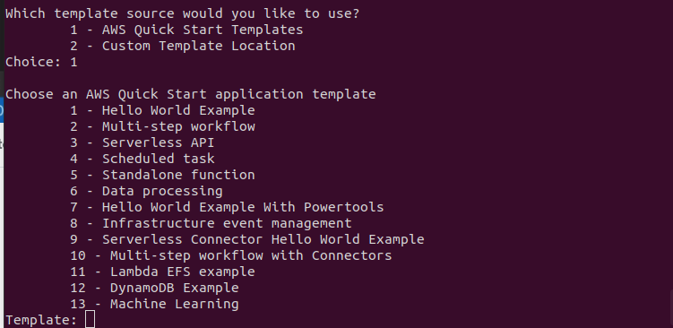
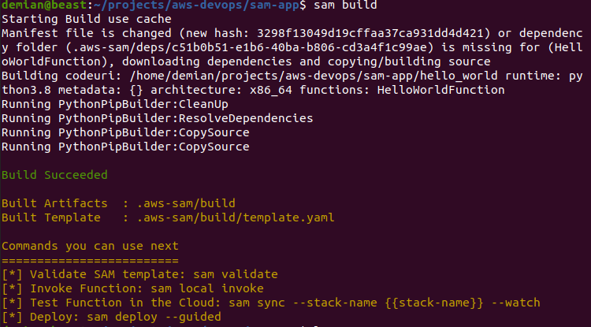
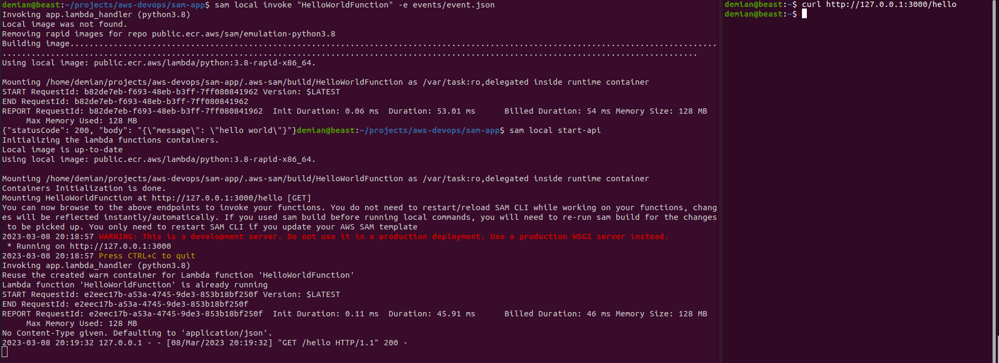
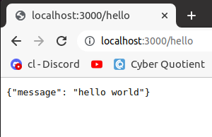
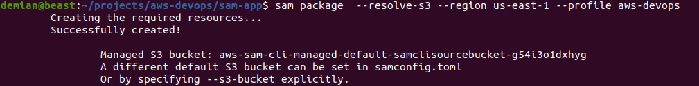
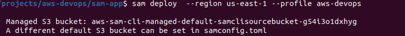
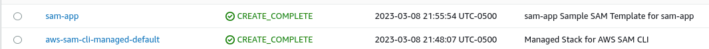

# AWS SAM

## Introduction

✍️ Today was all about the SAM(Serverless Application Model). I worked in the SAM cli to create a sample hello world application, SAM simplifies creating serverless applications

## Prerequisite

✍️ Under the hood cloudformation and cloud deploy is working. You should have an understanding fo those. You will need to download and install the cli.

## Use Case

- 🖼️ Creating Serverless Applications

## Cloud Research

- ✍️ For this the AWS SAM documentation is your friend. Otherwise I based most of the material came from Stephane Maarek's, udemy Devops course.


### Step 1 — Install SAM
Instructions here:
https://docs.aws.amazon.com/serverless-application-model/latest/developerguide/install-sam-cli.html#install-sam-cli-instructions


### Step 2 — Download a sample application
sam init --runtime python3.8
The python version should match the version you have on your machine. In my case that is python 3.8



### Step 3 — Choose a Template
I'll choose hello World, and select y to python runtime and zip package type and accept the defaults for the others


### Step 4 — CD into sam-app and build
```
cd sam-app
sam build
```


### Step 5 — Testing Locally
If you have docker installed, you can test locally
```
docker --version
```

### Step 6 — Invoke Function Locally
```
sam local invoke "HelloWorldFunction" -e events/event.json
sam local start-api
curl http://127.0.0.1:3000/hello
```





### Step 7 — Package your application
```
sam package --output-template packaged.yaml --s3-bucket aws-devops-course-demian --region us-east-1 --profile
aws-devops
```




### Step 8 — Deploy your application
```
sam deploy  --region us-east-1 --profile aws-devops

```






## ☁️ Cloud Outcome

✍️ (Result) Describe your personal outcome, and lessons learned.

## Next Steps

✍️ Describe what you think you think you want to do next.

## Social Proof

✍️ Show that you shared your process on Twitter or LinkedIn

[Twitter](https://twitter.com/DemianJennings/status/1633681454658928641)
[LinkedIn](https://www.linkedin.com/posts/demian-jennings_100daysofcloud-aws-awscloud-activity-7039447583127195648-uLV4?utm_source=share&utm_medium=member_desktop)
