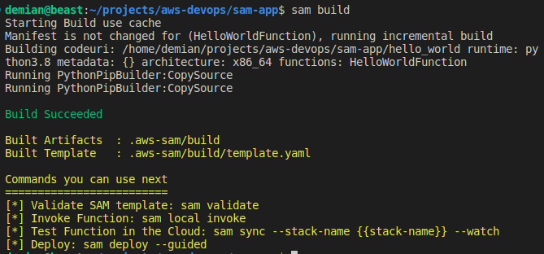
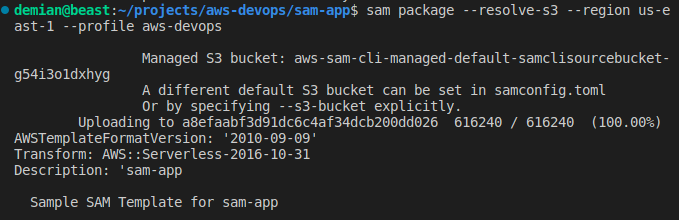
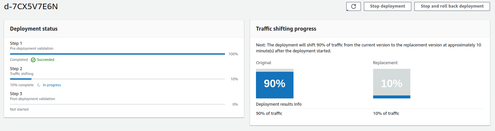
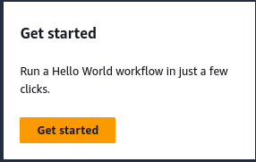
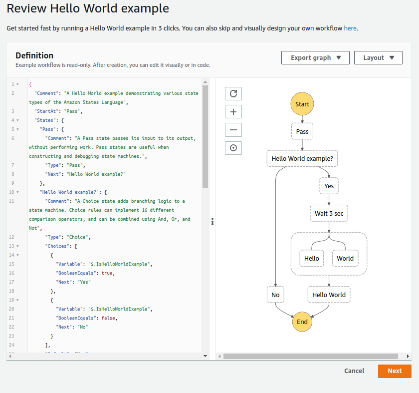
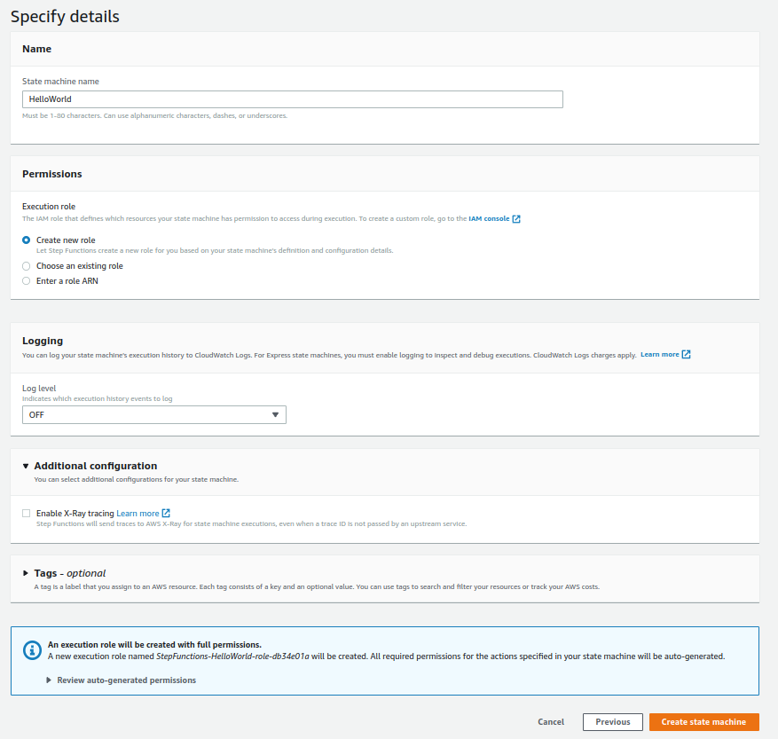
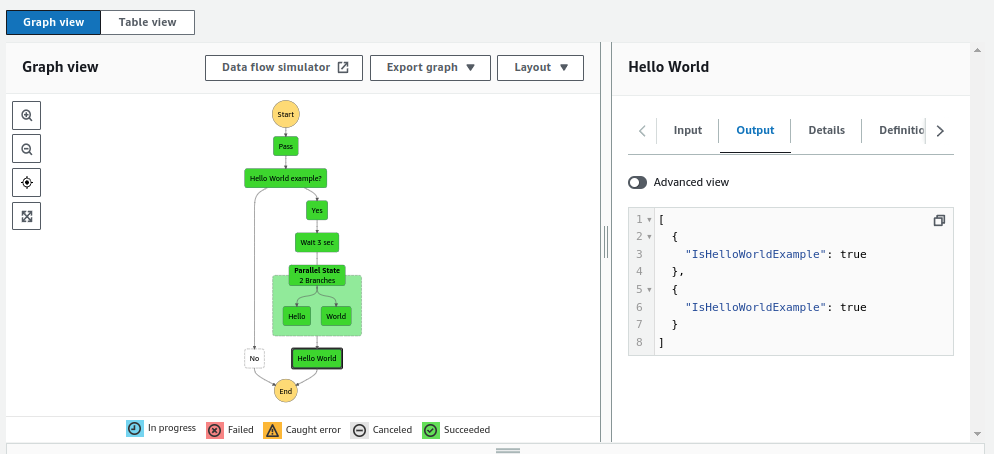
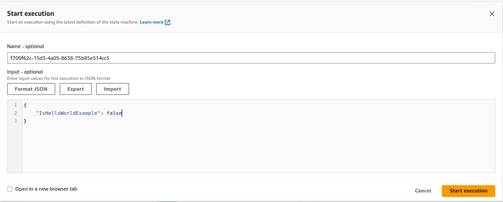
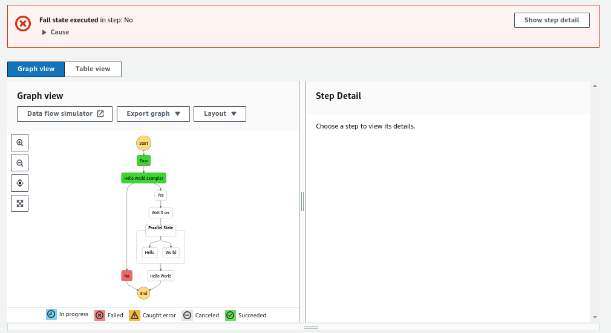

# SAM , CodeDeploy, Step function Overview

## Introduction

✍️ Today I looked at another example exploring how SAM and CodeDeploy work together. I also did an overview of step functions

## Prerequisite

✍️ Nothing too much. You should know about lambda functions and codedeploy and also cloudformation. Basic stuff

## Use Case

- 🖼️ With respect to step functions, they help you orchestrate complex workflows. SAM does alot of work for you. You create a relatively simple yaml file and SAM goes to work.

## Cloud Research

- ✍️ I'm using Stephane Maarek's udemy course for devops. The SAM cli and lambda ui has changed, so you have to figure out those changes, but nothing to crazy.


### Step 1 — Gradually Shift Users to New Deployed Version
Using CodeDeploy we gradually shift users to the new function version. We will add this code to our evetns section in template.yaml

```
AutoPublishAlias: live

    DeploymentPreference:
      Type: Canary10Percent10Minutes
```

### Step 2 — Make a change app.py
changing hello to goodbye

```
    return {
        "statusCode": 200,
        "body": json.dumps({
            "message": "goodbye world",
            # "location": ip.text.replace("\n", "")
        }),
    }
```

### Step 4 — Build
```
sam build
```



### Step 5 — Package Function



### Step 6 — Deploy



## Step Functions
### Step 7 — Get Started







### Step 8 — Start Execution



### Step 9 — Test False
select a new execution and change true to false



### Step 10 — Result




## ☁️ Cloud Outcome

✍️ SAM and step-functions really start to flex your power. Incredible assets to add your AWS skill set. On the negative side, AWS is changing rapidly so course materials can quickly become obsolete. You need to adjust.

## Next Steps

✍️ Maybe more step function tutorials and then API gateway

## Social Proof


[Twitter](https://twitter.com/DemianJennings/status/1634010073944014850)
[linkedin](https://www.linkedin.com/posts/demian-jennings_aws-awscloud-activity-7039775978776141825-jcgK?utm_source=share&utm_medium=member_desktop)
