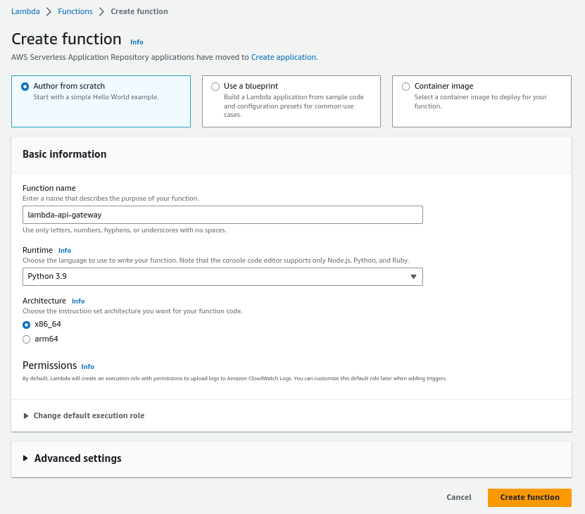

# Api Gateway

## Introduction

✍️ API Gateway is a service that easily allows you to spin up an API from a variety of sources like lambda, ec2 and others. Today I created a simple API that used a lambda function as its source. 

## Prerequisite

✍️ You should know how lambda functions work and how to create them. You should also have a general idea of http protocol and verbs.

## Use Case

- 🖼️ Quickly create an API. You also have the options of using different deployments and stages for example using blue/green deployment.

## Cloud Research

- ✍️ The material is from Stephane Maarek's Udemy course on AWS Devops. Also some of the official AWS documentation.

## Try yourself

### Step 1 — Create an API

### Step 2 — Select REST API

### Step 3 — Set API settings
I will create a New regional API 

### Step 4 — Create Method
Choose Get from the dropdown

### Step 5 — Choose Integration
As our integration type, we will choose a lambda function. So we will make a demo lambda function for this

### Step 6 — Create Lambda Function

### Step 7 — Select Lambda Function
Refresh the page and begin typing in the lambda function you just created, it should auto-complete. Click save and accept the next screen.

### Step 8 — Test Endpoint
Click on Test, and verify response

### Step 9 — Deploy API
From the Actions menu click on deploy. Create a new stage named DEV

### Step 10 — Invoke URL
Once the API is deployed a new stage will be created and a public url will be supplied

## ☁️ Cloud Outcome

✍️ After building many api's I thought this was a relatively easy quick method to spin up an api with tons of options like authenticating users, using cognito and creating api keys. I can't wait to see what else I can do with this.

## Next Steps

✍️ Dig deeper into api gateway.

## Social Proof

✍️ Show that you shared your process on Twitter or LinkedIn

[twitter](https://twitter.com/DemianJennings/status/1634633798703886338)
[linkedIn](https://www.linkedin.com/posts/demian-jennings_100daysofcloud-aws-awscloud-activity-7040400116423299073-v4g_?utm_source=share&utm_medium=member_desktop)
