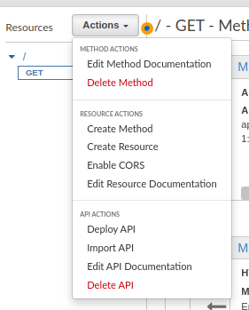

# API Gateway -Deployments, Throttling and Step Functions
## Introduction

✍️ Today I covered how to manage deployments, throttling and how to incorporate step functions in API Gateway

## Prerequisite

✍️ You should know about different deployments with respect to lambda functions, how to create a IAM role, and how to work with step functions

## Use Case

- 🖼️ You need to test changes before you release it fully, you can accomplish that with canary deployments. You need to throttle certain endpoints and you want to initiate a complicated scenario with apigateway.

## Cloud Research

- ✍️ I'm using Stephane Maarek's Devops course on udemy.

## Try yourself

### Step 1 — Creating New Stages
We already have our DEV stage we will add a PROD stage. Select Deploy API from the Actions menu.



### Step 2 — Create PROD Stage
Select New Stage from the Deployment stage dropdown. Type in PROD for new stage and deploy stage


### Step 3 — Canary Deployment
Canary deployment is a way to test changes to stage variables. A canary will only receive a percentage of requests. We will direct 10% of traffic to canary.


### Step 4 — Resources
Switch to resources tab, clcik on the get request. Change the Integration request to Mock


### Step 5 — Deploy to dev
Switch back to Method Execution and Deploy Api from the actions menu


### Step 6 — Deploy to Prod
We will deploy to prod. Prod is canary, so when we test the url, 10% of the time we will get an empty response from DEV


### Step 7 — Promote Canary
If we are happy with the Canary, we can promote it and it will become our main stage.


## Throttling 
### Step 8 — Usage Plans
api gateway is limited to 10,000 requests/second, however you can control the throttling with usage plans


### Step 9 — Add throttling to a Stage
Select the API and stage. Then click the check mark


### Step 10 — Select which Method Needs Throttling
Click on the Configure Method Throttling link.
So in all there is throttling at the api level, you can throttle also with usage plans, and lambdas are limited to 1000 users at any one time.


## API Gateway - Fronting Step Functions
### Step 11 — Create a New Resource in DemoAPI
Our new resource will be called Step Function Invoke.


### Step 12 — Define a POST method
We are going to be passing in data to our step function so will choose Post. Select actions -> Create method and choose POST


### Step 13 — Create an Execution Role
Select the API and stage. Then click the check mark


### Step 14 — POST setup
Copy the setup as follows, but put in your arn for the role that you just created.


### Step 15 — Test the Function
Cleck the test button enter the following into the body, but replace the arn with your own state-machinearn

```
{
   "input": "{}",
   "name": "MyExecution",
   "stateMachineArn": "arn:aws:states:us-east-1:123456789012:stateMachine:HelloWorld"
}
```


### Step 16 — Access Denied
We will need to add AWSStepFunctionsFullAccess to the role

### Step 17 — Try Again. Success!
We now get a status 200


## ☁️ Cloud Outcome

✍️ It's very exciting, because now I'm getting to the point in my journey where I see how these different services overlap and how different services can be employed. Love it, the possibilities are endless.

## Next Steps

✍️ Most likely ECS

## Social Proof

[Twitter](https://twitter.com/DemianJennings/status/1635062282165313536)
[LinkedIn](https://www.linkedin.com/posts/demian-jennings_100daysofcloud-aws-awscloud-activity-7040828535334215680-M0rB?utm_source=share&utm_medium=member_desktop)
