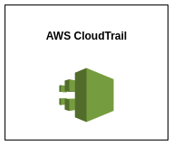

# CloudTrail

## Introduction

✍️ CloudTrail Lake lets you query multiple event fields in your logs, across all regions, for auditing and analysis. 

## Prerequisite

✍️ All you need to know is how navigate AWS and set IAM permissions.

## Use Case

- 🖼️ CloudTrail by default will record all the actions in our account. But if you want to if you want these events delivered to an s3 bucket or cloud watch logs, then you need to set up a trail. 

## Cloud Research

- ✍️ My source material is the official AWS documentation and Stephane Maarek's Devops course on udemy. The course I have is dated, so there have been some changes in the UI

## Try yourself

### Step 1 — Create a Trail

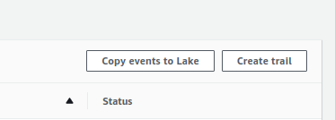

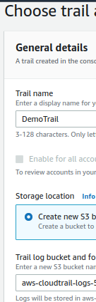

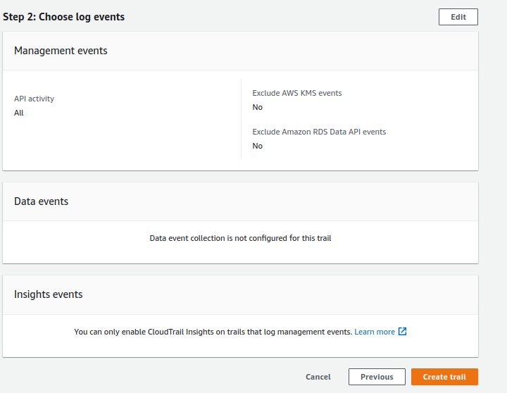

### Step 2 — Finished Trail

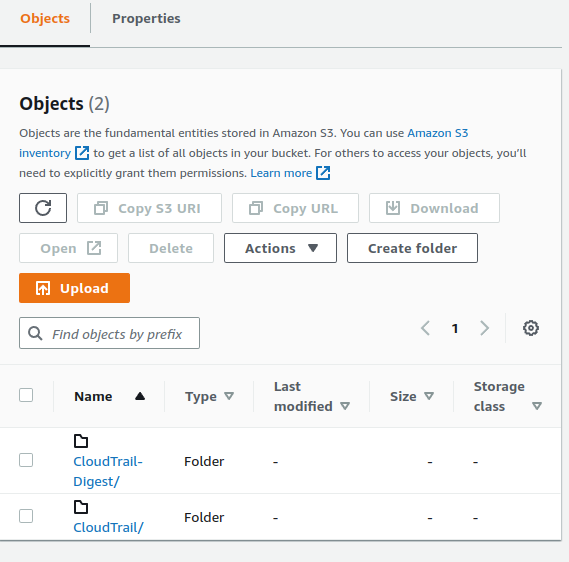

### Step 3 — Verify and review Contents of CloudTrail

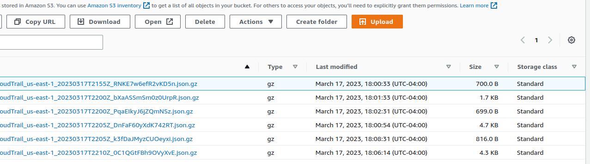

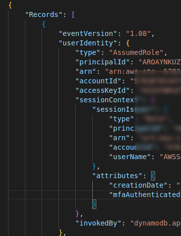

## File Integrity Check
### Step 4 — Validating CloudTrail File Integrity
The cli will tell you if a cloudtrail file has been modified or deleted. To test this I will delete one of my CloudTrail files. While I'm at it I'll download a file and modify it. I'll change the arn.

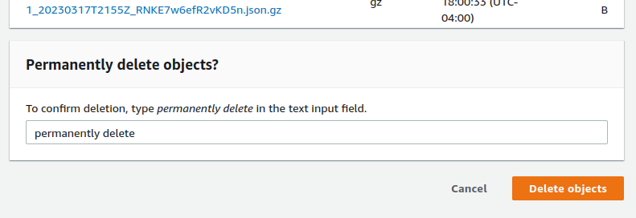

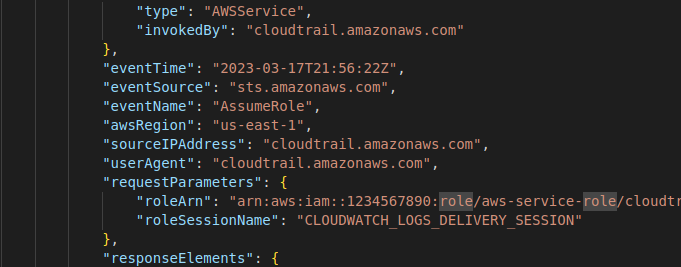

### Step 5 — Verify and review Contents of CloudTrail

```
aws cloudtrail validate-logs --trail-arn <trailARN> --start-time <start-time> [--end-time <end-time>] [--s3-bucket <bucket-name>] [--s3-prefix <prefix>] [--verbose]
```

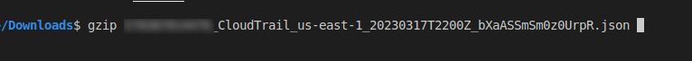

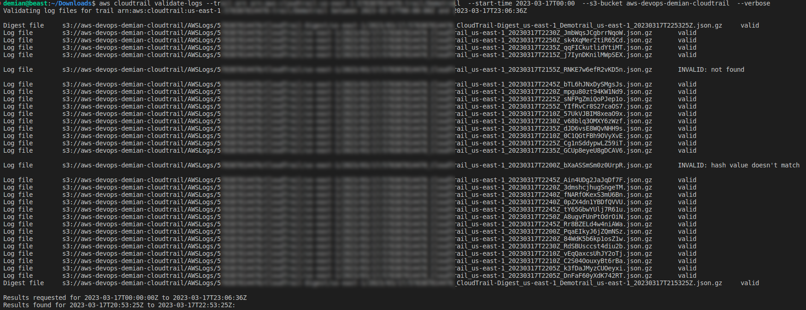

## Multiple Cloudtrail Accounts
### Step 6 — Cross Account Logging
  1. Set a trail in each account.
  2. Update the bucket policy on your destination bucket to grant cross-account permissions to CloudTrail.
  3. Turn on CloudTrail in the other accounts you want. Configure CloudTrail in these accounts to use the same bucker belonging to the account that you specified in step 1.

---
Sample Policy. Add the other bucket arn's in the s3:PutObject setting
```
{
  "Version": "2012-10-17",
  "Statement": [
    {
      "Sid": "AWSCloudTrailAclCheck20131101",
      "Effect": "Allow",
      "Principal": {
        "Service": "cloudtrail.amazonaws.com"
      },
      "Action": "s3:GetBucketAcl",
      "Resource": "arn:aws:s3:::myBucketName",
      "Condition": { 
          "StringEquals": { 
            "aws:SourceArn": [ 
              "arn:aws:cloudtrail:region:111111111111:trail/primaryTrailName",
              "arn:aws:cloudtrail:region:222222222222:trail/secondaryTrailName"
            ]
          }
       }
    },
    {
      "Sid": "AWSCloudTrailWrite20131101",
      "Effect": "Allow",
      "Principal": {
        "Service": "cloudtrail.amazonaws.com"
      },
      "Action": "s3:PutObject",
      "Resource": [
        "arn:aws:s3:::myBucketName/optionalLogFilePrefix/AWSLogs/111111111111/*",
        "arn:aws:s3:::myBucketName/optionalLogFilePrefix/AWSLogs/222222222222/*"
      ],
      "Condition": { 
        "StringEquals": { 
          "aws:SourceArn": [ 
            "arn:aws:cloudtrail:region:111111111111:trail/primaryTrailName",
            "arn:aws:cloudtrail:region:222222222222:trail/secondaryTrailName"
          ],
          "s3:x-amz-acl": "bucket-owner-full-control"
        }
      }
    }
  ]
}
```

## ☁️ Cloud Outcome

✍️ One thing to keep in mind when working with cloudtrail, is that it is not realtime. It updates every 15 minutes and the digest updates hourly. That can throw you off. Also, keep track of where the trail is storing the logs.

## Next Steps

✍️ Next up Kinesis streams

## Social Proof

[Twitter](link)

[LinkedIn](link)