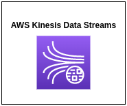
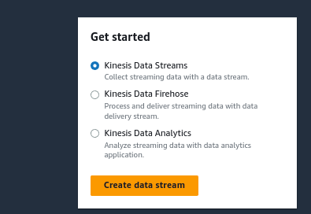
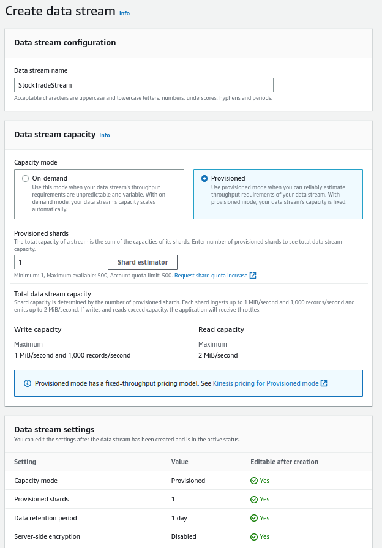
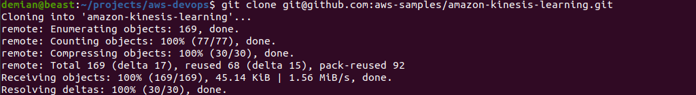
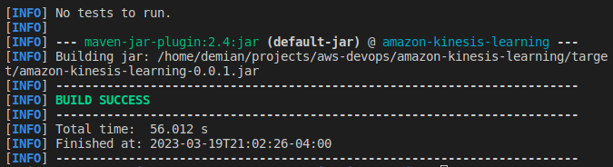

# Kinesis Data Streams

## Introduction

✍️ I chose to work on kinesis Data streams. I can see an application capturing data streams from iOT devices. For example, capturing the position of the sun or collecting moisture levels of soil from my garden.

## Prerequisite

✍️ I am following the AWS tutorial, Process Real-Time Stock Data Using KPL and KCL 2.x. As I found out, you will need a base level understanding of Java and Maven. Otherwise basic AWS skills like creating IAM users and roles, etc.

## Use Case

- 🖼️ You can use Amazon Kinesis Data Streams to collect and process large streams of data records in real time. You can create data-processing applications, known as Kinesis Data Streams applications. A typical Kinesis Data Streams application reads data from a data stream as data records. These applications can use the Kinesis Client Library, and they can run on Amazon EC2 instances. You can send the processed records to dashboards, use them to generate alerts, dynamically change pricing and advertising strategies, or send data to a variety of other AWS services.

## Cloud Research

- ✍️ My research was to read official AWS documentation.

## Try yourself

### Step 1 — Kinesis Tutorial
follow this tutorial, https://docs.aws.amazon.com/streams/latest/dev/tutorial-stock-data-kplkcl2.html
### Step 2 — Install AWS SDK, Maven, install Amazon Kineses Client Library For Java
```
sudo apt update
sudo apt install maven
```
verify installation
```
mvn -version
```

### Step 3 — Create a Data Stream





### Step 4 — Create an IAM Policy and User

Determine the arn for the kinesis stream
```
arn:aws:kinesis:region:account:stream/name
```

Determine the arn for the DynamoDb table by the consume , StockTradesProcessor

```
arn:aws:dynamodb:region:account:table/name
```

Create Policy as follows:

create access keys and store them in named ~/.aws/credentials 

The format should be as follows:
```
[default]
aws_access_key_id=access key
aws_secret_access_key=secret access key
```


### Step 5 — Download Code
Code located at  https://github.com/aws-samples/amazon-kinesis-learning



### Step 6 — Edit The pom.xml
I added the needed dependencies to the pom.xml

```
<project xmlns="http://maven.apache.org/POM/4.0.0"
         xmlns:xsi="http://www.w3.org/2001/XMLSchema-instance"
         xsi:schemaLocation="http://maven.apache.org/POM/4.0.0 https://maven.apache.org/maven-v4_0_0.xsd">
    <modelVersion>4.0.0</modelVersion>
    <groupId>com.amazonaws</groupId>
    <artifactId>amazon-kinesis-learning</artifactId>
    <packaging>jar</packaging>
    <name>Amazon Kinesis Tutorial</name>
    <version>0.0.1</version>
    <description>Tutorial and examples for aws-kinesis-client
    </description>
    <url>https://aws.amazon.com/kinesis</url>

    <scm>
        <url>https://github.com/awslabs/amazon-kinesis-learning.git</url>
    </scm>
    <build>
        <plugins>
            <plugin>
                <groupId>org.apache.maven.plugins</groupId>
                <artifactId>maven-compiler-plugin</artifactId>
                <configuration>
                    <source>1.8</source>
                    <target>1.8</target>
                </configuration>
            </plugin>
        </plugins>
    </build>

    <licenses>
        <license>
            <name>Amazon Software License</name>
            <url>https://aws.amazon.com/asl</url>
            <distribution>repo</distribution>
        </license>
    </licenses>

    <properties>
        <aws-kinesis-client.version>2.2.8</aws-kinesis-client.version>
    </properties>

    <dependencies>
        <dependency>
            <groupId>software.amazon.kinesis</groupId>
            <artifactId>amazon-kinesis-client</artifactId>
            <version>2.2.9</version>
        </dependency>
        <dependency>
            <groupId>commons-logging</groupId>
            <artifactId>commons-logging</artifactId>
            <version>1.2</version>
        </dependency>
        <dependency>
          <groupId>com.amazonaws</groupId>
          <artifactId>aws-java-sdk</artifactId>
          <version>1.11.1000</version>
        </dependency>
        <dependency>
            <groupId>org.apache.commons</groupId>
            <artifactId>commons-lang3</artifactId>
            <version>3.12.0</version>
        </dependency>
        <dependency>
            <groupId>com.google.guava</groupId>
            <artifactId>guava</artifactId>
            <version>23.5-jre</version> <!-- or 23.5-android for the Android flavor -->
        </dependency>
        <dependency>
          <groupId>com.fasterxml.jackson.core</groupId>
          <artifactId>jackson-core</artifactId>
          <version>2.9.6</version>
        </dependency>
        <dependency>
          <groupId>com.fasterxml.jackson.core</groupId>
          <artifactId>jackson-annotations</artifactId>
          <version>2.9.6</version>
        </dependency>
        <dependency>
          <groupId>com.fasterxml.jackson.core</groupId>
          <artifactId>jackson-databind</artifactId>
          <version>2.9.6</version>
        </dependency>
        <dependency>
            <groupId>com.fasterxml.jackson.dataformat</groupId>
            <artifactId>jackson-dataformat-cbor</artifactId>
            <version>2.9.6</version>
        </dependency>  
        <dependency>
          <groupId>joda-time</groupId>
          <artifactId>joda-time</artifactId>
          <version>2.9.1</version>
        </dependency>
    </dependencies>
</project>
```
### Step 7 — Build the file
```
mvn package
```


### Step 8 — Run the producer
This where things ran off the rails for me. Mainly because I don't really know Java or Maven. I know enough to be dangerous. In this step, you should verify that you have an access key pair. That is not a problem, I've done that already. The Last step is Run the StockTradeWriter class with the following arguments:

```
StockTradeStream us-west-2
```
The output should look like the following:
```
Feb 16, 2015 3:53:00 PM  
com.amazonaws.services.kinesis.samples.stocktrades.writer.StockTradesWriter sendStockTrade
INFO: Putting trade: ID 8: SELL 996 shares of BUD for $124.18
Feb 16, 2015 3:53:00 PM 
com.amazonaws.services.kinesis.samples.stocktrades.writer.StockTradesWriter sendStockTrade
INFO: Putting trade: ID 9: BUY 159 shares of GE for $20.85
Feb 16, 2015 3:53:01 PM 
com.amazonaws.services.kinesis.samples.stocktrades.writer.StockTradesWriter sendStockTrade
INFO: Putting trade: ID 10: BUY 322 shares of WMT for $90.08
```


## ☁️ Cloud Outcome

✍️ Everything was running well till the end. I will go back and troubleshoot what I'm doing wrong. I have to review my Java programming. Big picture I have a better idea of how kinesis works. But hey this is learning. It's not always neat, in fact it can be downright messy.

## Next Steps

✍️ Troubleshooting this tutorial. Maybe I will try it in a language I am more familiar with like python.

## Social Proof

✍️ Show that you shared your process on Twitter or LinkedIn

[Twitter](https://twitter.com/DemianJennings/status/1637961433974464512)
[LinkedIn](https://www.linkedin.com/posts/demian-jennings_100daysofcloud-activity-7043727761546346496-6uTX?utm_source=share&utm_medium=member_desktop)
