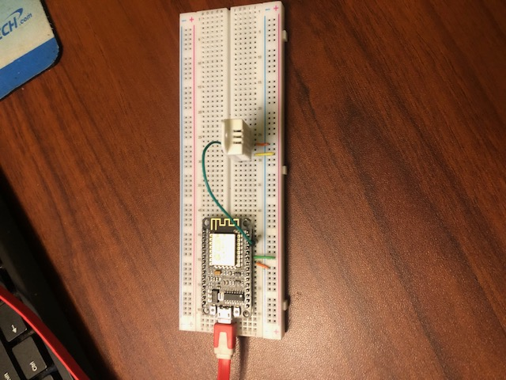

# iOT

## Cloud Research

- ✍️ Today, I figured it was time to dive into AWS iOT. My first order of business was to setup a sample breadboard setup using an esp8266 taking temperature readings from a DHT22 temperature sensor. Eventually, I will incorporate this into a larger project using AWS iOT Core. I had a few struggles getting everything to read, but hey thats called learning.

## Social Proof

✍️ Show that you shared your process on Twitter or LinkedIn

[Twitter](https://twitter.com/DemianJennings/status/1641274249645023237)
[Linkedin](https://www.linkedin.com/posts/demian-jennings_100daysofcloud-activity-7047040173997527040-w_Z7?utm_source=share&utm_medium=member_desktop)

