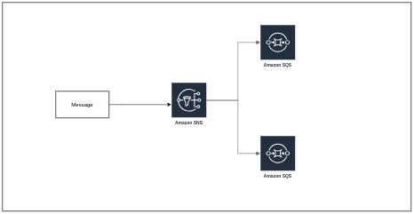

<!-- **Add a cover photo like:** -->

# Fanout Architecture Using SDS and SQS

## Introduction

✍️ In this installment, a startup E-commerce company wants to migrate from a custom solution to one that publishes messages to multiple endpoints/ The custom solution occassionally goes down, which impacts workflow. The development team needs a managed solution that can send published message to multiple sets of endpoints so that they don have to worry about high-availability and the configuration of the custom solution. To achieve this use-case, we will use a fanout architecture using SNS and test the overall capabilities.

## Prerequisite

✍️ You will use AWS services SQS and SNS.

## Use Case

- 🖼️ Ideal for push notifications. It is an efficient way to push messages for a massive amount of users. 

## Cloud Research

- ✍️ Fanout Architecture tutorial by Zeal Vora, and youtube

### Step 1 — Creat SNS Topic
Create a standard sns topic called "demo-topic"

### Step 2 — Create 2 SQS Queues
Create 2 SQS queues called queue-1 and queue-2 with standard configuration

### Step 3 — Subscribe SQS Queue to SNS topic
Click on queue-1 SQS. Scroll down to SNS Subscriptions and click Subscribe to AMAzon SNS topic. select the demo-topic. Repeat for queue-2

### Step 4 — Test Fanout Architecture
Manually publish a message from the SNS topic and ensure that it is replicated on both queues.
1. Go to the SNS console, find the topid, and click on "Publish Message"
2. type any message in "message body"
3. click "Publish Message"
4. Go to the SQs console and refresh the queues; A message is replicated in both queues

### Step 5 — Delete all resources

## ☁️ Cloud Outcome

✍️ This is a way to serve many subcribers. Great fo rthe right use case

## Social Proof

[Toots](https://mastodon.social/@code_sentinel/111095367314871266)