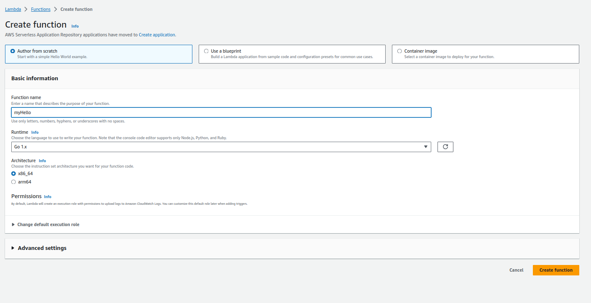
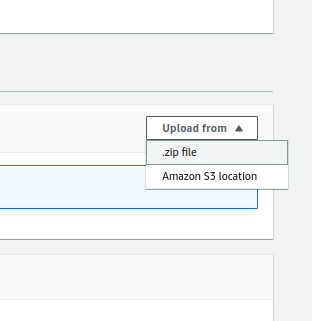
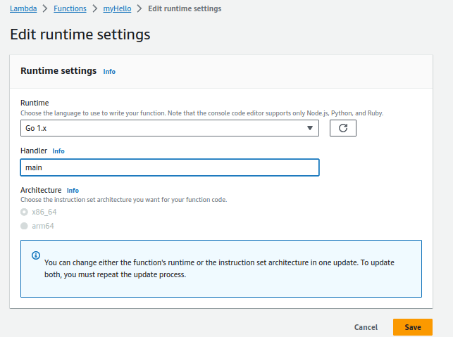
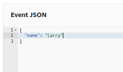

`**The Real Work Begins:**


# Creating an AWS Golang Lambda Function

## Introduction

✍️ From this moment forward I will begin to build something I've been thinking about for a long time. For the next 50 days of this journey i will be focused on building an automated reconnaisance tool. 

## Prerequisite

✍️ Basic knowledge of how to create a golang project and how lambda functions work

## Use Case

- 🖼️ The tool will be used for ethical hacking and bug bounty.

## Cloud Research

- ✍️ Blogs by Hakluke and brevityinmotion and also AWS documentation

## Try yourself


### Step 1 — Create a project
Create a directory where you want this to live. Inside that directory run this command. For my example I called i hello, but that could be whatever you want it to be.

```
go mod init hello
```

### Step 2 — Create your go file
For this I'm just copying the code directly from the AWS documentation for Go lambdas

```
package main

import (
	"context"
	"fmt"

	"github.com/aws/aws-lambda-go/lambda"
)

type MyEvent struct {
	Name string `json:"name"`
}

func HandleRequest(ctx context.Context, name MyEvent) (string, error) {
	return fmt.Sprintf("Hello %s!", name.Name), nil
}

func main() {
	lambda.Start(HandleRequest)
}
```

### Step 4 — Import the Golang AWS runtime

```
go get github.com/aws/aws-lambda-go/lambda
```

### Step 5 — Build the the executable
The name of the package and main function is called main.

```
go build -o main main.go
```


### Step 6 — Zip the file

```
zip archive.zip main
```


### Step 7 — Create a Golang Lambda on AWS




### Step 8 — Upload the Zip File




### Step 9 — Edit the Runtime Settings

Change the Handler name to main. (If that's your main function)




### Step 10 — Create a test
give the test a name. In the file i'm using, it's expecting a json object. 
Here's what I used



## ☁️ Cloud Outcome

✍️ It was a success although I hade to coblle up the answers I need from several sources.

## Next Steps

✍️ Implement another lambda function, but this time make it port scan

## Social Proof

[toot](https://mastodon.social/@code_sentinel/111112691450006115)
