**Add a cover photo like:**
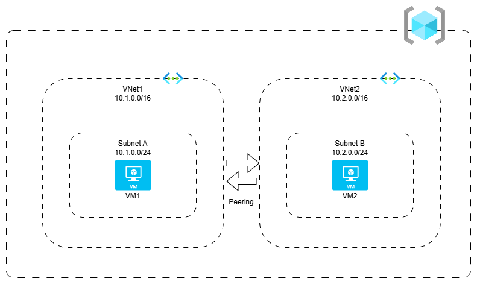

# Implementing Virtual Network Peering

## Introduction

✍️ (Why) The goal is to create to a two peered Virtual Networks. Launch a VM in both Virtual Networks and establish a communication between both the VMs

## Prerequisite

✍️ (What) You should be familiar with what a virtual network is and how to create a virtual machine inside Azure

## Use Case
- ✍️ (Show-Me) One particular usecase could be in a remote network, one PC is an admin and it needs to remote into another PC to apply patches or some sort of troubleshooting.

## Cloud Research

- ✍️ It's easy to lose track of which VM that your on. I had to backtrack and retrace my steps several times.

## Try yourself

### Step 1 — Create the first Virtual network
    1. In the search box, enter Virtual Network
    2. Click on Create
    3. In the Basics tab, select resource group, Virtual network , region (West Europe)

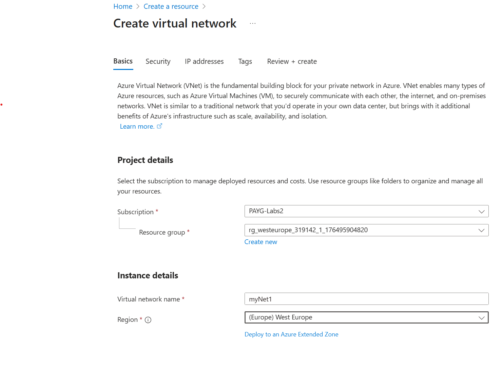

### Step 2 — Set IP Addresses
    1. Edit subnet to 10.1.0.0/16

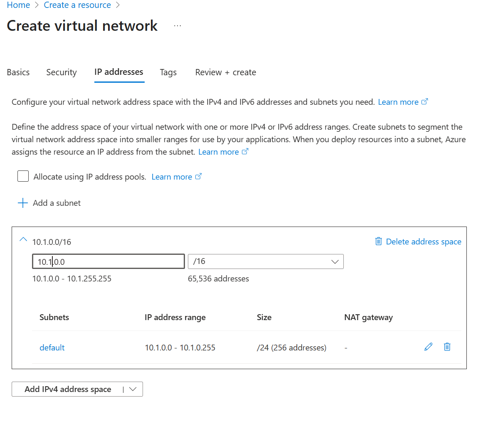

### Step 3 — Edit the Subnet
    1. Subnet Name: enter SubnetA
    2. Starting Address: Enter 10.1.0.0/24
    3. The rest leave defaults
    4. Select Review + Create and then Create

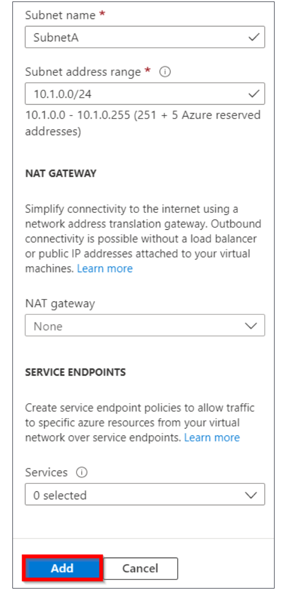

### Step 4 — Repeat the 1st three steps to create the second Virtual network
    1. In the search box, enter Virtual Network
    2. Click on Create
    3. In the Basics tab, select resource group, Virtual network (VNet2), region (West Europe)

### Step 5 — Set IP Addresses
    1. Edit subnet to 10.2.0.0/16

### Step 6 — Edit the Subnet
    1. Subnet Name: enter Subnetb
    2. Starting Address: Enter 10.2.0.0/24
    3. The rest leave defaults
    4. Select Review + Create and then Create

### Step 7 - Peer the Virtual Networks
    1. In the top of the azure portal search for the first virtual network
    2. Go to Settings -> Peerings, and click Add
    3. For name, we are setting peering from 2 to 1, So I set my peering link name as VNet1 to VNet2, and local peering name as VNet1-VNet1
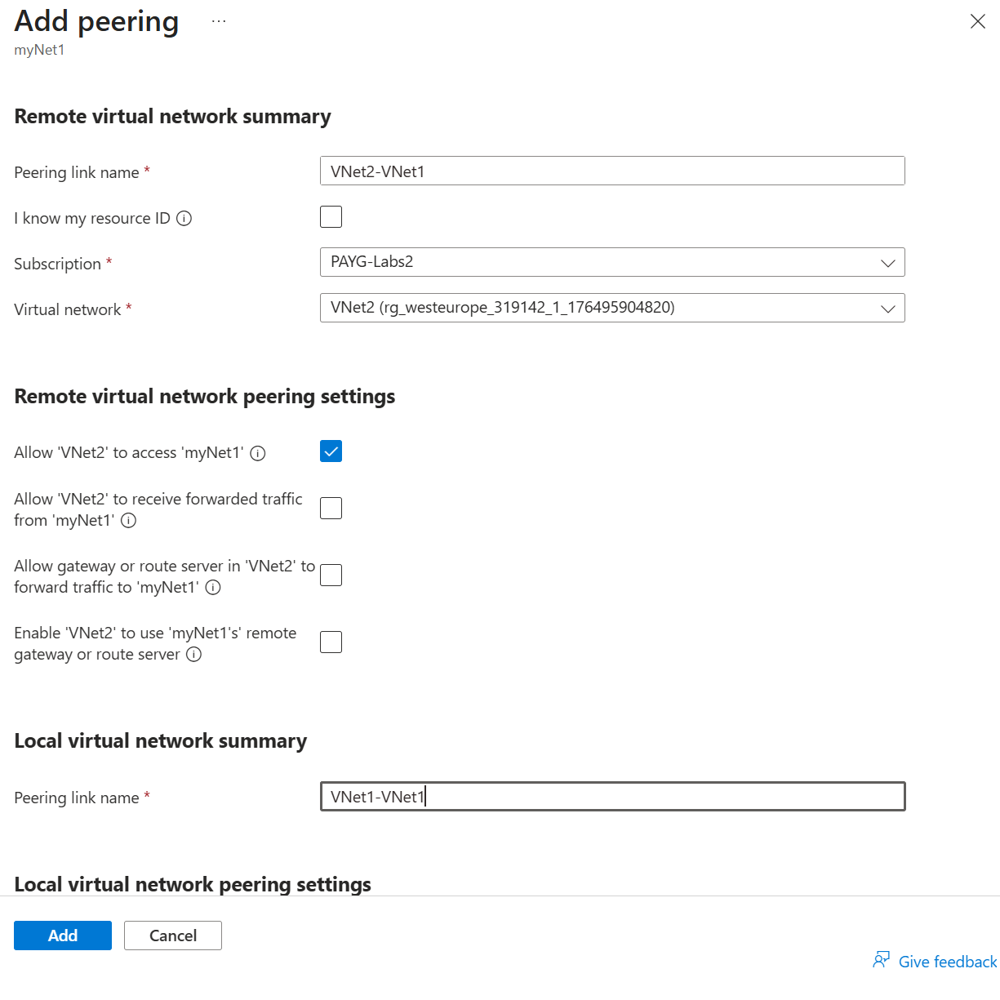

### Step 8 - Peering State
    1. Peering sync status should real fully synchronized and peering state as connected
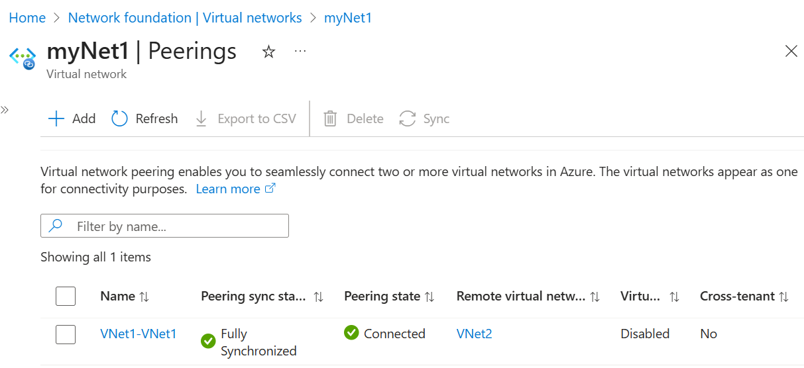

### Step 9 -  Create Virtual Machines
    1. Search in the search bar for Virtual Machines, click create, select the top choice, Virtual Machine
    2. Select Resource Group
        Enter Name - VM1
        Region - West Europe
        Availability Zone - No Infrastructure redundancy required
        Security type - Standard
        Image - Windows Server 2016 Gen 2
        Spot Instance - default
        Size - Click on all sizes, select B2s from B-Series
    3. Give it a username and password
    4. Allow inbound port rules , RDP (3389)

### Step 10 - Disk Settings
    1. Set Disks to Standard
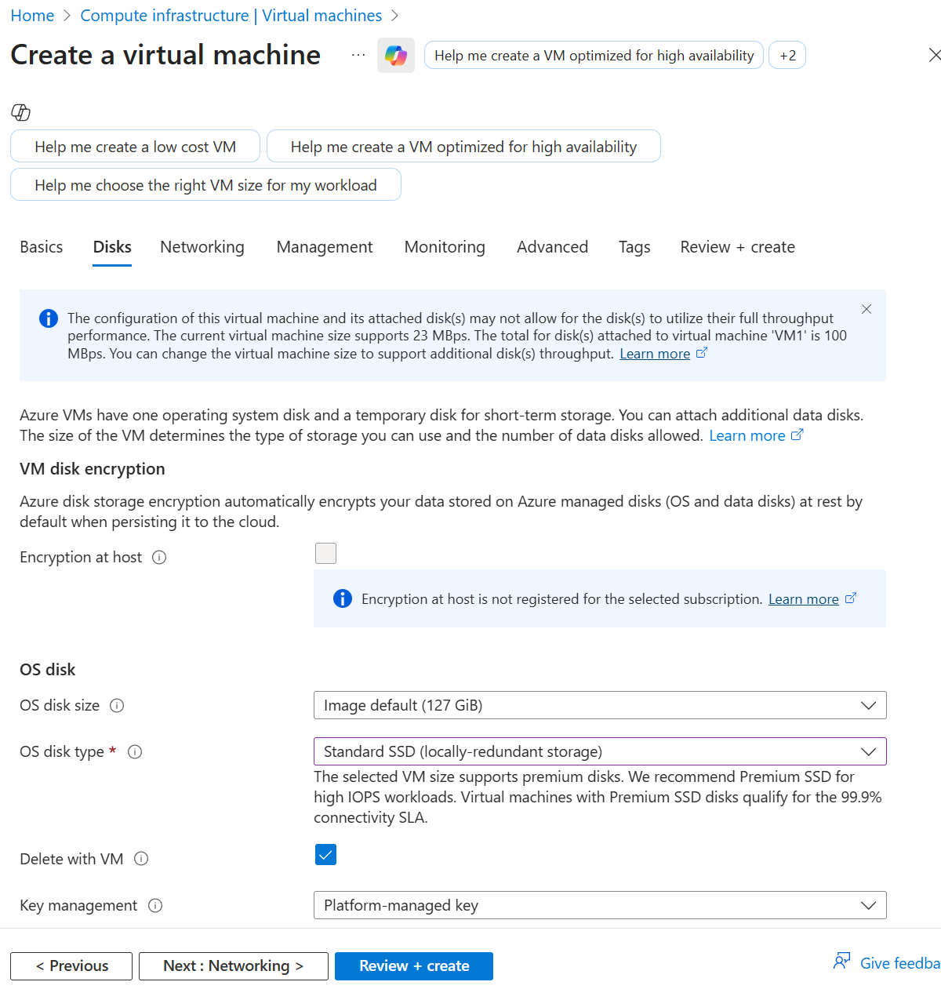

### Step 11 - Network Settings
    1. Set the virtual network to the first network name
    2. SubnetA ( or whatever your the first subnet is called)
    3. Select Review + Create, then Create
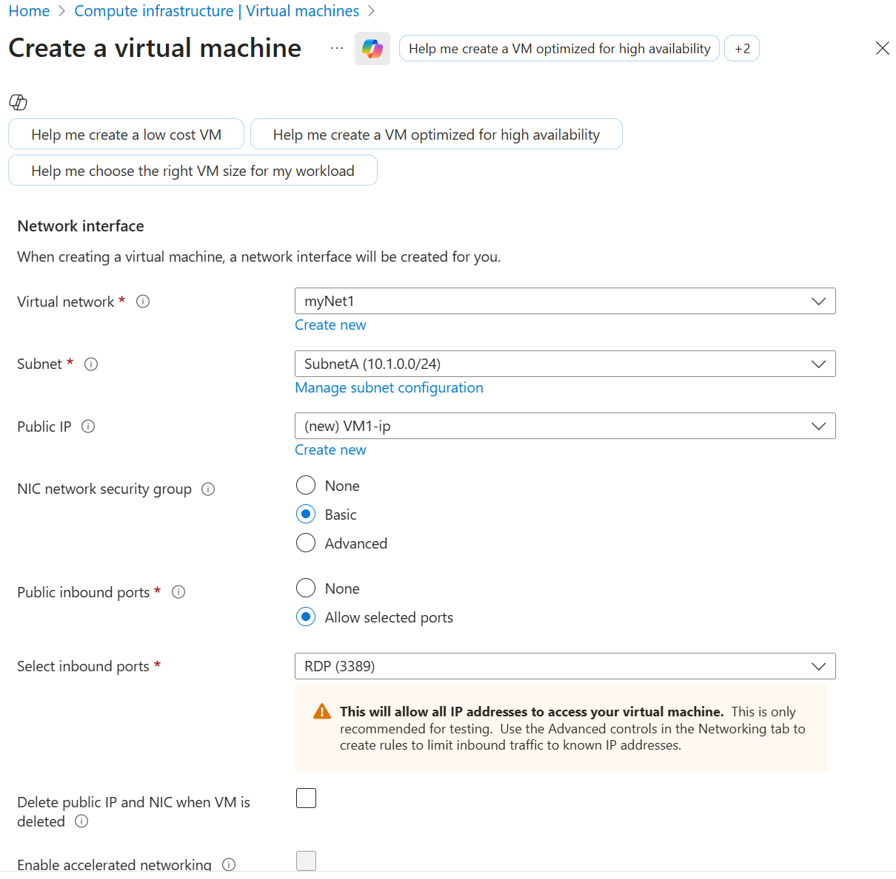

### Step 12 - Repeat Steps 9-11 for the VM2
    1. Search in the search bar for Virtual Machines, click create, select the top choice, Virtual Machine
    2. Select Resource Group
        Enter Name - VM2
        Region - West Europe
        Availability Zone - No Infrastructure redundancy required
        Security type - Standard
        Image - Windows Server 2016 Gen 2
        Spot Instance - default
        Size - Click on all sizes, select B2s from B-Series
    3. Give it a username and password
    4. Allow inbound port rules , RDP (3389)
    5. Disks to Standard
    6. Network - VNet2
    7. SubnetB
    8. Review + Create , Create

### Step 13 - Establish Communication between Virtual Machines
    1. In the Search box, search for the first VM VM!
    2 Click on Connect and Select Download RDP file.
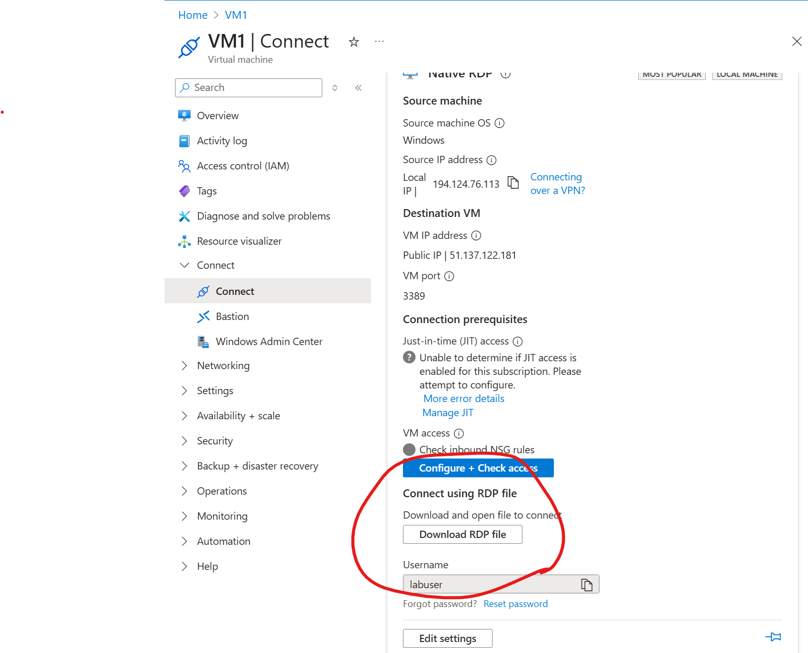

### Step 14 - Enter Credentials and Login
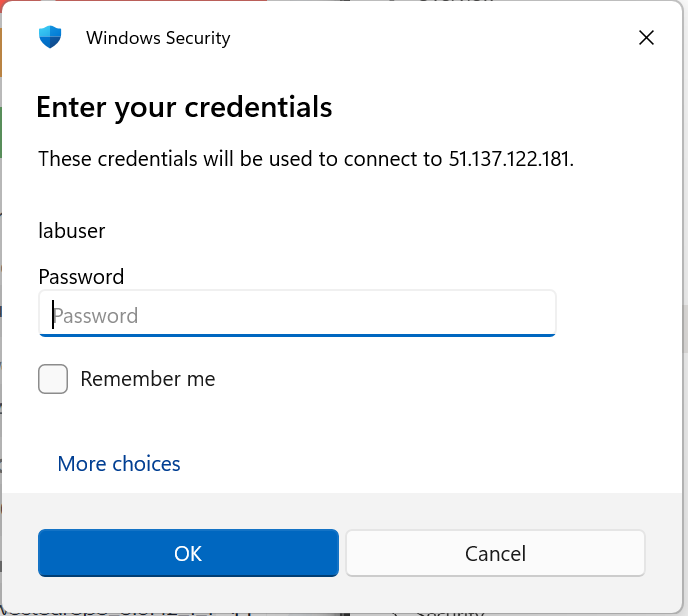

### Step 15 - Set Firewall Rule
    1. Open a Powershell Prompt. Enter the followingg Command:
    `New-NetFirewallRule –DisplayName "Allow ICMPv4-In" –Protocol ICMPv4`
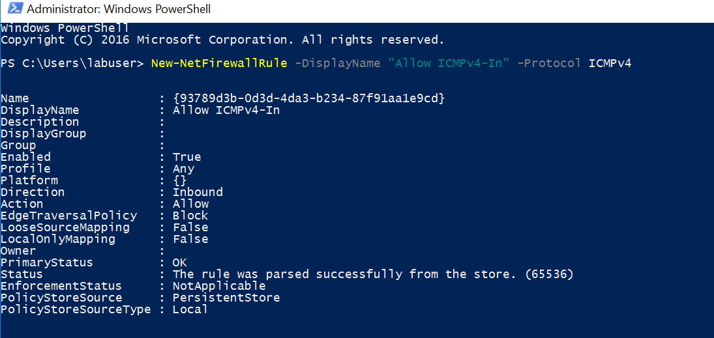

### Step 16 - Connect to VM2 from VM1
    1. From a VM1 Powershell prompt enter this command on the login prompt
    `mstsc /v:10.2.0.4

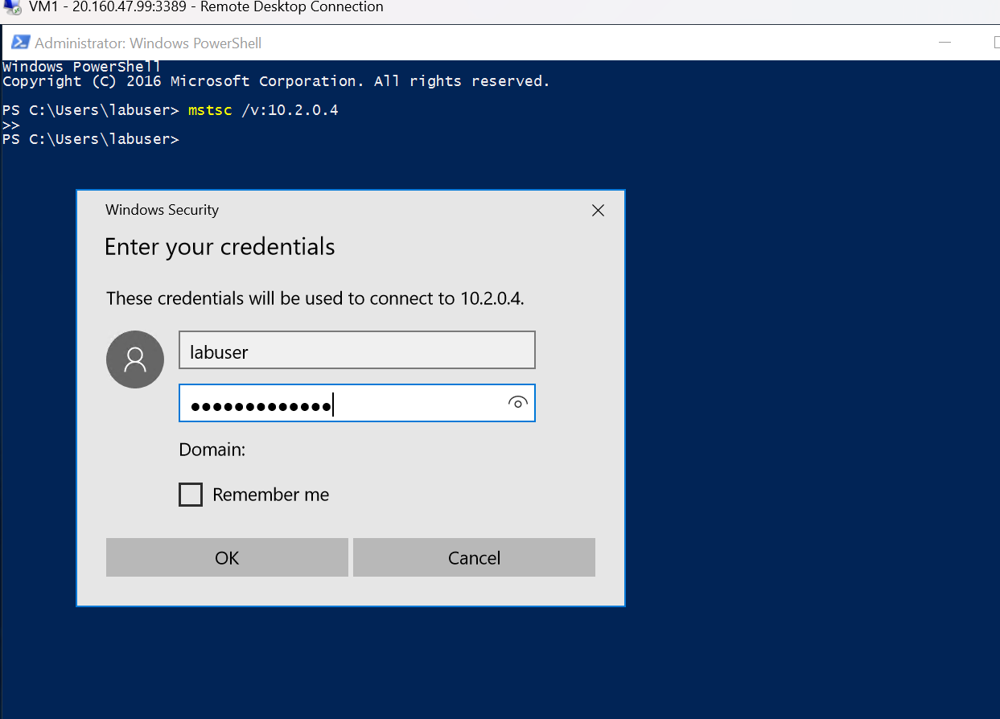

### Step 17 - Success! Peer from VM1 to VM2
    1. After entering credentials, we successfully peered into VM2 from VM1
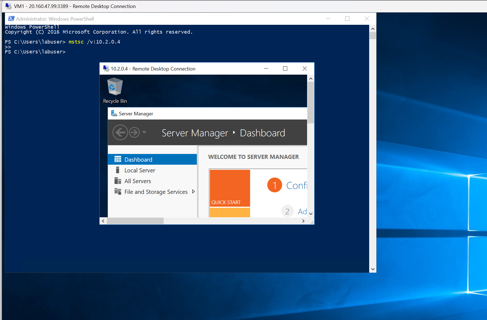

## ☁️ Cloud Outcome

✍️ (Result) We Successfully created to Virtual Networks. We created subnets in each of the networks. We then created virtual machines in each of the networks. In VM1 we configured peering from VM1 to VM2. We then remoted into VM1 and set a firewall rule to allow ICMP protocol, and finally remoted intp VM2 from inside VM1. Wild So we essentially from a remote machine we remoted into another machine. 

## Next Steps

✍️ Next is to try to expand on anything related to networking with Azure. Perhaps implemnting a load balancer.

## Social Proof

[link](https://www.linkedin.com/posts/demian-jennings_awhile-back-i-was-doing-100-days-of-cloud-activity-7403878030403592192-034X?utm_source=share&utm_medium=member_desktop&rcm=ACoAADXbhxEBzxsfNpRcEjDWcxJMI75kD_O-eRA)
