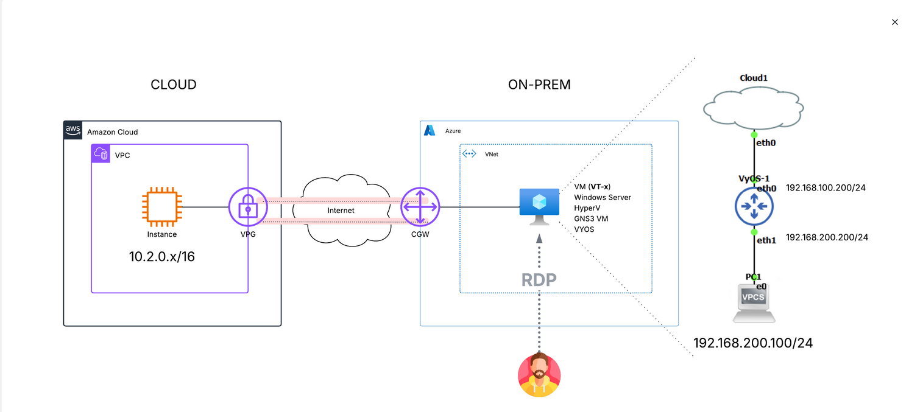

**Add a cover photo like:**

# Hybrid Cloud AWS IAC Deployment

## Introduction

✍️ This is a repeat of day 53, but with a terraform iac deployment.

## Use Case

- ✍️ In production deploying assets in the AWS console is not practical. Not only can it lead to errors and inconsistency
if you massive amounts of assets to deploy it can be time consuming. Also when it's time to take those assets down, it's easy to
miss something. That's the problem that infrastructure as code solves. repeatable consistent deployments and detroying of assets. For this 
hour I use terraform to deploy a vpc, ec2, set up gateways and vpn tunnels to my virtualized on-prem environment (GNS3).

## Cloud Research

- ✍️ Terraform documentation and Gemini llm.

## Result

This was one of those character building exercises where not everything worked as expected. I was able to deploy a vpc, ec2, setup the vpn tunnels
but I was not successful reaching the private IP from onprem. I spent a number of tries and a significant amount of time and was unsuccesful. 
Everything won't be easy. I can say that now I am much better at setting up and troubleshooting the router cli. I'll keep trying

## Social Proof

✍️ 
[Mastodon](https://mastodon.social/@code_sentinel/116615529216532299)
[LinkedIn](https://www.linkedin.com/posts/demian-jennings_day-54-of-100-days-of-cloud-hybrid-cloud-share-7463394690764120065-QmTu?utm_source=share&utm_medium=member_desktop&rcm=ACoAADXbhxEBzxsfNpRcEjDWcxJMI75kD_O-eRA)

