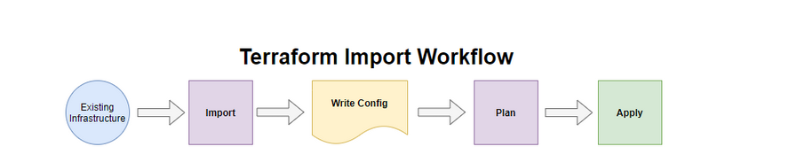

# Importing Existing Infrastructure into Terraform

## Introduction

✍️ Terraform is a great way to deploy and manage infrastructure. But what about the existing infrastructure that has been deployed and managed manually? One of the main principles of infrastructure development is to "define everything in code'. To fully reap the benefits of operating your infrastructure through Terraform, pre-existing infrastructure should be managed and used in the same manner to prevent one-off environments and reduce risk. This often takes time and effort and is usually a considerable-sized project to migrate old infrastructure into Terraform retroactively.

## Use Case

- ✍️ This useful for reversing infrastructure as code. 

## Cloud Research

- ✍️ Labs by QA

## Social Proof

[Mastodon](https://mastodon.social/@code_sentinel/116621281383375454)
[LinkedIn](https://www.linkedin.com/posts/demian-jennings_day-55-of-100-days-of-code-importing-existing-share-7463762633855373312-JYsX?utm_source=share&utm_medium=member_desktop&rcm=ACoAADXbhxEBzxsfNpRcEjDWcxJMI75kD_O-eRA)