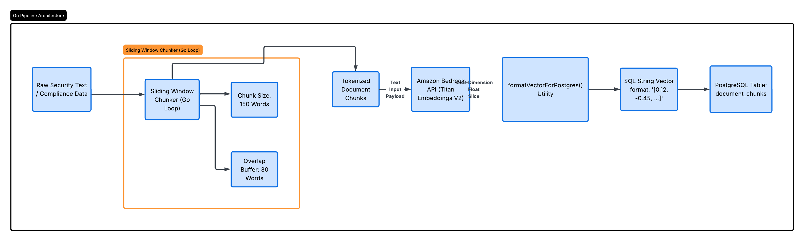

# Create the Go Ingestion Service

## Introduction

✍️ Today I built a Go ingestion service. Leveraging Go's native concurrency model, allows me to stream, chunk, and embed
documents simultaneously without blocking the pipeline. The Go worker will be able to take a raw security policy text file,
slice it into overlapping chunks, call Amazon Bedrock to generate a 1536-dimensionsal vector embedding, and save it directly
into the document_chunks table in the postgres database

## Prerequisite

✍️ An AWS account and golang installed.


### Step 1 — Initialize the Go Module & dependencies

```
mkdir -p cloudshield-ingestion && cd cloudshield-ingestion
go mod init cloudshield-ingestion

# Install AWS SDK V2 packages for Amazon Bedrock Runtime
go get github.com/aws/aws-sdk-go-v2/config
go get github.com/aws/aws-sdk-go-v2/service/bedrockruntime

# Install the high-performance pgx driver for PostgreSQL
go get github.com/jackc/pgx/v5

```


### Step 2 — Go Code Summary - Data Structure
The DocumentChunk struct holds the content in a string and an Index for each paragraph

### Step 3 — Go Code Summary - Sliding Window Chunker
```
func ChunkText(text string, chunkSize int, overlap int) []DocumentChunk
```
This is the heart of the data ingestion. This function splits the text into an array of words.
The function creates chunks of a specific word size (chunkSize := 150). It implements an overlap (30 words).
This means Chunk 2 starts 30 words before Chunk 1 ended. This creates an information safety net,
ensuring classes, verbs, and context are never split across boundaries, maximizing retrieval quality.


### Step 4 — Go Code Summary - Bedrock Core
```
modelID := "amazon.titan-embed-text-v2:0"
output, err := client.InvokeModel(ctx, &bedrockruntime.InvokeModelInpu{...})
```
The Go engine conects directly to the AWS Becrock runtime API. A raw text chunk is submitted
as a JSON payload. The model processes the text and returns an array of 1536 floating-point
mathematical coordiantes representing the multidimensional meaning of the paragraph.


### Step 5 — Go Code Summary
```
func formatVectorForPostgres(v []float32) string {...}
```

Go reads vectors as a native array slice. However, PostgreSQl pgvector extension expects the data formatted as
a SQL text string. This functions iterates over the float array and dynamically builds a string builder stream,
and converts the GO numbers into a raw database-compliant string block.

## ☁️ Cloud Outcome

✍️ This was a great sesssion because this is the heart of the project. It showed how to 
process text through golang, integrate AWS Bedrock and store in the postgres database. The sliding window
code and the chunker was totally new.

## Next Steps

✍️ The next steps are to fully test it out and work out any AWS access errors, code errors, and database sync challenges

## Social Proof

✍️ Show that you shared your process on Twitter or LinkedIn

[linkedIn](https://www.linkedin.com/posts/demian-jennings_cloudcomputing-aiengineering-golang-share-7478808846631845892-xKEA/?utm_source=share&utm_medium=member_desktop&rcm=ACoAADXbhxEBzxsfNpRcEjDWcxJMI75kD_O-eRA)
