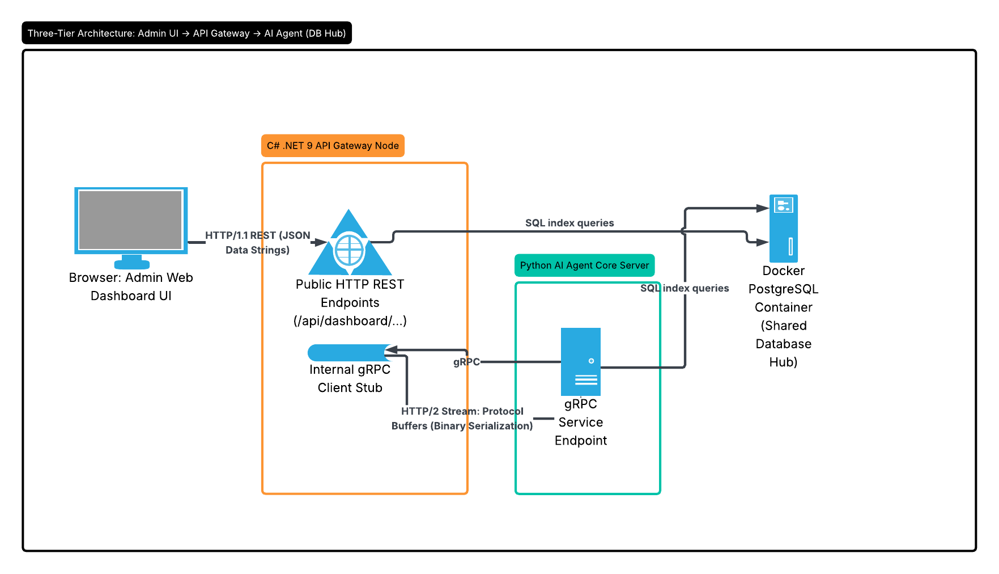

# CloudShieldAI - Transitioning to internal gRPC communication

## Introduction

✍️ With the decoupled Go, Python, and C# services running independently, today I shifted focus away from database-centric communication to build an active service-to-service orchestration engine using gRPC over HTTP/2.

While our .NET 9 Gateway retains standard HTTP REST endpoints facing the public dashboard UI, internal microservice operations have transitioned to binary contract-based channels.

## Use Case

- ✍️ gRPC reduces latency and  is more secure. By eliminating heavy JSON string transformations internally, our polyglot application stack can now execute sub-millisecond, type-safe commands across service boundaries. 

## Cloud Research

- ✍️ Shifting to gPRC requires a mind shift. I've been working with REST api's for so long, gRPC requires a different way of approaching the problem. It's not hard, just different. Once yo have all of the packages installed you just have to be methodical. 

## Social Proof

✍️ Show that you shared your process on Twitter or LinkedIn

[linkedIn](https://lnkd.in/p/eicwPgmE)
