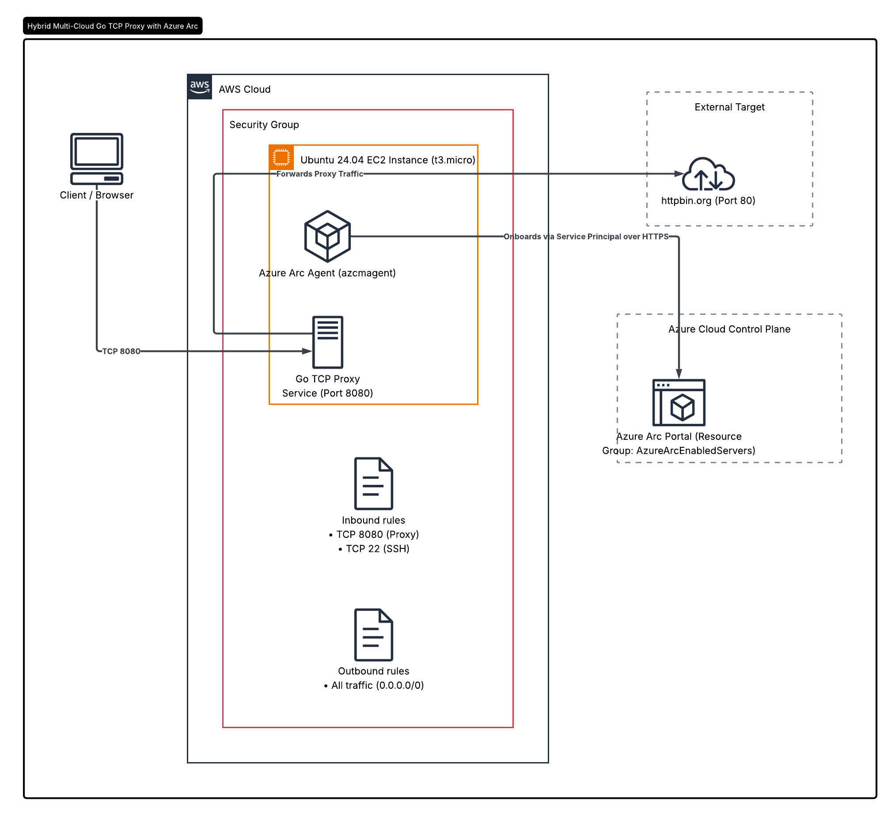
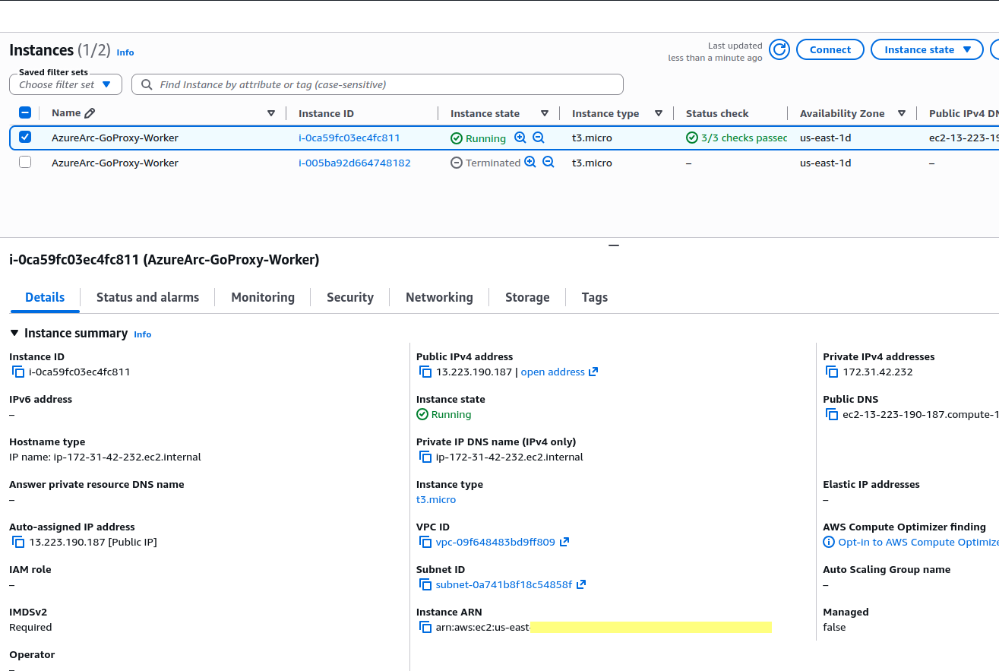
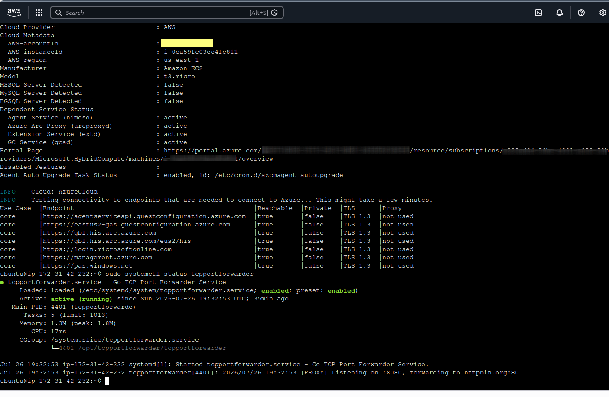
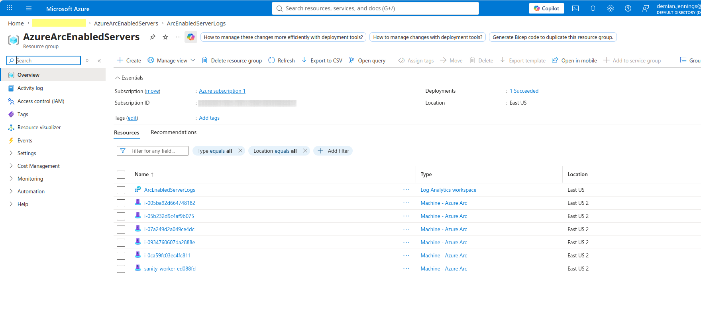
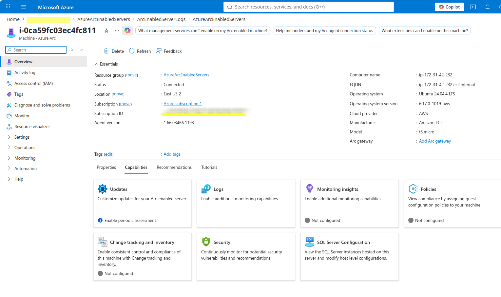
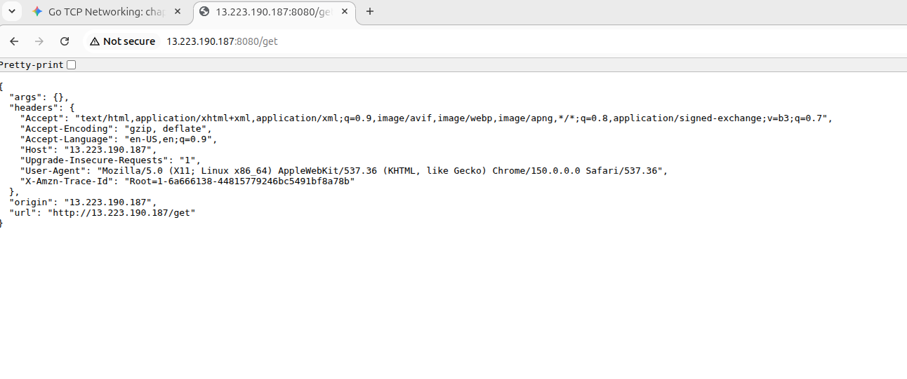

# MultiCloud Architecture - Azure/AWS version

## Introduction

✍️ In this session I wanted to deploy a golang tcp port forwarder. So I thought why not combine some of the other things that I've learned across this cloud journey. So they are several layers to this mini-project. I'm revisting day 56 and deploying a Multicloud architecture. For this i am once again using Pulumi as my Infrastructure As Code (IAC). Pulumi is provisioning the security groups and deploys the ec2 instance. It also installs the Azure Arc agent. During the deploying of the ec2, cloud-init compiles the Go source code and installs it as a native systemd background service. The Go proxy handles the TCP socket streams and forwards them to httpbin.org. With the Azure Arc agent installed on the ec2, Azure arc is serving as the control plane.

## Prerequisite

✍️ Azure account, Pulumi account, AWS account

## Use Case

- Database bastion / Jump Host proxy
- Microservice Service Mesh & sidecar
- Protocol Wrapping & TLS Termination
- Zero Trust Access & Tunnel


## Try yourself

### Step 1 - Install Azure CLI
```
curl -sL https://aka.ms/InstallAzureCLIDeb | sudo bash
```
#### Verify
```
az version
```
#### Login
```
az login
```
### Step 2 - Install pulumi
```curl -fsSL https://get.pulumi.com | sh```

Reload shell config

```source ~/.bashrc```

Verify pulumi installation

```pulumi version```

### Step 3 - Set Up Your State Backend
```pulumi login```

### Step 4 - Create a Role for the Azure Account

```
az ad sp create-for-rbac  \
    --name "Arc-Onboarding-Worker"   \
    --role "Azure Connected Machine Onboarding"   \
    --scopes "/subscriptions/<YOUR_SUBSCRIPTION_ID>/resourceGroups/<YOUR_RESOURCE_GROUP_NAME>"
```
The output will be JSON like this
```
{
    "appID":"11111-2222-3333-4444",
    "displayName": "Arc-Onboarding-Worker",
    "password": "xxxxxxxxxxxxxxxxx",
    "tenant": "6666-7777-8888-9999-000000"
}
```

Assign the role explicitly
```
az role assignment create \
    --- assignee "SERVICE_PRINCIPAL_ID" \
    --role "Azure Connected Machine Onboarding" \
    --scope "SUBSCRIPTION_ID"
```

Store the password as a Pulumi secret

```pulumi config set --secret arcSecret xxxxxxxx```

### Step 5 - Initialize a Pulumi Go Project
This does not have to be Go. Pulumi has options for many languages

```
mkdir -p ~/<whereever you want to store this project>
cd ~/<whereever you want to store this project>
pulumi new azure-go
```

Pulumi will ask for Project Name, Description, and Stack Name
Then it will download all the dependencies

### Step 6 - Swap Boilerplate Go Code
```
package main

import (
	"github.com/pulumi/pulumi-aws/sdk/v6/go/aws/ec2"
	"github.com/pulumi/pulumi/sdk/v3/go/pulumi"
)


func main() {
	pulumi.Run(func(ctx *pulumi.Context) error {
		
		rawCloudInit := `#!/bin/bash
# 1. Install Azure Arc Agent and Go Runtime
wget https://packages.microsoft.com/config/ubuntu/24.04/packages-microsoft-prod.deb
dpkg -i packages-microsoft-prod.deb
apt-get update
apt-get install -y azcmagent golang-go

# 2. Onboard Machine to Azure Arc
azcmagent connect \
 --service-principal-id "#######-####-####-####-#########" \
 --service-principal-secret "##.##~###########-#######-###" \
 --tenant-id "###################################" \
 --subscription-id "############################" \
 --resource-group "AzureArcEnabledServers" \
 --location "eastus2" || true

# 3. Create Go TCP Proxy Directory and Source File
mkdir -p /opt/tcpportforwarder
cat << 'EOF' > /opt/tcpportforwarder/main.go
package main

import (
	"io"
	"log"
	"net"
)

const (
	listenAddr = ":8080"
	targetAddr = "httpbin.org:80"
)

func main() {
	listener, err := net.Listen("tcp", listenAddr)
	if err != nil {
		log.Fatalf("Failed to bind: %v", err)
	}
	defer listener.Close()

	log.Printf("[PROXY] Listening on %s, forwarding to %s\n", listenAddr, targetAddr)

	for {
		clientConn, err := listener.Accept()
		if err != nil {
			log.Printf("Failed to accept: %v", err)
			continue
		}
		go handleConnection(clientConn)
	}
}

func handleConnection(clientConn net.Conn) {
	defer clientConn.Close()

	targetConn, err := net.Dial("tcp", targetAddr)
	if err != nil {
		log.Printf("Failed to dial target: %v", err)
		return
	}
	defer targetConn.Close()

	done := make(chan struct{}, 2)

	go func() {
		io.Copy(targetConn, clientConn)
		done <- struct{}{}
	}()

	go func() {
		io.Copy(clientConn, targetConn)
		done <- struct{}{}
	}()

	<-done
}
EOF

# 4. Create systemd Daemon Unit 
cat << 'EOF' > /etc/systemd/system/tcpportforwarder.service
[Unit]
Description=Go TCP Port Forwarder Service
After=network.target

[Service]
Type=simple
User=root
WorkingDirectory=/opt/tcpportforwarder
ExecStart=/opt/tcpportforwarder/tcpportforwarder
Restart=always
RestartSec=5

[Install]
WantedBy=multi-user.target
EOF

# 5. Build Native Binary with Explicit Environment Vars
export HOME=/root
export GOPATH=/root/go
cd /opt/tcpportforwarder
/usr/bin/go mod init tcpportforwarder || true
/usr/bin/go build -o tcpportforwarder main.go

# 6. Enable and Start the Service
systemctl daemon-reload
systemctl enable tcpportforwarder
systemctl start tcpportforwarder
`

		// Create AWS Security Group
		secGroup, err := ec2.NewSecurityGroup(ctx, "proxy-secgroup", &ec2.SecurityGroupArgs{
			Description: pulumi.String("Allow HTTP Proxy and SSH traffic"),
			Ingress: ec2.SecurityGroupIngressArray{
				&ec2.SecurityGroupIngressArgs{
					Protocol:   pulumi.String("tcp"),
					FromPort:   pulumi.Int(8080),
					ToPort:     pulumi.Int(8080),
					CidrBlocks: pulumi.StringArray{pulumi.String("0.0.0.0/0")},
				},
				&ec2.SecurityGroupIngressArgs{
					Protocol:   pulumi.String("tcp"),
					FromPort:   pulumi.Int(22),
					ToPort:     pulumi.Int(22),
					CidrBlocks: pulumi.StringArray{pulumi.String("0.0.0.0/0")},
				},
			},
			Egress: ec2.SecurityGroupEgressArray{
				&ec2.SecurityGroupEgressArgs{
					Protocol:   pulumi.String("-1"),
					FromPort:   pulumi.Int(0),
					ToPort:     pulumi.Int(0),
					CidrBlocks: pulumi.StringArray{pulumi.String("0.0.0.0/0")},
				},
			},
		})
		if err != nil {
			return err
		}

		// Lookup Canonical Ubuntu 24.04 AMI
		ami, err := ec2.LookupAmi(ctx, &ec2.LookupAmiArgs{
			MostRecent: pulumi.BoolRef(true),
			Filters: []ec2.GetAmiFilter{
				{
					Name:   "name",
					Values: []string{"ubuntu/images/hvm-ssd-gp3/ubuntu-noble-24.04-amd64-server-*"},
				},
				{
					Name:   "virtualization-type",
					Values: []string{"hvm"},
				},
			},
			Owners: []string{"099720109477"},
		})
		if err != nil {
			return err
		}

		// Provision Instance
		server, err := ec2.NewInstance(ctx, "proxy-worker", &ec2.InstanceArgs{
			InstanceType:        pulumi.String("t3.micro"),
			Ami:                 pulumi.String(ami.Id),
			VpcSecurityGroupIds: pulumi.StringArray{secGroup.ID()},
			UserData:            pulumi.String(rawCloudInit),
			Tags: pulumi.StringMap{
				"Name": pulumi.String("AzureArc-GoProxy-Worker"),
			},
		})
		if err != nil {
			return err
		}

		ctx.Export("instancePublicIp", server.PublicIp)
		return nil
	})
}

```

### Step 7 - Tidy up code and download dependencies

```go mod tidy```

### Step 8 - Deploy Stack

```pumuli up```

That's it. You should now see the ec2 instance deployed, and see the server on Azure Arc


### Step 9 — Verify the ec2 instance



### Step 10 — Verify the TCP Port Forwarding service is running
Connect to the ec2 either with ssh or ec2 connect

Check the Logs
`
sudo tail -n 50 /var/log/cloud-init-output.log
`

Verify the service is running
`
sudo systemctl status tcpportforwarder
`


### Step 11 — Verify that the Azure Arc Agent is running





### Step 12 — Verify the Proxy is running via browser
`
http://<PUBLIC_IP>:8080/get
`



### Step 13 - Destroy the Stack
Once you are finished, you can shutdown and delete resources

```pumuli destroy```

## ☁️ Cloud Outcome

There were many moving parts to this. The greatest difficulty was setting up the iam permissions for the role. That was an iterative process of adding permissions, reading the error message, repeat. The other headache was getting the string interpolation to work in the cloud-init. Cloud-init is good for a POC , but in practice you want to pull the binary from a repo are use something like ansible.Other than that I was very happy with it, extending my exploration of multi-cloud architecture. I've just scratch the surface of what i can do with Azure arc. Also there are more use cases to explore in port forwarding. But it it was fun writing the go code and see it all come together.

## Next Steps

✍️ Leveraging more of Azure arc. Explore more TCP port forwarding use cases. Write more code!

## Social Proof

✍️ Show that you shared your process on Twitter or LinkedIn

[linkedIn](https://www.linkedin.com/posts/demian-jennings_day-62100-days-of-cloud-multi-cloud-architecture-share-7487273819817197568-INnB/?utm_source=share&utm_medium=member_desktop&rcm=ACoAADXbhxEBzxsfNpRcEjDWcxJMI75kD_O-eRA)
