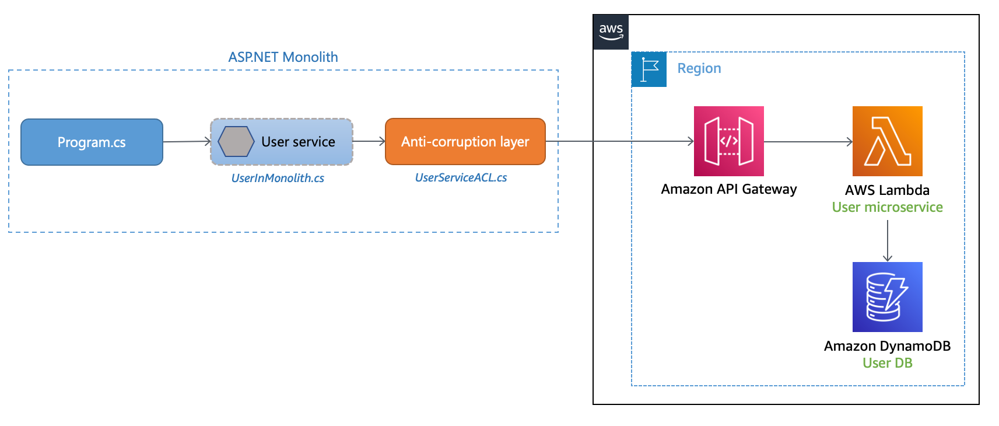

# Cloud Design Patterns - Anti-corruption layer pattern (AWS)

## Introduction

✍️ The anti-corruption layer (ACL) pattern acts as a mediation layer that translates domain model semantics from one system to another system. It translates the model of the upstream bounded context (monolith) into a model that suits the downstream bounded context (microservice) before consuming the communication contract that's established by the upstream team. This pattern might be applicable when the downstream bounded context contains a core subdomain, or the upstream model is an unmodifiable legacy system. It also reduces transformation risk and business disruption by preventing changes to callers when their calls have to be redirected transparently to the target system.

## Prerequisite

- An AWS account
- An AWS user with AdministratorAccess. I created a role specifically for these type of projects which i assumed.
- Node.js 18.0.0.0 or later
- npm 
- AWS CDK v2
- Access to Amazon API Gateway, AWS Lambda, and Amazon DynamoDB
- .NET 6.0 SDK installed and .NET Core Global Tools for AWS
- a zip archiver tool


## Use Case

Consider using this pattern when:

-    Your existing monolithic application has to communicate with a function that has been migrated into a microservice, and the migrated service domain model and semantics differ from the original feature.

-   Two systems have different semantics and need to exchange data, but it isn't practical to modify one system to be compatible with the other system.

-   You want to use a quick and simplified approach to adapt one system to another with minimal impact.

-   Your application is communicating with an external system.

## Cloud Research

- https://docs.aws.amazon.com/prescriptive-guidance/latest/cloud-design-patterns/acl.html

## Implementation
There are three repos in this example:
- anti-corruption-layer-impl - Contains the source code for the .NET 6.0 monolithic application and this contains the implementation of the Anti-corruption layer.
- cdk-user-microservice - CDK implementation for the AWS services
- user-microservice-lambda - Source code for Lambda function


### Step 1 — Clone the Github repository
```
git clone https://github.com/aws-samples/anti-corruption-layer-pattern.git
```

### Step 2 — Create packages for the Lambda function

```
$ cd anti-corruption-layer
$ cd user-microservice-lambda/src/UserMicroserviceLambda
$ dotnet tool install --global Amazon.Lambda.Tools
$ dotnet lambda package
$ mkdir -p ../../../cdk-user-microservice/lambdas # create lambdas folder if there is no lambdas folder
$ cp bin/Release/net6.0/UserMicroserviceLambda.zip ../../../cdk-user-microservice/lambdas
$ cd ../../..
```

### Step 3 - Create IAM Role (In Console as Admin)

1. Open the IAM Console while logged in as Admin.
1. Go to Roles $\rightarrow$ Create role.
1. Select AWS account as the trusted entity type.
1. Choose An AWS account and select This account.
1. Under Permissions, attach the necessary policies (for testing CDK, AdministratorAccess is standard).
1. Name the role something clear, like CDKDeployerRole, and click Create role.

### Step 4 - Grant <Admin Role> Permission to Assume the Role.
By default, an IAM user cannot assume a role unless granted explicit permission:
1. In the IAM Console, go to Users $\rightarrow$ <your admin user>
1. Under Permissions, click Add permissions $\rightarrow$ Create inline policy (or attach a customer managed policy).
1. Switch to the JSON tab and paste the following policy (replace 123456789012 with your actual 12-digit AWS Account ID):

```
{
  "Version": "2012-10-17",
  "Statement": [
    {
      "Sid": "AllowCDKBootstrapAndDeployManagement",
      "Effect": "Allow",
      "Action": [
        "cloudformation:CreateStack",
        "cloudformation:UpdateStack",
        "cloudformation:DeleteStack",
        "cloudformation:DescribeStacks",
        "cloudformation:DescribeStackEvents",
        "cloudformation:CreateChangeSet",
        "cloudformation:DescribeChangeSet",
        "cloudformation:ExecuteChangeSet",
        "cloudformation:GetTemplate",
        "s3:*",
        "ecr:*",
        "iam:CreateRole",
        "iam:DeleteRole",
        "iam:GetRole",
        "iam:TagRole",
        "iam:UntagRole",
        "iam:AttachRolePolicy",
        "iam:DetachRolePolicy",
        "iam:PutRolePolicy",
        "iam:GetRolePolicy",
        "iam:DeleteRolePolicy",
        "ssm:PutParameter",
        "ssm:GetParameter",
        "ssm:DeleteParameter"
      ],
      "Resource": "*"
    },
    {
      "Sid": "AllowCDKRoleAssumption",
      "Effect": "Allow",
      "Action": "sts:AssumeRole",
      "Resource": "arn:aws:iam::123456789:role/cdk-hnb659fds-*-123456789-us-east-1"
    },
    {
      "Sid": "AllowPassCDKExecutionRole",
      "Effect": "Allow",
      "Action": "iam:PassRole",
      "Resource": "arn:aws:iam::123456789:role/cdk-hnb659fds-cfn-exec-role-123456789-us-east-1"
    }
  ]
}
```

### Step 4 - Configure Your Local Terminal (~/.aws/config)
Your local machine will use your <Admin Roles> existing access keys to automatically request short-lived temporary credentials for CDKDeployerRole.

Open your ~/.aws/config file on your Ubuntu workstation and add a new profile block:
```
[profile cdk-dev]
role_arn = arn:aws:iam::123456789012:role/CDKDeployerRole
source_profile = default
```

### Step 5 - Test Role Assumption In the CLI
```
aws sts get-caller-identity --profile cdk-dev
```

### Step 6 - Deploy the CDK code
```
$ npm install -g aws-cdk
$ cd cdk-user-microservice/src/CdkUserMicroservice && dotnet build
$ cd ../..
$ cdk bootstrap aws://<arn>/us-east-1 --profile cdk-dev
$ cdk synth
$ cdk deploy --profile cdk-dev
```
### This what a successful deployment would look like:
```
cdk deploy  --profile cdk-dev
/usr/lib/dotnet/sdk/9.0.118/Sdks/Microsoft.NET.Sdk/targets/Microsoft.NET.EolTargetFrameworks.targets(32,5): warning NETSDK1138: The target framework 'net6.0' is out of support and will not receive security updates in the future. Please refer to https://aka.ms/dotnet-core-support for more information about the support policy.
/usr/lib/dotnet/sdk/9.0.118/Sdks/Microsoft.NET.Sdk/targets/Microsoft.NET.EolTargetFrameworks.targets(32,5): warning NETSDK1138: The target framework 'net6.0' is out of support and will not receive security updates in the future. Please refer to https://aka.ms/dotnet-core-support for more information about the support policy.
/home/beast/projects/aws_patterns/anti-corruption-layer-pattern/cdk-user-microservice/src/CdkUserMicroservice/CdkUserMicroservice.csproj : warning NU1901: Package 'Amazon.CDK.Lib' 2.80.0 has a known low severity vulnerability, https://github.com/advisories/GHSA-464c-974j-9xm6
/usr/lib/dotnet/sdk/9.0.118/Sdks/Microsoft.NET.Sdk/targets/Microsoft.NET.EolTargetFrameworks.targets(32,5): warning NETSDK1138: The target framework 'net6.0' is out of support and will not receive security updates in the future. Please refer to https://aka.ms/dotnet-core-support for more information about the support policy.
/home/beast/projects/aws_patterns/anti-corruption-layer-pattern/cdk-user-microservice/src/CdkUserMicroservice/CdkUserMicroservice.csproj : warning NU1901: Package 'Amazon.CDK.Lib' 2.80.0 has a known low severity vulnerability, https://github.com/advisories/GHSA-464c-974j-9xm6
!!!!!!!!!!!!!!!!!!!!!!!!!!!!!!!!!!!!!!!!!!!!!!!!!!!!!!!!!!!!!!!!!!!!!!!!!!!!!!!!!!!!!!!!!!!!!!!!!!!!!!!!!!!!!!!!!!!!!!!!!!
!!                                                                                                                      !!
!!  This software has not been tested with node v24.18.1.                                                               !!
!!  Should you encounter odd runtime issues, please try using one of the supported release before filing a bug report.  !!
!!                                                                                                                      !!
!!  This software is currently running on node v24.18.1.                                                                !!
!!  As of the current release of this software, supported node releases are:                                            !!
!!                                                                                                                      !!
!!  This warning can be silenced by setting the JSII_SILENCE_WARNING_UNTESTED_NODE_VERSION environment variable.        !!
!!                                                                                                                      !!
!!!!!!!!!!!!!!!!!!!!!!!!!!!!!!!!!!!!!!!!!!!!!!!!!!!!!!!!!!!!!!!!!!!!!!!!!!!!!!!!!!!!!!!!!!!!!!!!!!!!!!!!!!!!!!!!!!!!!!!!!!

✨  Synthesis time: 5.72s

CdkUserMicroserviceStack: creating CloudFormation changeset...
Changeset arn:aws:cloudformation:us-east-1:508375325349:changeSet/cdk-deploy-change-set/20fd5d88-78ad-4b10-b16b-b4efa1225be2 created and waiting in review for manual execution (--no-execute)
Stack CdkUserMicroserviceStack
IAM Statement Changes
┌───┬─────────────────────────────────────────┬────────┬─────────────────────────────────────────┬─────────────────────────────────────────┬──────────────────────────────────────────┐
│   │ Resource                                │ Effect │ Action                                  │ Principal                               │ Condition                                │
├───┼─────────────────────────────────────────┼────────┼─────────────────────────────────────────┼─────────────────────────────────────────┼──────────────────────────────────────────┤
│ + │ ${MicroserviceAPI/CloudWatchRole.Arn}   │ Allow  │ sts:AssumeRole                          │ Service:apigateway.amazonaws.com        │                                          │
├───┼─────────────────────────────────────────┼────────┼─────────────────────────────────────────┼─────────────────────────────────────────┼──────────────────────────────────────────┤
│ + │ ${MicroserviceLambdaExecutionRole.Arn}  │ Allow  │ sts:AssumeRole                          │ Service:lambda.amazonaws.com            │                                          │
├───┼─────────────────────────────────────────┼────────┼─────────────────────────────────────────┼─────────────────────────────────────────┼──────────────────────────────────────────┤
│ + │ ${UserMicroserviceLambda.Arn}           │ Allow  │ lambda:InvokeFunction                   │ Service:apigateway.amazonaws.com        │ "ArnLike": {                             │
│   │                                         │        │                                         │                                         │   "AWS:SourceArn": "arn:${AWS::Partition │
│   │                                         │        │                                         │                                         │ }:execute-api:${AWS::Region}:${AWS::Acco │
│   │                                         │        │                                         │                                         │ untId}:${MicroserviceAPI276DE572}/${dev} │
│   │                                         │        │                                         │                                         │ /*/user"                                 │
│   │                                         │        │                                         │                                         │ }                                        │
│ + │ ${UserMicroserviceLambda.Arn}           │ Allow  │ lambda:InvokeFunction                   │ Service:apigateway.amazonaws.com        │ "ArnLike": {                             │
│   │                                         │        │                                         │                                         │   "AWS:SourceArn": "arn:${AWS::Partition │
│   │                                         │        │                                         │                                         │ }:execute-api:${AWS::Region}:${AWS::Acco │
│   │                                         │        │                                         │                                         │ untId}:${MicroserviceAPI276DE572}/test-i │
│   │                                         │        │                                         │                                         │ nvoke-stage/*/user"                      │
│   │                                         │        │                                         │                                         │ }                                        │
├───┼─────────────────────────────────────────┼────────┼─────────────────────────────────────────┼─────────────────────────────────────────┼──────────────────────────────────────────┤
│ + │ ${apiRole.Arn}                          │ Allow  │ sts:AssumeRole                          │ Service:apigateway.amazonaws.com        │                                          │
├───┼─────────────────────────────────────────┼────────┼─────────────────────────────────────────┼─────────────────────────────────────────┼──────────────────────────────────────────┤
│ + │ *                                       │ Allow  │ cloudwatch:PutMetricData                │ AWS:${MicroserviceLambdaExecutionRole}  │                                          │
│   │                                         │        │ xray:PutTelemetryRecords                │                                         │                                          │
│   │                                         │        │ xray:PutTraceSegments                   │                                         │                                          │
│ + │ *                                       │ Allow  │ lambda:InvokeFunction                   │ AWS:${apiRole}                          │                                          │
└───┴─────────────────────────────────────────┴────────┴─────────────────────────────────────────┴─────────────────────────────────────────┴──────────────────────────────────────────┘
IAM Policy Changes
┌───┬────────────────────────────────────┬─────────────────────────────────────────────────────────────────────────────────────────┐
│   │ Resource                           │ Managed Policy ARN                                                                      │
├───┼────────────────────────────────────┼─────────────────────────────────────────────────────────────────────────────────────────┤
│ + │ ${MicroserviceAPI/CloudWatchRole}  │ arn:${AWS::Partition}:iam::aws:policy/service-role/AmazonAPIGatewayPushToCloudWatchLogs │
├───┼────────────────────────────────────┼─────────────────────────────────────────────────────────────────────────────────────────┤
│ + │ ${MicroserviceLambdaExecutionRole} │ arn:${AWS::Partition}:iam::aws:policy/CloudWatchLogsFullAccess                          │
│ + │ ${MicroserviceLambdaExecutionRole} │ arn:${AWS::Partition}:iam::aws:policy/AWSXrayFullAccess                                 │
│ + │ ${MicroserviceLambdaExecutionRole} │ arn:${AWS::Partition}:iam::aws:policy/CloudWatchLambdaInsightsExecutionRolePolicy       │
└───┴────────────────────────────────────┴─────────────────────────────────────────────────────────────────────────────────────────┘
(NOTE: There may be security-related changes not in this list. See https://github.com/aws/aws-cdk/issues/1299)


Stack includes security-sensitive updates and "--require-approval" is set to 'broadening'.
Do you wish to deploy these changes? (y/n) y
CdkUserMicroserviceStack: deploying... [1/1]

✅  CdkUserMicroserviceStack

✨  Deployment time: 84.1s

Outputs:
CdkUserMicroserviceStack.MicroserviceAPIEndpointE7B12008 = https://13dqco0d9c.execute-api.us-east-1.amazonaws.com/prod/
Stack ARN:
arn:aws:cloudformation:us-east-1:508375325349:stack/CdkUserMicroserviceStack/b47f8d90-8e1d-11f1-ab5c-129f834c24bd

✨  Total time: 118.82s

```

### Step 7 - Test the deployment and ACL!!!
In the terminal send a POST request
```
$ curl -X POST https://13dqco0d9c.execute-api.us-east-1.amazonaws.com/dev/user \
  -H "Content-Type: application/json" \
  -d '{"UserId": 12345, "Address": "475 Sansome St,10th floor","City": "San Francisco","State": "California","ZipCode": 94111,"Country": "United States"}'
```

The response should look like this
```
{"statusCode":200,"headers":{"Content-Type":"application/json","Access-Control-Allow-Origin":"*"},"body":"Processed","isBase64Encoded":false}
```

## ☁️ Cloud Outcome

This is a recap of what happened
```
[ Your Terminal ]
       │
       │ (1) HTTP POST with modern JSON Payload
       ▼
[ AWS API Gateway ]  (Endpoint: /dev/user)
       │
       │ (2) Triggers the Anti-Corruption Layer Lambda
       ▼
[ UserMicroserviceLambda ] 
       │
       │ (3) ACL Translation Layer:
       │     - Receives modern JSON data (UserId, Address, City...)
       │     - Transforms/Adapts it to fit the legacy domain requirements
       │     - Executes microservice logic
       │
       ▼
[ Returns 200 OK + "Processed" ] ───> Back to the terminal
```
#### Why This Matters for the Anti-Corruption Layer Pattern
We wanted to see how downstream microservices interact with upstream legacy domains without letting legacy schemas corrupt new clean code.

1. Your Client (curl): Acted as a modern client or downstream service. It sent clean, standardized JSON:
{"UserId": 12345, "Address": "475 Sansome St...", "City": "San Francisco"...}

1. The CDK Stack: Bootstrapped, built, packaged, and deployed an isolated serverless application using your custom IAM role.

1. The Lambda Function: Acted as the Anti-Corruption Layer (ACL). It intercepted the request, parsed the modern format, ran the domain transformation code you compiled from .NET, and returned a successful 200 response without exposing any legacy mechanics to your terminal.

## Next Steps

✍️ There are quite a few design patterns to review. Next I will try this same pattern out in an Azure implementation

## Social Proof

✍️ Show that you shared your process on Twitter or LinkedIn

[LinkedIn](https://lnkd.in/p/erZj4dWP)
