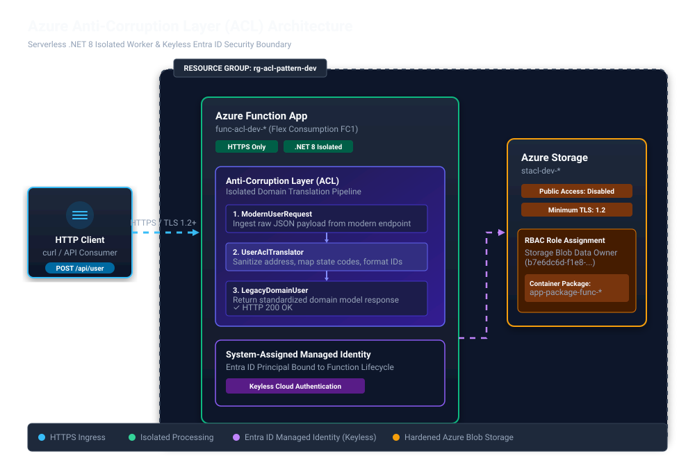

# Cloud Design Patterns - Anti-corruption layer pattern (Azure)

## Introduction

✍️ Implement a facade or adapter layer between different subsystems that don't share the same semantics. This layer translates requests that one subsystem makes to the other subsystem. Use this pattern to ensure that dependencies on outside subsystems don't limit an application's design. 

## Prerequisite
The following need to be installed:
- Azure Account
- Node and npm
- Azure CLI
- dotnet 8.0


## Use Case
✍️ Most applications rely on other systems for some data or functionality. For example, when you migrate a legacy application to a modern system, the application might continue to use existing legacy resources. New features must be able to call the legacy system. This capability is especially important for gradual migrations in which you move different features of a larger application to a modern system over time.

These legacy systems often have quality problems like convoluted data schemas or obsolete APIs. The features and technologies that legacy systems use can vary widely from more modern systems. To interoperate with the legacy system, the new application might need to support outdated infrastructure, protocols, data models, APIs, or other features that you wouldn't otherwise put into a modern application.

When you maintain access between new and legacy systems, you force the new system to adhere to at least some of the legacy system's APIs or other semantics. When these legacy features have quality problems, this support corrupts what might otherwise be a cleanly designed modern application.
Isolate the different subsystems by placing an anti-corruption layer between them. This layer translates communication between the two systems. By using this approach, you can keep one system unchanged without compromising the design and technological approach of the other.

## Cloud Research

- ✍️ https://learn.microsoft.com/en-us/azure/architecture/patterns/anti-corruption-layer


### Step 1 — Login into account via CLI
```
az login
```
### Step 2 — Verify Account details
```
az account show --output table
```

### Step 3 — Create a Resource Group 
```
# Set a local variable for consistency
export RG_NAME="rg-acl-pattern-dev"
export LOCATION="eastus"

# Create the isolated Resource Group
az group create --name $RG_NAME --location $LOCATION

```


### Step 4 - Configure Azure CLI Scope Enforcement
```
# Set your active subscription
az account set --subscription "Azure subscription 1"

# Set default resource group location for all future CLI commands
az configure --defaults group=rg-acl-pattern-dev location=eastus
```
### Step 5 - Setting RBAC Permission
```
# 1. Grab your Entra ID Object ID
MY_OBJECT_ID=$(az ad signed-in-user show --query id --output tsv)

# 2. Get the full Resource ID of your sandbox Resource Group
RG_SCOPE=$(az group show --name rg-acl-pattern-dev --query id --output tsv)

# 3. Create the explicit Role Assignment at the Resource Group scope
az role assignment create \
  --assignee $MY_OBJECT_ID \
  --role "Contributor" \
  --scope $RG_SCOPE
```

### Step 6 - Verify Least Privilege Enforcement
```
# List explicit permissions granted on your Resource Group
az role assignment list \
  --assignee $MY_OBJECT_ID \
  --resource-group rg-acl-pattern-dev \
  --output table
```

### Step 7 - Verify Environment Setup
```
az group show --name rg-acl-pattern-dev --query "{Name:name, ID:id, Location:location}" --output json
```

### Step 8 - Local Project Initialization
```
# Navigate to project root
cd ~/projects

# Initialize a .NET 8 Isolated Azure Functions project
func init azure-acl-pattern --worker-runtime dotnet-isolated --target-framework net8.0

cd azure-acl-pattern

# Create an HTTP trigger endpoint for processing users
func new --name UserHttpTrigger --template "HTTP trigger" --authlevel anonymous
```

### Step 9 - Project File Configuration
The isolated worker model requires executable output (<OutputType>Exe</OutputType>) and ASP.NET Core integration packages. Ensure your .csproj file reflects these dependencies:
```
<Project Sdk="Microsoft.NET.Sdk">

  <PropertyGroup>
    <TargetFramework>net8.0</TargetFramework>
    <AzureFunctionsVersion>v4</AzureFunctionsVersion>
    <OutputType>Exe</OutputType>
    <ImplicitUsings>enable</ImplicitUsings>
    <Nullable>enable</Nullable>
    <RootNamespace>azure_acl_pattern</RootNamespace>
  </PropertyGroup>

  <ItemGroup>
    <FrameworkReference Include="Microsoft.AspNetCore.App" />
    <PackageReference Include="Microsoft.Azure.Functions.Worker" Version="1.21.0" />
    <PackageReference Include="Microsoft.Azure.Functions.Worker.Sdk" Version="1.17.2" />
    <PackageReference Include="Microsoft.Azure.Functions.Worker.Extensions.Http.AspNetCore" Version="1.2.1" />
  </ItemGroup>

</Project>

```

Use ConfigureFunctionsWebApplication() to enable standard ASP.NET Core HTTP handling (HttpRequest, IActionResult), matching modern ASP.NET development standards:
```
using Microsoft.Azure.Functions.Worker;
using Microsoft.Extensions.DependencyInjection;
using Microsoft.Extensions.Hosting;
using azure_acl_pattern;

var host = new HostBuilder()
    .ConfigureFunctionsWebApplication()
    .ConfigureServices(services =>
    {
        // Register your Anti-Corruption Layer service
        services.AddSingleton<IUserAclTranslator, UserAclTranslator>();
    })
    .Build();

host.Run();
```
### Step 10 - Anti-Corruption Layer Logic
Define the models and translation layer inside UserAclTranslator.cs. This layer receives the external/modern request format and converts it into the internal legacy domain contract before processing.
```
using Microsoft.Extensions.Logging;

namespace azure_acl_pattern;

// Modern incoming request model from downstream clients
public record ModernUserRequest(
    int UserId,
    string Address,
    string City,
    string State,
    int ZipCode,
    string Country
);

// Legacy internal domain model expecting structured contact details
public record LegacyDomainUser(
    string UserReferenceId,
    string FormattedAddress,
    string PostalCode,
    string CountryCode,
    DateTime ProcessedAtUtc
);

public interface IUserAclTranslator
{
    LegacyDomainUser TranslateToLegacyDomain(ModernUserRequest request);
}

public class UserAclTranslator : IUserAclTranslator
{
    private readonly ILogger<UserAclTranslator> _logger;

    public UserAclTranslator(ILogger<UserAclTranslator> logger)
    {
        _logger = logger;
    }

    public LegacyDomainUser TranslateToLegacyDomain(ModernUserRequest request)
    {
        _logger.LogInformation("ACL Translating ModernUserRequest for UserId: {UserId}", request.UserId);

        // Anti-Corruption Layer Transformation Logic
        return new LegacyDomainUser(
            UserReferenceId: $"LEGACY-USR-{request.UserId:D6}",
            FormattedAddress: $"{request.Address}, {request.City}, {request.State}",
            PostalCode: request.ZipCode.ToString("D5"),
            CountryCode: request.Country.Equals("United States", StringComparison.OrdinalIgnoreCase) ? "US" : request.Country,
            ProcessedAtUtc: DateTime.UtcNow
        );
    }
}
```
### Step 11 - HTTP Trigger Endpoint(UserHttpTrigger.cs)
Implement the HTTP endpoint accepting POST requests at /api/user
```
using Microsoft.Azure.Functions.Worker;
using Microsoft.Extensions.Logging;
using Microsoft.AspNetCore.Http;
using Microsoft.AspNetCore.Mvc;
using System.Text.Json;

//namespace azure_acl_pattern;
namespace azure_acl_pattern;
public class UserHttpTrigger
{
    private readonly IUserAclTranslator _translator;
    private readonly ILogger<UserHttpTrigger> _logger;

    public UserHttpTrigger(IUserAclTranslator translator, ILogger<UserHttpTrigger> logger)
    {
        _translator = translator;
        _logger = logger;
    }

    [Function("ProcessUserAcl")]
    public async Task<IActionResult> Run(
        [HttpTrigger(AuthorizationLevel.Anonymous, "post", Route = "user")] HttpRequest req)
    {
        _logger.LogInformation("Processing user request via Azure Function ACL trigger.");

        string requestBody = await new StreamReader(req.Body).ReadToEndAsync();
        
        if (string.IsNullOrWhiteSpace(requestBody))
        {
            return new BadRequestObjectResult(new { error = "Request payload cannot be empty." });
        }

        var options = new JsonSerializerOptions { PropertyNameCaseInsensitive = true };
        ModernUserRequest? modernRequest;

        try
        {
            modernRequest = JsonSerializer.Deserialize<ModernUserRequest>(requestBody, options);
        }
        catch (JsonException ex)
        {
            _logger.LogError(ex, "JSON Deserialization failed.");
            return new BadRequestObjectResult(new { error = "Invalid JSON payload structure." });
        }

        if (modernRequest is null)
        {
            return new BadRequestObjectResult(new { error = "Unable to deserialize payload." });
        }

        // Pass payload through Anti-Corruption Layer
        LegacyDomainUser legacyUser = _translator.TranslateToLegacyDomain(modernRequest);

        _logger.LogInformation("Successfully adapted payload for legacy domain. Reference ID: {RefId}", legacyUser.UserReferenceId);

        return new OkObjectResult(new
        {
            status = "Processed",
            legacyReference = legacyUser.UserReferenceId,
            formatted = legacyUser.FormattedAddress,
            processedTimestamp = legacyUser.ProcessedAtUtc
        });
    }
}


```

### Step 12 - Test the Anti-Corruption Layer Endpoint  
```
# Build the .NET8 application
dotnet build

# Launch the Function host:
func start

```
Open a second terminal window and execute the test request:
```
curl -X POST http://localhost:7071/api/user \
  -H "Content-Type: application/json" \
  -d '{"UserId": 12345, "Address": "475 Sansome St,10th floor","City": "San Francisco","State": "California","ZipCode": 94111,"Country": "United States"}'
```

### Step 13 - Build the BICEP File

```
@description('Azure region where resources will be deployed.')
param location string = resourceGroup().location

@description('Environment tag to enforce consistent naming conventions.')
param environmentName string = 'dev'

// Correct built-in Storage Blob Data Owner Role Definition ID
var storageBlobDataOwnerRoleId = '###############################'

// Naming
var namingSuffix = uniqueString(resourceGroup().id)
var storageAccountName = take('stacl${environmentName}${namingSuffix}', 24)
var functionAppName = 'func-acl-${environmentName}-${namingSuffix}'
var appServicePlanName = 'asp-acl-${environmentName}'
var deploymentContainerName = 'app-package-${functionAppName}'

// 1. Storage Account
resource storageAccount 'Microsoft.Storage/storageAccounts@2023-01-01' = {
  name: storageAccountName
  location: location
  sku: {
    name: 'Standard_LRS'
  }
  kind: 'StorageV2'
  properties: {
    supportsHttpsTrafficOnly: true
    minimumTlsVersion: 'TLS1_2'
    allowBlobPublicAccess: false
  }
}

// 2. Blob Services & Deployment Container
resource blobService 'Microsoft.Storage/storageAccounts/blobServices@2023-01-01' = {
  parent: storageAccount
  name: 'default'
}

resource deploymentContainer 'Microsoft.Storage/storageAccounts/blobServices/containers@2023-01-01' = {
  parent: blobService
  name: deploymentContainerName
  properties: {
    publicAccess: 'None'
  }
}

// 3. Flex Consumption Plan
resource appServicePlan 'Microsoft.Web/serverfarms@2023-12-01' = {
  name: appServicePlanName
  location: location
  sku: {
    name: 'FC1'
    tier: 'FlexConsumption'
  }
  properties: {
    reserved: true
  }
}

// 4. Function App
resource functionApp 'Microsoft.Web/sites@2023-12-01' = {
  name: functionAppName
  location: location
  kind: 'functionapp,linux'
  identity: {
    type: 'SystemAssigned'
  }
  properties: {
    serverFarmId: appServicePlan.id
    httpsOnly: true
    functionAppConfig: {
      deployment: {
        storage: {
          type: 'blobContainer'
          value: '${storageAccount.properties.primaryEndpoints.blob}${deploymentContainerName}'
          authentication: {
            type: 'SystemAssignedIdentity'
          }
        }
      }
      runtime: {
        name: 'dotnet-isolated'
        version: '8.0'
      }
      scaleAndConcurrency: {
        maximumInstanceCount: 100
        instanceMemoryMB: 2048
      }
    }
    siteConfig: {
      minTlsVersion: '1.2'
      appSettings: [
        {
          name: 'AzureWebJobsStorage'
          value: 'DefaultEndpointsProtocol=https;AccountName=${storageAccount.name};EndpointSuffix=${az.environment().suffixes.storage};AccountKey=${storageAccount.listKeys().keys[0].value}'
        }
      ]
    }
  }
}

// 5. RBAC: Assign Managed Identity 'Storage Blob Data Owner' permission
resource roleAssignment 'Microsoft.Authorization/roleAssignments@2022-04-01' = {
  name: guid(storageAccount.id, functionApp.id, storageBlobDataOwnerRoleId)
  scope: storageAccount
  properties: {
    roleDefinitionId: subscriptionResourceId('Microsoft.Authorization/roleDefinitions', storageBlobDataOwnerRoleId)
    principalId: functionApp.identity.principalId
    principalType: 'ServicePrincipal'
  }
}

// Outputs
output functionAppName string = functionApp.name
output functionAppUrl string = 'https://${functionApp.properties.defaultHostName}'
```
### Step 14 - Deploy the BICEP File
```
# 1. Validate the Bicep template
az deployment group validate --template-file main.bicep

# 2. Execute the infrastructure deployment
az deployment group create \
  --name "acl-pattern-deploy" \
  --template-file main.bicep

# 3. Publish your compiled .NET code to the newly created Function App
func azure functionapp publish <YOUR_FUNCTION_APP_NAME>
```

### Step 15 - Verification Check
Once published, execute your live test against your actual Azure cloud endpoint
```
curl -X POST https://<YOUR_DEPLOYED_FUNCTION_APP_NAME>.azurewebsites.net/api/user \
  -H "Content-Type: application/json" \
  -d '{"UserId": 99999, "Address": "100 Pine St","City": "San Francisco","State": "CA","ZipCode": 94111,"Country": "United States"}'
```

## ☁️ Cloud Outcome

✍️ Today we designed a domain translation worker that adapts dynamic external payloads into structured internal models using the Anti-Corruption layer pattern. We also configured a decoupled azure function host model on linux. We deployed the function using BICEP as our IAC while observing RBAC controls. 

## Next Steps

✍️ Explore more cloud architecture patterns

## Social Proof

✍️ Show that you shared your process on Twitter or LinkedIn

[LinkedIn](https://lnkd.in/p/exk2tD3M)
